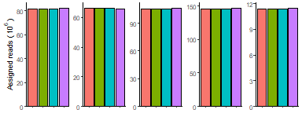
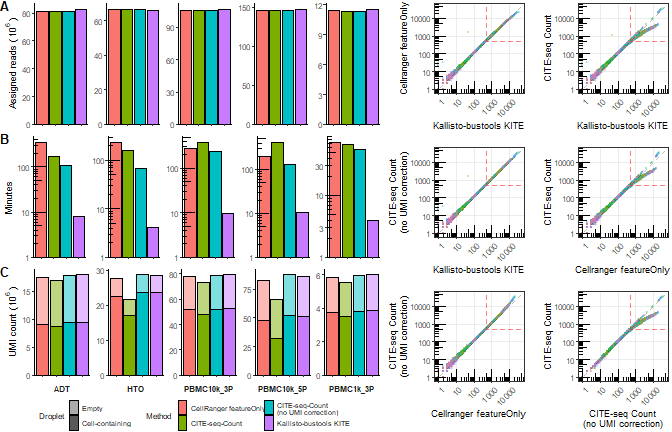
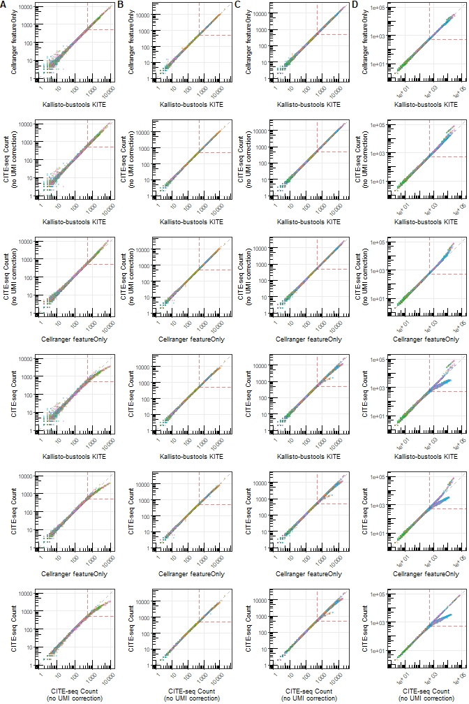

CITE-seq optimization - ADT counting methods
================
Terkild Brink Buus
30/3/2020

## Load utilities

Including libraries, plotting and color settings and custom utility
functions

``` r
set.seed(114)
require("tidyverse", quietly=T)
library("Matrix", quietly=T)

## Load ggplot theme and defaults
source("R/ggplot_settings.R")

## Load helper functions
source("R/Utilities.R")

outdir <- "figures"
```

## Runtime

All analysis was run on the NYU Medical Center computing cluster
“BigPurple” on a “fat\_node” with an allocated 16 cores and 64GB
memory.

``` r
time.s <- data.frame(ADT=c("kallisto"=474, "cellranger"=20901, "csc"=10410, "csc_nc"=6541), 
                     HTO=c("kallisto"=252, "cellranger"=13988, "csc"=9641, "csc_nc"=4051),
                     PBMC10k_3P=c("kallisto"=591, "cellranger"=16940, "csc"=22645, "csc_nc"=14420),
                     PBMC1k_3P=c("kallisto"=234, "cellranger"=4309, "csc"=3943, "csc_nc"=3336),
                     PBMC10k_5P=c("kallisto"=629, "cellranger"=11972, "csc"=24735, "csc_nc"=7652))

aligned <- data.frame(ADT=c("kallisto"=82527351, "cellranger"=81355365, "csc"=81355365, "csc_nc"=81355365), 
                     HTO=c("kallisto"=65875774, "cellranger"=66540087, "csc"=66540087, "csc_nc"=66540087),
                     PBMC10k_3P=c("kallisto"=106650656, "cellranger"=105346468, "csc"=105787248, "csc_nc"=105787248),
                     PBMC1k_3P=c("kallisto"=11517927, "cellranger"=11371198, "csc"=11345985, "csc_nc"=11345985),
                     PBMC10k_5P=c("kallisto"=147360481, "cellranger"=145950841, "csc"=145496165, "csc_nc"=145496165))

methods <- c("cellranger"="CellRanger featureOnly",
             "csc"="CITE-seq-Count",
             "csc_nc"="CITE-seq-Count\n(no UMI correction)",
             "kallisto"="Kallisto-bustools KITE")

aligned.long <- aligned %>% mutate(method=rownames(aligned)) %>% pivot_longer(-method)

p.alignedReads <- ggplot(aligned.long,aes(x=method,y=value/10^6,fill=method)) + 
    geom_bar(stat="identity", color="black") + 
    scale_y_continuous(expand=c(0,0,0.05,0)) + 
    labs(y=bquote("Assigned reads ("~10^6~")"), x="Method") + 
    facet_wrap(~name, scales="free_y", nrow=1, strip.position = "bottom") + 
    theme(panel.grid=element_blank(), 
          panel.border=element_blank(), 
          axis.line=element_line(),
          legend.position="none",
          strip.placement="outside",
          strip.text=element_blank(),
          axis.text.x=element_blank(),
          axis.title.x=element_blank())

p.alignedReads
```

<!-- -->

``` r
time.s.long <- time.s %>% mutate(method=rownames(time.s)) %>% pivot_longer(-method)

p.runtime <- ggplot(time.s.long,aes(x=method,y=value/60,fill=method)) + 
    geom_bar(stat="identity", color="black") + 
    scale_y_log10(expand=c(0,0,0.05,0)) + 
    annotation_logticks(sides = "l", size=0.25) + 
    labs(x="Method", y="Minutes") + 
    facet_wrap(~name, scales="free_y", nrow=1, strip.position = "bottom") + 
    theme(panel.grid=element_blank(), 
          panel.border=element_blank(), 
          axis.line=element_line(),
          legend.position="none",
          strip.placement="outside",
          strip.text=element_blank(),
          axis.text.x=element_blank(),
          axis.title.x=element_blank())


p.runtime
```

<!-- -->

## Determine ADT counts in cells vs empty drops.

Cell-containing vs non-cell-containing (empty) droplets are filtered
based on inflection point in the barcode-rank plot from the mRNA
library. See [Load unfiltered data vignette](Load-unfiltered-data.md).

``` r
## Load ADT and HTO data from previous preprocessing
load("data/data.HTO.Rdata")
load("data/data.ADT.Rdata")

## Total ADT UMI count
ADT.totalUMI <- c("kallisto"=sum(kallisto.ADT),"csc"=sum(CSC.ADT),"csc_nc"=sum(CSC.ADT.uncorrected),"cellranger"=sum(cellranger.ADT))
## ADT UMI counts within cell-containing droplets
ADT.UMIincell <- c("kallisto"=sum(kallisto.ADT[,gex.aboveInf]),"csc"=sum(CSC.ADT[,intersect(colnames(CSC.ADT),gex.aboveInf)]),"csc_nc"=sum(CSC.ADT.uncorrected[,intersect(colnames(CSC.ADT.uncorrected),gex.aboveInf)]),"cellranger"=sum(cellranger.ADT[,gex.aboveInf]))
## ADT UMI counts within empty droplets
ADT.UMIindrops <- ADT.totalUMI - ADT.UMIincell

## Combine to data.frame and set dataset to "ADT" for plotting with other datasets
ADT <- data.frame(method=names(ADT.totalUMI),Cell=ADT.UMIincell,EmptyDrop=ADT.UMIindrops)
ADT$dataset <- "ADT"

## Total ADT UMI count
HTO.totalUMI <- c("kallisto"=sum(kallisto.HTO),"csc"=sum(CSC.HTO),"csc_nc"=sum(CSC.HTO.uncorrected),"cellranger"=sum(cellranger.HTO))
## ADT UMI counts within cell-containing droplets
HTO.UMIincell <- c("kallisto"=sum(kallisto.HTO[,gex.aboveInf]),"csc"=sum(CSC.HTO[,intersect(colnames(CSC.HTO),gex.aboveInf)]),"csc_nc"=sum(CSC.HTO.uncorrected[,intersect(colnames(CSC.HTO.uncorrected),gex.aboveInf)]),"cellranger"=sum(cellranger.HTO[,gex.aboveInf]))
## ADT UMI counts within empty droplets
HTO.UMIindrops <- HTO.totalUMI - HTO.UMIincell

## Combine to data.frame and set dataset to "HTO" for plotting with other datasets
HTO <- data.frame(method=names(HTO.totalUMI),Cell=HTO.UMIincell,EmptyDrop=HTO.UMIindrops)
HTO$dataset <- "HTO"
```

## Include publicly availabe 10X Datasets

To determine if the observations from our dataset is more broadly
applicable, we include publicly available data from the 10X website from
two 3’ (V3 chemistry) and one 5’ single-cell run with feature barcoding
with a panel of 17 TotalSeqB and TotalSeqC antibodies, respectively.

``` r
## Load data from previous preprocessing
load("data/data.10X.datasets.Rdata")

## Add to a dataframe containing the ADT and HTO datasets
plotData <- rbind(ADT,HTO)

## Loop through each 10X dataset
for(i in seq_along(data.10X.datasets)){
  dataset <- data.10X.datasets[i]
  
  ## Extract data for the current dataset
  cells <- data.10X.datasets.gex.aboveInf[[dataset]]
  kallisto <- data.10X.datasets.adt.kallisto[[dataset]]
  csc <- data.10X.datasets.adt.csc[[dataset]]
  csc_nc <- data.10X.datasets.adt.csc_nc[[dataset]]
  cellranger <- data.10X.datasets.adt.cellranger[[dataset]]
  
  ## Total UMI counts
  totalUMI <- c("kallisto"=sum(kallisto),"csc"=sum(csc),"csc_nc"=sum(csc_nc),"cellranger"=sum(cellranger))
  
  ## UMI counts in cell-containing droplets
  # for some reason kallisto was lacking counts from a singlecell barcode "ACTTCCGAGACGAGCT" in 10k_v3 dataset.
  UMIincell <- c("kallisto"=sum(kallisto[,intersect(colnames(kallisto),cells)]),"csc"=sum(csc[,cells]),"csc_nc"=sum(csc_nc[,cells]),"cellranger"=sum(cellranger[,cells]))
  
  ## UMI counts in empty droplets
  UMIindrops <- totalUMI - UMIincell
  
  ## Combine into dataframe and set assign dataset variable for plotting together with other datasets
  df <- data.frame(method=names(totalUMI),Cell=UMIincell,EmptyDrop=UMIindrops)
  df$dataset <- dataset
  
  plotData <- rbind(plotData,df)
}
```

## Make UMI count plots for all datasets

To visualize the amount of UMIs within cell-containing vs. empty
droplets and to determine if the counting methods have differences in
their UMI assignment.

``` r
## Make into "long format" for plotting with ggplot.
plotData <- plotData %>% pivot_longer(c(-method,-dataset))
plotData$name <- gsub("EmptyDrop", "Empty", plotData$name)
plotData$name <- gsub("Cell", "Cell-containing", plotData$name)
plotData$name <- factor(plotData$name, levels=c("Empty","Cell-containing"))

## Rename datasets
plotData$dataset <- c("ADT"="ADT",
                      "HTO"="HTO",
                      "PBMC_10k_GEXFeature_v3"="PBMC10k_3P", 
                      "PBMC_1k_GEXFeature_v3"="PBMC1k_3P", 
                      "PBMC_GEXFeatureVDJ_v1"="PBMC10k_5P")[plotData$dataset]

## Make plot
p.UMIcounts <- ggplot(plotData,aes(x=method,y=value/10^6,fill=methods[method], alpha=name)) + 
    geom_bar(stat="identity", color="black") + 
    scale_alpha_manual(values=c("Empty"=0.5,"Cell-containing"=1), guide="legend") + 
    scale_y_continuous(expand=c(0,0,0.05,0)) + 
    labs(y=bquote("UMI count ("~10^6~")"), x="Method", alpha="Droplet", fill="Method") + 
    guides(fill=guide_legend(ncol=2), alpha=guide_legend(ncol=1)) + 
    facet_wrap(~dataset, scales="free_y", nrow=1, strip.position = "bottom") +  
    theme(panel.grid=element_blank(), 
          panel.border=element_blank(), 
          axis.line=element_line(),
          strip.placement="outside",
          strip.text=element_text(size=6),
          axis.text.x=element_blank(),
          axis.title.x=element_blank(),
          legend.key.size=unit(0.25,"cm"),
          legend.key.height=unit(0.4,"cm"),
          legend.text=element_text(size=5),
          legend.title=element_text(size=6))

## Extract legend
p.legend <- cowplot::get_legend(p.UMIcounts)

ABC <- cowplot::plot_grid(p.alignedReads, p.runtime, p.UMIcounts + theme(legend.position="none"), p.legend, 
                 labels=c("A", "B", "C"), 
                 ncol=1, 
                 rel_heights=c(1,1,1,0.25), 
                 label_size=panel.label_size, vjust=panel.label_vjust, hjust=panel.label_hjust)

ABC
```

<!-- -->

## UMI per marker per cell correlations

As we see differences in UMI assignment between CITE-seq count with
default settings versus all other counting methods particularly within
the HTO sample, we wanted to investigate if these differences were
evently distributed among cells or particularly within cells with high
UMI counts (and thus a higher chance of UMI collision when “correcting”
UMIs)

``` r
## Get UMI count matrices (marker x cells) within cell-containing droplets
HTOdata <- list(kallisto.HTO[,gex.aboveInf], 
                cellranger.HTO[,gex.aboveInf], 
                CSC.HTO[,gex.aboveInf], 
                CSC.HTO.uncorrected[,gex.aboveInf])


assays <- c("HTO.kallisto","HTO.cellranger","HTO.csc", "HTO.csc_nc")
names(assays) <- assays
names(HTOdata) <- assays

## Make rownames consistent across datasets and make "long format" for binding.
HTOdata <- lapply(HTOdata, function(x) as.matrix(x) %>% as.data.frame(x) %>% 
                    mutate(marker=gsub("\\-[TGAC]+","",rownames(x))) %>% 
                    mutate(marker=gsub("^HTO","",marker)) %>% 
                    pivot_longer(-marker))

## Combine data from each method into a single data.frame
HTOdata.DF <- bind_rows(HTOdata, .id="method")

## Make into "wide" matrix format
HTOdata.DF <- HTOdata.DF %>% pivot_wider(names_from = method, values_from = value)

## Remove rows (antibodies) that do not have any counts
HTOdata.DF <- HTOdata.DF[rowSums(HTOdata.DF[,-c(1,2)]) > 0,]

## Shuffle the dataframe to make visualization less biased towards the order of plotting.
HTOdata.DF <- HTOdata.DF[sample(nrow(HTOdata.DF),nrow(HTOdata.DF)),]

## Set axis limits to best visualize the bulk of the data
curLimit <- 40000

## Add individual pair-wise comparison plots into a list
p.methodCorr <- list()

p.methodCorr[["KvsR"]] <- ggplot(HTOdata.DF, aes(x=HTO.kallisto+1, y=HTO.cellranger+1)) + 
    labs(x="Kallisto-bustools KITE", y="Cellranger featureOnly")
    
p.methodCorr[["KvsC"]] <- ggplot(HTOdata.DF, aes(x=HTO.kallisto+1, y=HTO.csc+1)) + 
    labs(x="Kallisto-bustools KITE", y="CITE-seq Count")

p.methodCorr[["KvsC_NC"]] <- ggplot(HTOdata.DF, aes(x=HTO.kallisto+1, y=HTO.csc_nc+1)) + 
    labs(x="Kallisto-bustools KITE", y="CITE-seq Count\n(no UMI correction)")

p.methodCorr[["RvsC"]] <- ggplot(HTOdata.DF, aes(x=HTO.cellranger+1, y=HTO.csc+1)) + 
    labs(x="Cellranger featureOnly", y="CITE-seq Count")

p.methodCorr[["RvsC_NC"]] <- ggplot(HTOdata.DF, aes(x=HTO.cellranger+1, y=HTO.csc_nc+1)) + 
    labs(x="Cellranger featureOnly", y="CITE-seq Count\n(no UMI correction)")

p.methodCorr[["CvsC_NC"]] <- ggplot(HTOdata.DF, aes(x=HTO.csc_nc+1, y=HTO.csc+1)) + 
    labs(x="CITE-seq Count\n(no UMI correction)", y="CITE-seq Count")

## Add plotting settings to each plot
p.methodCorrAdd <- lapply(p.methodCorr, function(x){
    x + 
    geom_point(aes(color=marker), stroke=0, alpha=0.25, size=0.5) + 
    geom_abline(slope=1, linetype="dashed", col="black", size=0.25, alpha=0.25) +
    annotate(geom="rect", xmin=500, ymin=500, xmax=Inf, ymax=Inf, fill=NA, color=alpha("red",0.5), linetype="dashed") + 
    scale_x_log10(limits=c(1,curLimit)) + scale_y_log10(limits=c(1,curLimit)) + 
    annotation_logticks(size=0.25) + 
    theme(aspect.ratio = 1, legend.position="none", plot.margin=unit(c(1,1,1,1),"mm"))
})

## Combine into 
D <- cowplot::plot_grid(plotlist=p.methodCorrAdd, align="hv", axis="tblr", ncol=2, label_size=panel.label_size, vjust=panel.label_vjust, hjust=panel.label_hjust) 
```

## Make final plot

``` r
plotFinal <- cowplot::plot_grid(ABC, D, align="v", axis="lr", nrow=1, rel_widths=c(3,2.25))

png(file=file.path(outdir,"Figure 6.png"), 
    width=figure.width.full, 
    height=4.5, 
    units=figure.unit, 
    res=figure.resolution, 
    antialias=figure.antialias)

  plotFinal

dev.off()
```

    ## png 
    ##   2

``` r
plotFinal
```

<!-- -->

## UMI per marker per cell correlations: ADT

Similar analysis is made of the ADT library

``` r
ADTdata <- list(kallisto.ADT[,gex.aboveInf], 
                cellranger.ADT[,gex.aboveInf], 
                CSC.ADT[,gex.aboveInf], 
                CSC.ADT.uncorrected[,gex.aboveInf])


assays <- c("ADT.kallisto","ADT.cellranger","ADT.csc", "ADT.csc_nc")
names(assays) <- assays
names(ADTdata) <- assays

ADTdata <- lapply(ADTdata, function(x) as.matrix(x) %>% as.data.frame(x) %>% mutate(marker=gsub("\\-[TGAC]+","",rownames(x))) %>% mutate(marker=gsub("^HTO","",marker)) %>% pivot_longer(-marker))

ADTdata.DF <- bind_rows(ADTdata, .id="method")
ADTdata.DF <- ADTdata.DF %>% pivot_wider(names_from = method, values_from = value)

ADTdata.DF <- ADTdata.DF[rowSums(ADTdata.DF[,-c(1,2)]) > 0,]
ADTdata.DF <- ADTdata.DF[sample(nrow(ADTdata.DF),nrow(ADTdata.DF)),]

curLimit <- quantile(ADTdata.DF$ADT.csc_nc, probs=c(0.99999))
p.methodCorr <- list()

p.methodCorr[["KvsR"]] <- ggplot(ADTdata.DF, aes(x=ADT.kallisto+1, y=ADT.cellranger+1)) + 
    labs(x="Kallisto-bustools KITE", y="Cellranger featureOnly")

p.methodCorr[["KvsC_NC"]] <- ggplot(ADTdata.DF, aes(x=ADT.kallisto+1, y=ADT.csc_nc+1)) + 
    labs(x="Kallisto-bustools KITE", y="CITE-seq Count\n(no UMI correction)")

p.methodCorr[["RvsC_NC"]] <- ggplot(ADTdata.DF, aes(x=ADT.cellranger+1, y=ADT.csc_nc+1)) + 
    labs(x="Cellranger featureOnly", y="CITE-seq Count\n(no UMI correction)") 

p.methodCorr[["KvsC"]] <- ggplot(ADTdata.DF, aes(x=ADT.kallisto+1, y=ADT.csc+1)) + 
    labs(x="Kallisto-bustools KITE", y="CITE-seq Count")

p.methodCorr[["RvsC"]] <- ggplot(ADTdata.DF, aes(x=ADT.cellranger+1, y=ADT.csc+1)) + 
    labs(x="Cellranger featureOnly", y="CITE-seq Count")

p.methodCorr[["CvsC_NC"]] <- ggplot(ADTdata.DF, aes(x=ADT.csc_nc+1, y=ADT.csc+1)) + 
    labs(x="CITE-seq Count\n(no UMI correction)", y="CITE-seq Count")

p.methodCorrAdd <- lapply(p.methodCorr, function(x){
    x + 
    geom_point(aes(color=marker), stroke=0, alpha=0.25, size=0.5) + 
    geom_abline(slope=1, linetype="dashed", col="black", size=0.25, alpha=0.25) +
    annotate(geom="rect", xmin=500, ymin=500, xmax=Inf, ymax=Inf, fill=NA, color=alpha("red",0.5), linetype="dashed") + 
    scale_x_log10(limits=c(1,curLimit)) + scale_y_log10(limits=c(1,curLimit)) + 
    annotation_logticks(size=0.25) + 
    theme(aspect.ratio = 1, legend.position="none", plot.margin=unit(c(1,1,1,1),"mm"))
})

plot.ADT <- cowplot::plot_grid(plotlist=p.methodCorrAdd, align="hv", axis="tblr", ncol=1) 
```

## UMI per marker per cell correlations: 10X data

Similar analysis is made of the 10X libraries

``` r
plot.10X <- list()
for(i in seq_along(data.10X.datasets)){
  dataset <- data.10X.datasets[i]
  cells <- data.10X.datasets.gex.aboveInf[[dataset]]
  ADTdata <- list(data.10X.datasets.adt.kallisto[[dataset]], 
                  data.10X.datasets.adt.cellranger[[dataset]], 
                  data.10X.datasets.adt.csc[[dataset]], 
                  data.10X.datasets.adt.csc_nc[[dataset]])
  
  commonCells <- Reduce("intersect",lapply(ADTdata,colnames))
  cells <- intersect(cells,commonCells)
  ADTdata <- lapply(ADTdata,function(x)x[,cells])
  ADTdata <- lapply(ADTdata,function(x){rownames(x) <- rownames(data.10X.datasets.adt.kallisto[[dataset]]); x})
  
  
  assays <- c("ADT.kallisto","ADT.cellranger","ADT.csc", "ADT.csc_nc")
  names(assays) <- assays
  names(ADTdata) <- assays
  
  ADTdata <- lapply(ADTdata, function(x) as.matrix(x) %>% as.data.frame(x) %>% mutate(marker=rownames(.)) %>% pivot_longer(-marker))
  
  ADTdata.DF <- bind_rows(ADTdata, .id="method")
  ADTdata.DF <- ADTdata.DF %>% pivot_wider(names_from = method, values_from = value)
  
  ADTdata.DF <- ADTdata.DF[rowSums(ADTdata.DF[,-c(1,2)]) > 0,]
  ADTdata.DF <- ADTdata.DF[sample(nrow(ADTdata.DF),nrow(ADTdata.DF)),]

  curLimit <- quantile(ADTdata.DF$ADT.csc_nc, probs=c(0.99999))
  p.methodCorr <- list()
  
  p.methodCorr[["KvsR"]] <- ggplot(ADTdata.DF, aes(x=ADT.kallisto+1, y=ADT.cellranger+1)) + 
      labs(x="Kallisto-bustools KITE", y="Cellranger featureOnly")
  
  p.methodCorr[["KvsC_NC"]] <- ggplot(ADTdata.DF, aes(x=ADT.kallisto+1, y=ADT.csc_nc+1)) + 
      labs(x="Kallisto-bustools KITE", y="CITE-seq Count\n(no UMI correction)")
  
  p.methodCorr[["RvsC_NC"]] <- ggplot(ADTdata.DF, aes(x=ADT.cellranger+1, y=ADT.csc_nc+1)) + 
      labs(x="Cellranger featureOnly", y="CITE-seq Count\n(no UMI correction)") 
  
  p.methodCorr[["KvsC"]] <- ggplot(ADTdata.DF, aes(x=ADT.kallisto+1, y=ADT.csc+1)) + 
      labs(x="Kallisto-bustools KITE", y="CITE-seq Count")
  
  p.methodCorr[["RvsC"]] <- ggplot(ADTdata.DF, aes(x=ADT.cellranger+1, y=ADT.csc+1)) + 
      labs(x="Cellranger featureOnly", y="CITE-seq Count")

  p.methodCorr[["CvsC_NC"]] <- ggplot(ADTdata.DF, aes(x=ADT.csc_nc+1, y=ADT.csc+1)) + 
      labs(x="CITE-seq Count\n(no UMI correction)", y="CITE-seq Count")
  
  p.methodCorrAdd <- lapply(p.methodCorr, function(x){
      x + 
      geom_point(aes(color=marker), stroke=0, alpha=0.25, size=0.5) + 
      geom_abline(slope=1, linetype="dashed", col="black", size=0.25, alpha=0.25) +
      annotate(geom="rect", xmin=500, ymin=500, xmax=Inf, ymax=Inf, fill=NA, color=alpha("red",0.5), linetype="dashed") + 
      scale_x_log10(limits=c(1,curLimit)) + scale_y_log10(limits=c(1,curLimit)) + 
      annotation_logticks(size=0.25) + 
      theme(aspect.ratio = 1, legend.position="none", plot.margin=unit(c(1,1,1,1),"mm"))
  })
  
  plot.10X[[dataset]] <- cowplot::plot_grid(plotlist=p.methodCorrAdd, align="hv", axis="tblr", ncol=1) 
}
```

## Final Suppl fig.

``` r
plot.10X[["ADT"]] <- plot.ADT
plot.10X <- plot.10X[c(4,1,2,3)]

p.supp.figure <- cowplot::plot_grid(plotlist=plot.10X, 
                                    align="v", 
                                    axis="lr", 
                                    ncol=4, 
                                    labels=c("A","B","C","D"), 
                                    label_size=panel.label_size, 
                                    vjust=panel.label_vjust, 
                                    hjust=panel.label_hjust)


png(file=file.path(outdir,"Supplementary Figure S7.png"), 
    width=figure.width.full, 
    height=10.5, 
    units=figure.unit, 
    res=figure.resolution, 
    antialias=figure.antialias)

  p.supp.figure
  
dev.off()
```

    ## png 
    ##   2

``` r
p.supp.figure
```

<!-- -->
