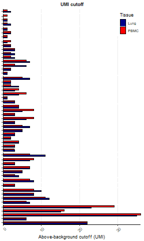
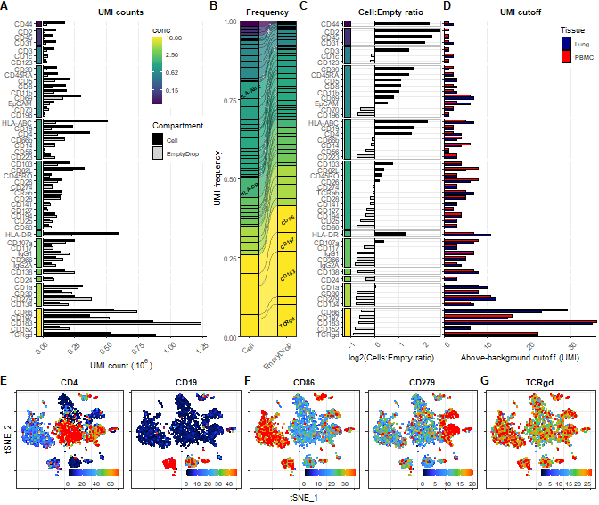

CITE-seq optimization - ADT in cell-containing vs empty drops
================
Terkild Brink Buus
30/3/2020

Background signal in CITE-seq has been proposed to be primarily caused
by free-floating antibodies and can be assessed by measuring reads from
Non-cell-containing (empty) droplets (Mulé et al. 2020). In this
vignette, we compare UMI counts from cell-containing vs. empty drops

## Load utilities

Including libraries, plotting and color settings and custom utility
functions

``` r
set.seed(114)
require("Seurat", quietly=T)
require("tidyverse", quietly=T)
library("Matrix", quietly=T)

## Load ggplot theme and defaults
source("R/ggplot_settings.R")

## Load helper functions
source("R/Utilities.R")

## Load color schemes
source("R/color.R")

outdir <- "figures"
data.drive <- "F:/"
data.abpanel <- "data/Supplementary_Table_1.xlsx"
data.markerStats <- "data/markerByClusterStats.tsv"
data.Seurat <- "data/5P-CITE-seq_Titration.rds"

show_tsne_markers <- c("CD4", "CD19", "CD86", "CD279", "TCRgd")

## Make a custom function for formatting the concentration scale
scaleFUNformat <- function(x) sprintf("%.2f", x)
```

## Load the data

The ADT UMI count data has already been loaded and filtered in the “ADT
counting methods” vignette. We’ll load it from there. This includes the
kallisto.ADT UMI count matrix as well as a list of barcodes that have
been filtered to have gene expression UMI counts above the inflection
point in the rank-barcode plot (used for calling cell-containing
vs. empty droplets).

``` r
load("data/data.ADT.Rdata")

## ADT UMI counts
kallisto.ADT[1:5,1:5]
```

    ## 5 x 5 sparse Matrix of class "dgCMatrix"
    ##       AAACCTGAGAAACCGC AAACCTGAGAAACCTA AAACCTGAGAACTCGG AAACCTGAGAACTGTA
    ## CD103                .                1                .                .
    ## CD223                2                1                .                .
    ## CD274                2                1                .                .
    ## CD45                 .                2                .                .
    ## CD134                3                4                .                .
    ##       AAACCTGAGAAGAAGC
    ## CD103                .
    ## CD223                .
    ## CD274                .
    ## CD45                 .
    ## CD134                .

``` r
## Barcodes for cell-containing droplet 
head(gex.aboveInf)
```

    ## [1] "AAACCTGAGAAACCTA" "AAACCTGAGCAGATCG" "AAACCTGAGCCGTCGT" "AAACCTGAGCGTCAAG"
    ## [5] "AAACCTGAGCGTGTCC" "AAACCTGAGCGTTGCC"

## Load antibody panel data

Antibody panel concentration data is loaded from the supplementary data
excel sheet.

``` r
abpanel <- data.frame(readxl::read_excel(data.abpanel))
rownames(abpanel) <- abpanel$Marker

head(abpanel)
```

    ##        Marker Category     Alias   Clone Isotype_Mouse Corresponding_gene
    ## CD103   CD103        B      <NA> BerACT8          IgG1              ITGAE
    ## CD107a CD107a        B     LAMP1    H4A3          IgG1              LAMP1
    ## CD117   CD117        E     C-kit   104D2          IgG1                KIT
    ## CD11b   CD11b        B      <NA>  ICRF44          IgG1              ITGAM
    ## CD123   CD123        E      <NA>     6H6          IgG1              IL3RA
    ## CD127   CD127        E IL7Ralpha  A019D5          IgG1               IL7R
    ##        TotalSeqC_Tag BioLegend_Cat Stock_conc_µg_per_mL conc_µg_per_mL
    ## CD103           0145        350233                  500          1.250
    ## CD107a          0155        328649                  500          2.500
    ## CD117           0061        313243                  500          2.500
    ## CD11b           0161        301359                  500          0.625
    ## CD123           0064        306045                  500          0.500
    ## CD127           0390        351356                  500          1.250
    ##        dilution_1x
    ## CD103          400
    ## CD107a         200
    ## CD117          200
    ## CD11b          800
    ## CD123         1000
    ## CD127          400

## Preprocess data for plotting

Make sums of ADT UMI counts within cell-containing and empty droplets.

``` r
ADT.matrix <- kallisto.ADT

## Calculate total UMI count per marker
markerUMI <- apply(ADT.matrix,1,sum)

## Calculate UMI count within cell-containing and empty droplets
markerUMI.inCell <- apply(ADT.matrix[,gex.aboveInf],1,sum)
markerUMI.inCell.freq <- markerUMI.inCell/sum(markerUMI.inCell)
markerUMI.inDrop <- markerUMI-markerUMI.inCell
markerUMI.inDrop.freq <- markerUMI.inDrop/sum(markerUMI.inDrop)

## Make DF to allow combination of the data into a "long" format
df.inCell <- data.frame(count=markerUMI.inCell, freq=markerUMI.inCell.freq, subset="Cell", marker=names(markerUMI.inCell.freq))
df.inDrop <- data.frame(count=markerUMI.inDrop, freq=markerUMI.inDrop.freq, subset="EmptyDrop", marker=names(markerUMI.inDrop.freq))

plotData <- rbind(df.inCell, df.inDrop)

## Add "metadata
plotData$conc <- abpanel[plotData$marker,"conc_µg_per_mL"]

plotData$subset <- factor(plotData$subset, levels=c("EmptyDrop","Cell"))

## Order markers according to antibody concentration and UMI frequency within empty droplets (by setting levels)
plotData$marker <- factor(plotData$marker, 
                          levels=plotData$marker[order(plotData$conc[plotData$subset=="EmptyDrop"], 
                                                       plotData$freq[plotData$subset=="EmptyDrop"])])

head(plotData)
```

    ##        count        freq subset marker conc
    ## CD103 211020 0.022481570   Cell  CD103 1.25
    ## CD223  59586 0.006348151   Cell  CD223 1.00
    ## CD274  74664 0.007954525   Cell  CD274 1.25
    ## CD45   77801 0.008288734   Cell   CD45 0.10
    ## CD134 128848 0.013727160   Cell  CD134 5.00
    ## CD56   16145 0.001720050   Cell   CD56 1.00

## Draw cell-containing to empty droplet frequency ratio plot

``` r
data.ratio <- data.frame(ratio=markerUMI.inCell.freq/markerUMI.inDrop.freq) %>% mutate(Marker=rownames(.), conc=abpanel[rownames(.),"conc_µg_per_mL"]) %>% arrange(conc, ratio)

data.ratio$Marker <- factor(data.ratio$Marker, levels=data.ratio$Marker)

p.ratio <- ggplot(data.ratio, aes(x=Marker, y=log2(ratio))) + 
  geom_rect(aes(xmin=-Inf,xmax=Inf,ymin=-1,ymax=-1.25,fill=conc), col="black") + 
  scale_fill_viridis_c(trans="log2", labels=scaleFUNformat, breaks=c(0.0375,0.15,0.625,2.5,10)) + 
  ggnewscale::new_scale_fill() + 
  geom_bar(stat="identity", aes(fill=log2(ratio)>0), color="black", width=0.4) +
  geom_hline(yintercept=0) + 
  scale_fill_manual(values=c(`FALSE`="lightgrey",`TRUE`="black")) + 
  scale_x_discrete(expand=c(0, 0.5)) + 
  scale_y_continuous(expand=c(0,0.05,0,0.05)) + 
  coord_flip() + 
  facet_grid(rows="conc", scales="free_y", space="free_y") + 
  labs(title="Cell:Empty ratio", y="log2(Cells:Empty ratio)", fill="µg/mL") + 
  theme(plot.title=element_text(size=7, face="bold", hjust=0.5), 
        panel.spacing=unit(0.5,"mm"),
        axis.line=element_line(), 
        axis.title.y=element_blank(), 
        strip.placement="outside", 
        strip.text=element_blank(), 
        panel.border=element_rect(color=alpha("black",0.25)),
        legend.position="none", 
        legend.justification=c(0,1),
        legend.direction="horizontal",
        legend.text.align=0, 
        legend.key.width=unit(0.3,"cm"), 
        legend.key.height=unit(0.4,"cm"), 
        legend.text=element_text(size=unit(5,"pt")))

p.ratio
```

<!-- -->

## Draw barplot of UMI counts in cell-containing and empty-droplets

``` r
plotData$marker <- factor(as.character(plotData$marker), levels=levels(data.ratio$Marker))

p.barplot <- ggplot(plotData, aes(x=marker, y=count/10^6)) + 
  geom_rect(aes(xmin=-Inf,xmax=Inf,ymin=-0.050000,ymax=-0.010000,fill=conc), col="black") + 
  scale_fill_viridis_c(trans="log2", labels=scaleFUNformat, breaks=c(0.0375,0.15,0.625,2.5,10)) + 
  ggnewscale::new_scale_fill() + 
  geom_bar(aes(fill=subset),stat="identity", position="dodge", color="black", width=0.65) + 
  geom_hline(yintercept=0, col="black") + 
  scale_fill_manual(values=c("Cell"="black","EmptyDrop"="lightgrey")) + 
  scale_x_discrete(expand=c(0, 0.5)) + 
  scale_y_continuous(expand=c(0,0,0,0.05)) + 
  coord_flip() +
  facet_grid(rows="conc", scales="free_y", space="free_y") +
  guides(fill=guide_legend(reverse=TRUE)) + 
  labs(title="UMI counts", y=bquote("UMI count ("~10^6~")"), fill="Compartment") + 
  theme(plot.title=element_text(size=7, face="bold", hjust=0.5),
        panel.border=element_blank(), 
        panel.grid.major.y=element_blank(), 
        panel.spacing=unit(0.5,"mm"),
        axis.line=element_line(), 
        axis.title.y=element_blank(),
        #axis.text.y=element_blank(), 
        strip.placement="outside", 
        strip.text=element_blank(), 
        legend.position=c(1,1), 
        legend.justification=c(1,1),
        legend.text.align=0, 
        legend.key.width=unit(0.3,"cm"), 
        legend.key.height=unit(0.4,"cm"), 
        legend.text=element_text(size=unit(5,"pt")))

p.barplot
```

<!-- -->

# Highlight markers

Determine which markers should be highlighted due to their differences
between cell-containing and empty droplets.

``` r
freq.threshold <- 0.05

plotData$highlight <- ifelse(plotData$marker %in% plotData$marker[plotData$freq >= freq.threshold],1,0)

## Determine which compartment has the highest frequency for the markers above the threshold and assign the labels accordingly
max.label <- plotData[plotData$freq >= freq.threshold,] %>% group_by(marker) %>% summarize(subset.max=subset[which.max(freq)])

plotData$label <- ifelse((paste(plotData$marker,plotData$subset) %in% 
                            paste(max.label$marker,max.label$subset.max))==FALSE | 
                           plotData$freq < freq.threshold, 
                         NA,as.character(plotData$marker))
```

## Make alluvial “river” plot of markers in each compartment

To allow labelling the markers, we need to calculate the
cummulativeFrequency.

``` r
## Order the dataframe
plotData$marker.conc <- factor(as.character(plotData$marker), levels=unique(plotData$marker[order(-plotData$conc, plotData$marker, decreasing=TRUE)]))
plotData <- plotData[order(plotData$marker.conc, decreasing=TRUE),]

plotData$cummulativeFreq <- 0
plotData$cummulativeFreq[plotData$subset=="EmptyDrop"] <- cumsum(plotData$freq[plotData$subset=="EmptyDrop"])
plotData$cummulativeFreq[plotData$subset=="Cell"] <- cumsum(plotData$freq[plotData$subset=="Cell"])

## A bit of a hack to get the columns in order
#plotData$subset.rev <- factor(as.character(plotData$subset), levels=c("Cell","EmptyDrop"))

p.alluvial <- ggplot(plotData, aes(y=freq, x=subset, fill=conc, stratum = marker.conc, alluvium = marker.conc)) + 
  ggalluvial::geom_flow(width = 1/2, color=alpha("black",0.25), alpha=0.75) + 
  ggalluvial::geom_stratum(width = 1/2) +
  geom_text(aes(y=cummulativeFreq-(freq/2),label=label), na.rm=TRUE, vjust=0.5, hjust=0.5,  angle=30, size=1.5, fontface="bold") + 
  scale_fill_viridis_c(trans="log2", labels=scaleFUNformat, breaks=c(0.0375,0.15,0.625,2.5,10)) + 
  scale_y_continuous(expand=c(0,0)) + 
  scale_x_discrete(expand=c(0,0), limits=rev(levels(plotData$subset))) + 
  labs(title="Frequency", y="UMI frequency", fill="DF1 µg/mL") + 
  theme(plot.title=element_text(size=7, face="bold", hjust=0.5),
        legend.position="none", 
        axis.title.x=element_blank(), 
        panel.grid=element_blank())

p.alluvial
```

<!-- -->

# Specific signals despite background

Despite high background (as assayed by high number of reads in empty
droplets), most markers provide specific signal. However, the number of
UMIs neede to achieve this signal is much lower in the markers with high
signal-to-noise.

``` r
object <- readRDS(file=data.Seurat)

## Show number of cells from each sample
table(object$group)
```

    ## 
    ## PBMC_50ul_1_1000k PBMC_50ul_4_1000k PBMC_25ul_4_1000k  PBMC_25ul_4_200k 
    ##              1777              1777              1777              1777 
    ##  Lung_50ul_1_500k  Lung_50ul_4_500k           Doublet          Negative 
    ##              1681              1681                 0                 0

``` r
object <- subset(object, subset=volume == "50µl" & dilution == "DF1")
object
```

    ## An object of class Seurat 
    ## 33572 features across 3458 samples within 3 assays 
    ## Active assay: RNA.kallisto (33514 features)
    ##  2 other assays present: HTO.kallisto, ADT.kallisto
    ##  3 dimensional reductions calculated: pca, tsne, umap

``` r
DefaultAssay(object) <- "ADT.kallisto"
```

## Show “positive” cutoff according to concentration

Another way to show this is to show the number of UMIs required to get
above the background threshold (defined in Supplementary Figure S1)

``` r
markerStats <- read.table(data.markerStats)
rownames(markerStats) <- paste(markerStats$marker,markerStats$tissue,sep="_")

## Determine which tissue has highest percentage positive cells and use this to set cutoff.
markerStats.max <- markerStats %>% group_by(marker) %>% filter(pct==max(pct))

data.UMI <- GetAssayData(object, assay="ADT.kallisto", slot="counts")
data.meta <- FetchData(object, vars=c("tissue"))

marker.data <- as.data.frame(data.UMI) %>% 
  mutate(marker=rownames(.)) %>% 
  pivot_longer(-marker) %>% 
  group_by(marker, tissue=data.meta[name,"tissue"]) %>% 
  summarize(pos.cutoff=quantile(value, probs=(1-min(0.95,(markerStats[paste(marker[1],tissue[1],sep="_"),"pct"]+20)/100)))) %>% left_join(markerStats)

marker.data$marker <- factor(as.character(marker.data$marker), levels=levels(data.ratio$Marker))

p.UMIcutoff <- ggplot(marker.data, aes(x=marker, y=pos.cutoff, group=tissue, fill=tissue)) + 
  geom_bar(position="dodge", stat="identity", color="black", width=0.65) + 
  scale_fill_manual(values=color.tissue) + 
  scale_x_discrete(expand=c(0, 0.5)) + 
  scale_y_continuous(expand=c(0,0.05,0,0.05)) + 
  coord_flip() + 
  facet_grid(rows="conc_µg_per_mL", scales="free_y", space="free_y") + 
  labs(title="UMI cutoff", y="Above-background cutoff (UMI)", fill="Tissue") + 
  theme(plot.title=element_text(size=7, face="bold", hjust=0.5), 
        panel.border=element_blank(), 
        panel.grid.major.y=element_blank(), 
        panel.spacing=unit(0.5,"mm"),
        axis.line=element_line(), 
        axis.title.y=element_blank(),
        axis.text.y=element_blank(), 
        strip.placement="outside", 
        strip.text=element_blank(), 
        legend.position=c(1,1), 
        legend.justification=c(1,1),
        legend.text.align=0, 
        legend.key.width=unit(0.3,"cm"), 
        legend.key.height=unit(0.4,"cm"), 
        legend.text=element_text(size=unit(5,"pt")))

p.UMIcutoff
```

<!-- -->

Make tSNE plots with raw UMI counts. Use rainbow color scheme to show
dynamic range in expression levels.

``` r
f.tsne.format <- function(x){
    x + 
    scale_color_gradientn(colours = c("#000033","#3333FF","#3377FF","#33AAFF","#33CC33","orange","red"), 
                          limits=c(0,NA)) + 
    scale_y_continuous(expand=c(0.15,0,0.05,0)) + 
    theme_get() + 
    theme(plot.title=element_text(size=7, face="bold", hjust=0.5),
          plot.background=element_blank(),
          panel.background=element_blank(),
          axis.title=element_blank(),
          axis.text.x=element_blank(),
          axis.text.y=element_blank(),
          legend.key.width=unit(3,"mm"),
          legend.key.height=unit(2,"mm"),
          legend.position=c(1,-0.03),
          legend.justification=c(1,0),
          legend.background=element_blank(),
          legend.direction="horizontal")
}

p.tsne <- lapply(FeaturePlot(object, reduction="tsne", sort=TRUE,  combine=FALSE,  
                           features=show_tsne_markers, 
                           slot="counts", 
                           max.cutoff='q90', 
                           pt.size=0.1),
               FUN=f.tsne.format)

## Get common y-axis label
p.tsne[[1]] <- p.tsne[[1]] + theme(axis.title.y=element_text())
# a bit of a hack to get a common x-axis label
p.tsne[[3]] <- p.tsne[[3]] + theme(axis.title.x=element_text(hjust=0.5))

p.UMI.tsne <- cowplot::plot_grid(plotlist=p.tsne, 
                                 align="h", 
                                 axis="tb", 
                                 nrow=1, 
                                 rel_widths=c(1.07,1,1,1,1),
                                 labels=c("E","","F","","G"), 
                                 label_size=panel.label_size, 
                                 vjust=panel.label_vjust, 
                                 hjust=panel.label_hjust)

p.UMI.tsne
```

<!-- -->

Make similar plots for all markers

``` r
markers <- sort(rownames(object[["ADT.kallisto"]])) 

p.tsne.all <- lapply(FeaturePlot(object, reduction="tsne", sort=TRUE,  combine=FALSE,  
                           features=markers, 
                           slot="counts", 
                           max.cutoff='q90', 
                           pt.size=0.1),
               FUN=f.tsne.format)

names(p.tsne.all) <- markers

p.tsne.all <- lapply(markers, function(x) p.tsne.all[[x]] + ggtitle(paste0(x," (",markerStats[paste0(x,"_PBMC"),"conc_µg_per_mL"]," µg/mL)")))

plot.columns <- 5
plot.num <- length(p.tsne.all)
plot.rows <- ceiling(plot.num/plot.columns)
plot.rowSplit <- 6

## Reduce margins
p.tsne.all <- lapply(p.tsne.all, function(x) x + 
                       theme(plot.margin=unit(c(0.1,0.1,0.3,0.1),"mm")))

## Get common y-axis label
p.tsne.all[(c(0:(plot.rows-1))*plot.columns+1)] <- lapply(p.tsne.all[(c(0:(plot.rows-1))*plot.columns+1)], function(x) x + theme(axis.title.y=element_text()))

## Show axis label for the center plot of the last row
p.tsne.all[[(plot.columns*plot.rowSplit-floor(plot.columns/2))]] <- p.tsne.all[[(plot.columns*plot.rowSplit-floor(plot.columns/2))]] + theme(axis.title.x=element_text(hjust=0.5))
# a bit of a hack to get a common x-axis label on the last row (hardcoded)
p.tsne.all[[52]] <- p.tsne.all[[52]] + theme(axis.title.x=element_text(hjust=2))

p.UMI.tsne.all.1 <- cowplot::plot_grid(plotlist=p.tsne.all[1:(plot.rowSplit*plot.columns)], align="h", axis="tb", ncol=plot.columns, rel_widths=c(1.1,1,1,1,1))
p.UMI.tsne.all.2 <- cowplot::plot_grid(plotlist=p.tsne.all[(plot.rowSplit*plot.columns+1):52], align="h", axis="tb", ncol=plot.columns, rel_widths=c(1.1,1,1,1,1))

png(file=file.path(outdir,paste0("Supplementary Figure S7A.png")), 
      units=figure.unit, 
      res=figure.resolution, 
      width=figure.width.full, 
      height=(figure.width.full/plot.columns*plot.rowSplit)*1.1,
      antialias=figure.antialias)

  p.UMI.tsne.all.1
  
dev.off()
```

    ## png 
    ##   2

``` r
png(file=file.path(outdir,paste0("Supplementary Figure S7B.png")), 
      units=figure.unit, 
      res=figure.resolution, 
      width=figure.width.full, 
      height=(figure.width.full/plot.columns*(plot.rows-plot.rowSplit))*1.1,
      antialias=figure.antialias)

  p.UMI.tsne.all.2
  
dev.off()
```

    ## png 
    ##   2

## Combine figure

``` r
p.row1 <- cowplot::plot_grid(p.barplot + theme(plot.margin=unit(c(0.02,0,0,0),"npc")), 
                              p.alluvial, 
                              p.ratio + theme(plot.margin=unit(c(0,0,0,0.05),"npc")), 
                              p.UMIcutoff + theme(plot.margin=unit(c(0,0,0,-0.007),"npc")), 
                              nrow=1, 
                              rel_widths=c(1.75,0.75,1.2,1.3), 
                              align="h", 
                              axis="tb", 
                              labels=c("A", "B", "C", "D"), 
                              label_size=panel.label_size, 
                              vjust=panel.label_vjust, 
                              hjust=panel.label_hjust)

p.final <- cowplot::plot_grid(p.row1, p.UMI.tsne, 
                              ncol=1, 
                              rel_heights=c(3,1.05))

p.final
```

<!-- -->

``` r
png(file=file.path(outdir,"Figure 5.png"), width=figure.width.full, height=5.9, units=figure.unit, res=figure.resolution, antialias=figure.antialias)
p.final
dev.off()
```

    ## png 
    ##   2
