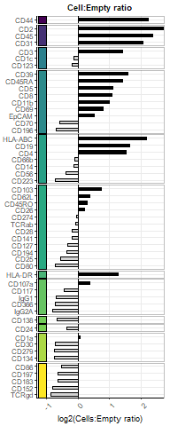
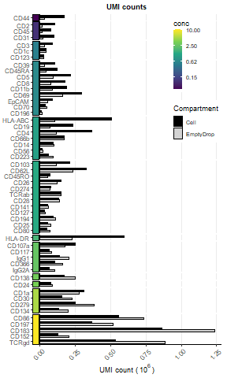
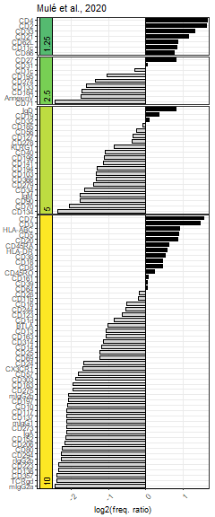
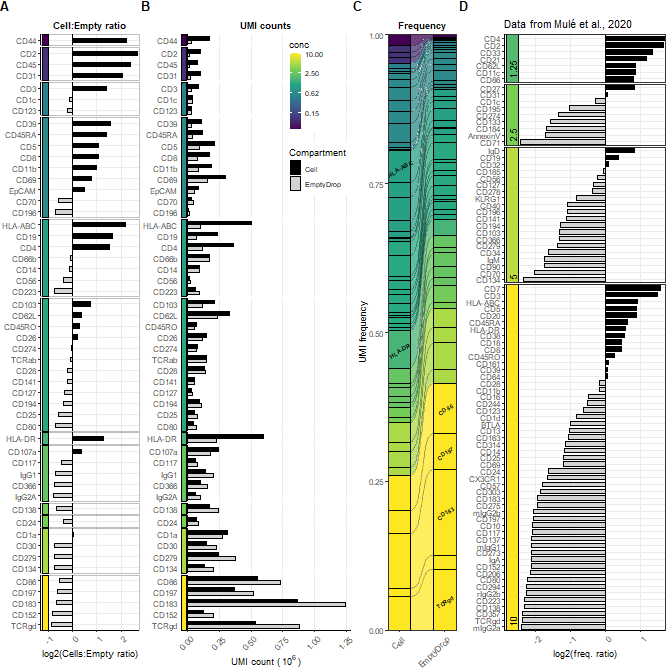

CITE-seq optimization - ADT in cell-containing vs empty drops
================
Terkild Brink Buus
30/3/2020

Background signal in CITE-seq has been proposed to be primarily caused
by free-floating antibodies and can be assessed by measuring reads from
Non-cell-containing (empty) droplets (Mulé et al. 2020). In this
vignette, we compare UMI counts from cell-containing vs. empty drops

## Load utilities

Including libraries, plotting and color settings and custom utility
functions

``` r
set.seed(114)
require("tidyverse", quietly=T)
library("Matrix", quietly=T)

## Load ggplot theme and defaults
source("R/ggplot_settings.R")

## Load helper functions
source("R/Utilities.R")

outdir <- "figures"
data.drive <- "F:/"
data.abpanel <- "data/Supplementary_Table_1.xlsx"

## Make a custom function for formatting the concentration scale
scaleFUNformat <- function(x) sprintf("%.2f", x)
```

## Load the data

The ADT UMI count data has already been loaded and filtered in the “ADT
counting methods” vignette. We’ll load it from there. This includes the
kallisto.ADT UMI count matrix as well as a list of barcodes that have
been filtered to have gene expression UMI counts above the inflection
point in the rank-barcode plot (used for calling cell-containing
vs. empty droplets).

``` r
load("data/data.ADT.Rdata")

## ADT UMI counts
kallisto.ADT[1:5,1:5]
```

    ## 5 x 5 sparse Matrix of class "dgCMatrix"
    ##       AAACCTGAGAAACCGC AAACCTGAGAAACCTA AAACCTGAGAACTCGG AAACCTGAGAACTGTA
    ## CD103                .                1                .                .
    ## CD223                2                1                .                .
    ## CD274                2                1                .                .
    ## CD45                 .                2                .                .
    ## CD134                3                4                .                .
    ##       AAACCTGAGAAGAAGC
    ## CD103                .
    ## CD223                .
    ## CD274                .
    ## CD45                 .
    ## CD134                .

``` r
## Barcodes for cell-containing droplet 
head(gex.aboveInf)
```

    ## [1] "AAACCTGAGAAACCTA" "AAACCTGAGCAGATCG" "AAACCTGAGCCGTCGT" "AAACCTGAGCGTCAAG"
    ## [5] "AAACCTGAGCGTGTCC" "AAACCTGAGCGTTGCC"

## Load antibody panel data

Antibody panel concentration data is loaded from the supplementary data
excel sheet.

``` r
abpanel <- data.frame(readxl::read_excel(data.abpanel))
rownames(abpanel) <- abpanel$Marker

head(abpanel)
```

    ##        Marker Category     Alias   Clone Isotype_Mouse Corresponding_gene
    ## CD103   CD103        B      <NA> BerACT8          IgG1              ITGAE
    ## CD107a CD107a        B     LAMP1    H4A3          IgG1              LAMP1
    ## CD117   CD117        E     C-kit   104D2          IgG1                KIT
    ## CD11b   CD11b        B      <NA>  ICRF44          IgG1              ITGAM
    ## CD123   CD123        E      <NA>     6H6          IgG1              IL3RA
    ## CD127   CD127        E IL7Ralpha  A019D5          IgG1               IL7R
    ##        TotalSeqC_Tag BioLegend_Cat Stock_conc_µg_per_mL conc_µg_per_mL
    ## CD103           0145        350233                  500          1.250
    ## CD107a          0155        328649                  500          2.500
    ## CD117           0061        313243                  500          2.500
    ## CD11b           0161        301359                  500          0.625
    ## CD123           0064        306045                  500          0.500
    ## CD127           0390        351356                  500          1.250
    ##        dilution_1x
    ## CD103          400
    ## CD107a         200
    ## CD117          200
    ## CD11b          800
    ## CD123         1000
    ## CD127          400

## Preprocess data for plotting

Make sums of ADT UMI counts within cell-containing and empty droplets.

``` r
ADT.matrix <- kallisto.ADT

## Calculate total UMI count per marker
markerUMI <- apply(ADT.matrix,1,sum)

## Calculate UMI count within cell-containing and empty droplets
markerUMI.inCell <- apply(ADT.matrix[,gex.aboveInf],1,sum)
markerUMI.inCell.freq <- markerUMI.inCell/sum(markerUMI.inCell)
markerUMI.inDrop <- markerUMI-markerUMI.inCell
markerUMI.inDrop.freq <- markerUMI.inDrop/sum(markerUMI.inDrop)

## Make DF to allow combination of the data into a "long" format
df.inCell <- data.frame(count=markerUMI.inCell, freq=markerUMI.inCell.freq, subset="Cell", marker=names(markerUMI.inCell.freq))
df.inDrop <- data.frame(count=markerUMI.inDrop, freq=markerUMI.inDrop.freq, subset="EmptyDrop", marker=names(markerUMI.inDrop.freq))

plotData <- rbind(df.inCell, df.inDrop)

## Add "metadata
plotData$conc <- abpanel[plotData$marker,"conc_µg_per_mL"]

plotData$subset <- factor(plotData$subset, levels=c("EmptyDrop","Cell"))

## Order markers according to antibody concentration and UMI frequency within empty droplets (by setting levels)
plotData$marker <- factor(plotData$marker, 
                          levels=plotData$marker[order(plotData$conc[plotData$subset=="EmptyDrop"], 
                                                       plotData$freq[plotData$subset=="EmptyDrop"])])

head(plotData)
```

    ##        count        freq subset marker conc
    ## CD103 211020 0.022481570   Cell  CD103 1.25
    ## CD223  59586 0.006348151   Cell  CD223 1.00
    ## CD274  74664 0.007954525   Cell  CD274 1.25
    ## CD45   77801 0.008288734   Cell   CD45 0.10
    ## CD134 128848 0.013727160   Cell  CD134 5.00
    ## CD56   16145 0.001720050   Cell   CD56 1.00

## Draw cell-containing to empty droplet frequency ratio plot

``` r
data.ratio <- data.frame(ratio=markerUMI.inCell.freq/markerUMI.inDrop.freq) %>% mutate(Marker=rownames(.), conc=abpanel[rownames(.),"conc_µg_per_mL"]) %>% arrange(conc, ratio)

data.ratio$Marker <- factor(data.ratio$Marker, levels=data.ratio$Marker)

p.ratio <- ggplot(data.ratio, aes(x=Marker, y=log2(ratio))) + 
  geom_bar(stat="identity", aes(fill=log2(ratio)>0), color="black", width=0.65) +
  geom_hline(yintercept=0) + 
  scale_fill_manual(values=c(`FALSE`="lightgrey",`TRUE`="black")) + 
  scale_x_discrete(expand=c(0, 0.5)) + 
  scale_y_continuous(expand=c(0,0.05,0,0.05)) + 
  coord_flip() + 
  facet_grid(rows="conc", scales="free_y", space="free_y") + 
  labs(y="log2(freq. ratio)", fill="µg/mL") + 
  theme(panel.spacing=unit(0.5,"mm"),
        axis.line=element_line(), 
        axis.title.y=element_blank(), 
        strip.placement="outside", 
        strip.text=element_blank(), 
        legend.position="none", 
        legend.justification=c(0,1),
        legend.direction="horizontal",
        legend.text.align=0, 
        legend.key.width=unit(0.3,"cm"), 
        legend.key.height=unit(0.4,"cm"), 
        legend.text=element_text(size=unit(5,"pt")))

p.ratio
```

<!-- -->

## Draw barplot of UMI counts in cell-containing and empty-droplets

``` r
plotData$marker <- factor(as.character(plotData$marker), levels=levels(data.ratio$Marker))

p.barplot <- ggplot(plotData, aes(x=marker, y=count/10^6)) + 
  geom_rect(aes(xmin=-Inf,xmax=Inf,ymin=-0.050000,ymax=-0.010000,fill=conc), col="black") + 
  scale_fill_viridis_c(trans="log2", labels=scaleFUNformat, breaks=c(0.0375,0.15,0.625,2.5,10)) + 
  ggnewscale::new_scale_fill() + 
  geom_bar(aes(fill=subset),stat="identity", position="dodge", color="black", width=0.65) + 
  geom_hline(yintercept=0, col="black") + 
  scale_fill_manual(values=c("Cell"="black","EmptyDrop"="lightgrey")) + 
  scale_x_discrete(expand=c(0, 0.5)) + 
  scale_y_continuous(expand=c(0,0,0,0.05)) + 
  coord_flip() +
  facet_grid(rows="conc", scales="free_y", space="free_y") +
  guides(fill=guide_legend(reverse=TRUE)) + 
  labs(y=bquote("UMI count ("~10^6~")"), fill="µg/mL") + 
  theme(panel.border=element_blank(), 
        panel.grid.major.y=element_blank(), 
        panel.spacing=unit(0.5,"mm"),
        axis.line=element_line(), 
        axis.title.y=element_blank(),
        axis.text.y=element_blank(), 
        strip.placement="outside", 
        strip.text=element_blank(), 
        legend.position=c(1,1), 
        legend.justification=c(1,1),
        legend.text.align=0, 
        legend.key.width=unit(0.3,"cm"), 
        legend.key.height=unit(0.4,"cm"), 
        legend.text=element_text(size=unit(5,"pt")))

p.barplot
```

<!-- -->

# Highlight markers

Determine which markers should be highlighted due to their differences
between cell-containing and empty droplets.

``` r
freq.threshold <- 0.05

plotData$highlight <- ifelse(plotData$marker %in% plotData$marker[plotData$freq >= freq.threshold],1,0)

## Determine which compartment has the highest frequency for the markers above the threshold and assign the labels accordingly
max.label <- plotData[plotData$freq >= freq.threshold,] %>% group_by(marker) %>% summarize(subset.max=subset[which.max(freq)])

plotData$label <- ifelse((paste(plotData$marker,plotData$subset) %in% 
                            paste(max.label$marker,max.label$subset.max))==FALSE | 
                           plotData$freq < freq.threshold, 
                         NA,as.character(plotData$marker))
```

## Make alluvial “river” plot of markers in each compartment

To allow labelling the markers, we need to calculate the
cummulativeFrequency.

``` r
## Order the dataframe
plotData$marker.conc <- factor(as.character(plotData$marker), levels=unique(plotData$marker[order(-plotData$conc, plotData$marker, decreasing=TRUE)]))
plotData <- plotData[order(plotData$marker.conc, decreasing=TRUE),]

plotData$cummulativeFreq <- 0
plotData$cummulativeFreq[plotData$subset=="EmptyDrop"] <- cumsum(plotData$freq[plotData$subset=="EmptyDrop"])
plotData$cummulativeFreq[plotData$subset=="Cell"] <- cumsum(plotData$freq[plotData$subset=="Cell"])

## A bit of a hack to get the columns in order
#plotData$subset.rev <- factor(as.character(plotData$subset), levels=c("Cell","EmptyDrop"))

p.alluvial <- ggplot(plotData, aes(y=freq, x=subset, fill=conc, stratum = marker.conc, alluvium = marker.conc)) + 
  ggalluvial::geom_flow(width = 1/2, color=alpha("black",0.25), alpha=0.75) + 
  ggalluvial::geom_stratum(width = 1/2) +
  geom_text(aes(y=cummulativeFreq-(freq/2),label=label), na.rm=TRUE, vjust=0.5, hjust=0.5,  angle=0, size=1.5, fontface="bold") + 
  scale_fill_viridis_c(trans="log2", labels=scaleFUNformat, breaks=c(0.0375,0.15,0.625,2.5,10)) + 
  scale_y_continuous(expand=c(0,0)) + 
  scale_x_discrete(expand=c(0,0), limits=rev(levels(plotData$subset))) + 
  labs(y="UMI frequency", fill="DF1 µg/mL") + 
  theme(legend.position="none", axis.title.x=element_blank(), panel.grid=element_blank())

p.alluvial
```

<!-- -->

## Combine figure

``` r
p.final <- cowplot::plot_grid(p.ratio + theme(plot.margin=unit(c(0.03,0,0,0),"npc")), 
                              p.barplot + theme(plot.margin=unit(c(0,0,0,-0.005),"npc"), axis.ticks.y=element_blank()), 
                              p.alluvial, 
                              nrow=1, 
                              rel_widths=c(2,4,1.5), 
                              align="h", 
                              axis="tb", 
                              labels=c("A", "B", "C"), 
                              label_size=panel.label_size, 
                              vjust=panel.label_vjust, 
                              hjust=panel.label_hjust)

p.final
```

<!-- -->

``` r
png(file=file.path(outdir,"Figure 5.png"), width=figure.width.full, height=4.5, units=figure.unit, res=figure.resolution, antialias=figure.antialias)
p.final
dev.off()
```

    ## png 
    ##   2

# Data from Mule et al 2020.

We also looked at ratio between UMI count frequency within
cell-containing and empty droplets from the Mulé et al 2020 dataset
(Available from Figshare: <https://doi.org/10.1038/s41591-020-0769-8>)

As we do not have full dataset, the UMI counts are not meaningful, but
the ratio within the cell-containing and empty droplets should still
inform on the degree of background at different antibody concentrations.

``` r
data.DSB.path <- "/Data/DSBdata"
data.cells <- file.path(data.drive,data.DSB.path,"H1_day0_demultilexed_singlets.RDS")
data.empty <- file.path(data.drive,data.DSB.path,"neg_control_object.rds")
data.conc <- file.path(data.drive,data.DSB.path,"Antibody_concentration.xlsx")
```

## Load and reformat the data

To make it more consistent with our setup, we will reformat the naming
of markers.

``` r
abpanel <- data.frame(readxl::read_excel(data.conc))
abpanel$Marker <- abpanel$Rename
rownames(abpanel) <- abpanel$Marker

cells <- readRDS(data.cells)
empty <- readRDS(data.empty)

ADT.cells <- cells@assay$CITE@raw.data
ADT.empty <- empty@assay$CITE@raw.data

renameRows <- function(names){
  names <- gsub("_PROT","",names)
  names <- gsub("Mouse IgG2bkIsotype","mIgG2b",names)   
  names <- gsub("MouseIgG1kappaisotype","mIgG1",names)
  names <- gsub("MouseIgG2akappaisotype","mIgG2a",names)
  names <- gsub("RatIgG2bkIsotype","rIgG2b",names)
  names <- gsub(" $","",names)
}

rownames(ADT.cells) <- renameRows(rownames(ADT.cells))
rownames(ADT.empty) <- renameRows(rownames(ADT.empty))
```

## Calculate UMI frequency

Within cell-containing and empty droplets

``` r
ADT.cells.marker <- Matrix::rowSums(ADT.cells)
ADT.cells.marker.freq <- ADT.cells.marker/sum(ADT.cells.marker)
ADT.empty.marker <- Matrix::rowSums(ADT.empty)
ADT.empty.marker.freq <- ADT.empty.marker/sum(ADT.empty.marker)

ADT.cellToEmptyRatio <- ADT.cells.marker.freq/ADT.empty.marker.freq
```

## Make Ratio plot

``` r
plotData <- data.frame(ratio=ADT.cellToEmptyRatio) %>% mutate(Marker=rownames(.), conc=abpanel[rownames(.),"conc"], subset=abpanel[rownames(.),"Most.positive.subset"]) %>% arrange(conc, ratio)

plotData$Marker <- factor(plotData$Marker, levels=plotData$Marker)

p.DSB.ratio <- ggplot(plotData, aes(x=Marker, y=log2(ratio))) + 
  geom_bar(stat="identity", aes(fill=log2(ratio)>0), color="black", width=0.65) +
  geom_hline(yintercept=0) + 
  scale_fill_manual(values=c(`FALSE`="lightgrey",`TRUE`="black")) + 
  ggnewscale::new_scale_fill() + 
  geom_rect(aes(xmin=-Inf,xmax=Inf,ymin=-2.5,ymax=-2.85,fill=conc), col="black") + 
  geom_text(data=plotData %>% group_by(conc) %>% summarize(length=n()) %>% mutate(subset="Cell"),aes(x=1,label=conc, y=-2.675), adj=0, vjust=0.5, size=2.5, angle=90) + 
  scale_fill_viridis_c(trans="log2", labels=scaleFUNformat, breaks=c(0.0375,0.15,0.625,2.5,10), limits=c(0.013,10)) +
  scale_x_discrete(expand=c(0, 0.5)) + 
  scale_y_continuous(expand=c(0,0.05,0,0.05)) + 
  coord_flip() + 
  facet_grid(rows="conc", scales="free_y", space="free_y") + 
  labs(y="log2(freq. ratio)", fill="µg/mL") + 
  theme(panel.spacing=unit(0.5,"mm"),
        axis.line=element_line(), 
        axis.title.y=element_blank(), 
        strip.placement="outside", 
        strip.text=element_blank(), 
        legend.position="none", 
        legend.justification=c(0,1),
        legend.direction="horizontal",
        legend.text.align=0, 
        legend.key.width=unit(0.3,"cm"), 
        legend.key.height=unit(0.4,"cm"), 
        legend.text=element_text(size=unit(5,"pt")))

p.DSB.ratio + ggtitle("Mulé et al., 2020")
```

<!-- -->

## Combine figure with Mulé data

``` r
p.final <- cowplot::plot_grid(p.ratio + theme(plot.margin=unit(c(0.03,0,0,0),"npc")), 
                              p.barplot + theme(plot.margin=unit(c(0,0,0,-0.005),"npc"), axis.ticks.y=element_blank()), 
                              p.alluvial, 
                              p.DSB.ratio + ggtitle("Data from Mulé et al., 2020"), 
                              nrow=1, 
                              rel_widths=c(2,3,1.5,3), 
                              align="h", 
                              axis="tb", 
                              labels=c("A", "B", "C", "D"), 
                              label_size=panel.label_size, 
                              vjust=panel.label_vjust, 
                              hjust=panel.label_hjust)

p.final
```

<!-- -->

``` r
png(file=file.path(outdir,"Figure 5 wMule.png"), width=figure.width.full, height=6.6, units=figure.unit, res=figure.resolution, antialias=figure.antialias)
p.final
dev.off()
```

    ## png 
    ##   2
