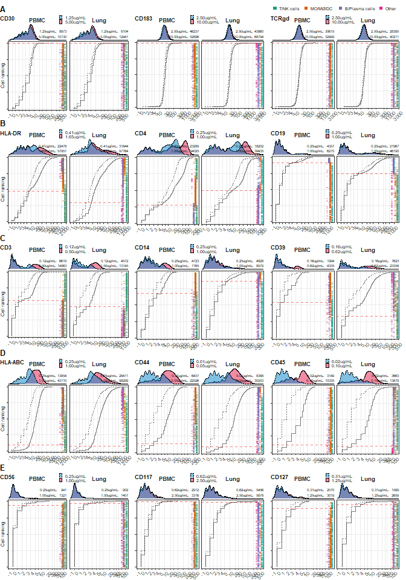

CITE-seq optimization - Antibody titration
================
Terkild Brink Buus
30/3/2020

## Load libraries etc.

``` r
set.seed(114)
require("Seurat")
```

    ## Loading required package: Seurat

``` r
require("tidyverse")
```

    ## Loading required package: tidyverse

    ## -- Attaching packages -------------------------------------------------------------------------------- tidyverse 1.3.0 --

    ## v ggplot2 3.3.0     v purrr   0.3.3
    ## v tibble  2.1.3     v dplyr   0.8.5
    ## v tidyr   1.0.2     v stringr 1.4.0
    ## v readr   1.3.1     v forcats 0.5.0

    ## -- Conflicts ----------------------------------------------------------------------------------- tidyverse_conflicts() --
    ## x dplyr::filter() masks stats::filter()
    ## x dplyr::lag()    masks stats::lag()

``` r
theme_set(theme_bw() + 
          theme(
            axis.text.x=element_text(angle=45, hjust=1), 
            panel.grid.minor = element_blank(), 
            strip.background=element_blank(), 
            strip.text=element_text(face="bold", size=10), 
            legend.position = "bottom"))

## Load helper functions (ggplot themes, biexp transformation etc.)
source("R/Utilities.R")

## Load predefined color schemes
source("R/color.R")

outdir <- "C:/Users/Terkild/OneDrive - Københavns Universitet/Koralovlab/ECCITE-seq/20200106 Titration 1"
```

## Load Seurat object

``` r
object <- readRDS(file="data/5P-CITE-seq_Titration.rds")

## Show number of cells from each sample
table(object$group)
```

    ## 
    ## PBMC_50ul_1_1000k PBMC_50ul_4_1000k PBMC_25ul_4_1000k  PBMC_25ul_4_200k 
    ##              1881              2167              2447              3070 
    ##  Lung_50ul_1_500k  Lung_50ul_4_500k           Doublet          Negative 
    ##              1876              1897                 0                 0

``` r
Idents(object) <- object$group

## While cell numbers are close, comparison is easier if we downsample to the same number of cells
object <- subset(object, subset=volume == "50µl", downsample=1800)
object
```

    ## An object of class Seurat 
    ## 33572 features across 7200 samples within 3 assays 
    ## Active assay: RNA.kallisto (33514 features)
    ##  2 other assays present: HTO.kallisto, ADT.kallisto
    ##  3 dimensional reductions calculated: pca, tsne, umap

## Cell type and tissue overview

``` r
p.tsne.tissue <- DimPlot(object, group.by="tissue", reduction="tsne", combine=FALSE)[[1]] + theme_get() + facet_wrap(~"Tissue") + scale_color_manual(values=color.tissue)

p.tsne.cluster <- DimPlot(object, group.by="supercluster", reduction="tsne", combine=FALSE)[[1]] + theme_get() + scale_color_manual(values=color.supercluster) + facet_wrap(~"Cell types")

p.tsne.finecluster <- DimPlot(object, label = T, reduction="tsne", group.by="fineCluster", combine=FALSE)[[1]] + theme_get() + facet_wrap( ~"Clusters") + guides(col=F)
```

    ## Warning: Using `as.character()` on a quosure is deprecated as of rlang 0.3.0.
    ## Please use `as_label()` or `as_name()` instead.
    ## This warning is displayed once per session.

``` r
p.tsne.cluster + p.tsne.finecluster + p.tsne.tissue
```

<!-- -->

## Overall ADT counts

Samples stained with diluted Ab panel have reduced ADT counts.

``` r
ADTcount.Abtitration <- data.frame(FetchData(object, vars=c("dilution", "tissue")), count=apply(GetAssayData(object, assay="ADT.kallisto", slot="counts"),2,sum)) %>% group_by(tissue, dilution) %>% summarise(sum=sum(count))

p.ADTcount.Abtitration <- ggplot(ADTcount.Abtitration, aes(x=dilution, y=sum/10^6, fill=dilution)) + geom_bar(stat="identity", col="black") + facet_wrap(~tissue) + scale_fill_manual(values=color.dilution) + scale_y_continuous(expand=c(0,0,0,0.05)) + guides(fill=FALSE) + ylab("ADT UMI count (x10^6)") + theme(panel.grid.major=element_blank(), axis.title.x=element_blank(), panel.border=element_blank(), axis.line = element_line())

p.ADTcount.Abtitration
```

<!-- -->

## ADT sum rank by cell

Samples stained with diluted Ab panel have reduced ADT counts evenly
distributed among cells

``` r
source("R/foot_plot.R")
p.ADTrank.Abtitration <- foot_plot(data=object$nCount_ADT.kallisto, group=object$group, linetype=object$dilution, wrap=object$tissue, barcodeGroup=object$supercluster, draw.line=TRUE, draw.barcode=TRUE, draw.points=FALSE, draw.fractile=FALSE, trans="log10", barcode.stepSize = 0.1, colors=color.supercluster) + labs(linetype="Dilution factor", color="Cell type") + ylab("ADT UMI count")
```

    ## Loading required package: ggrepel

``` r
p.ADTrank.Abtitration
```

<!-- -->

## Load Ab panel annotation and concentrations

``` r
abpanel <- data.frame(readxl::read_excel("data/Supplementary_Table_1.xlsx"))
rownames(abpanel) <- abpanel$Marker
```

``` r
ADT.matrix <- data.frame(GetAssayData(object, assay="ADT.kallisto", slot="counts"))
ADT.matrix$marker <- rownames(ADT.matrix)
ADT.matrix$conc <- abpanel[ADT.matrix$marker,"conc_µg_per_mL"]
ADT.matrix <- ADT.matrix %>% pivot_longer(c(-marker,-conc))
cell.annotation <- FetchData(object, vars=c("dilution", "tissue"))
#ADT.matrix$dilution <- cell.annotation[ADT.matrix$name,"dilution"] 

ADT.matrix.agg <- ADT.matrix %>% group_by(dilution=cell.annotation[name,"dilution"], tissue=cell.annotation[name,"tissue"], marker, conc) %>% summarise(sum=sum(value))

marker.order <- ADT.matrix.agg$marker[order(-ADT.matrix.agg$conc[(ADT.matrix.agg$dilution == "DF1" & ADT.matrix.agg$tissue == "Lung")], ADT.matrix.agg$sum[(ADT.matrix.agg$dilution == "DF1" & ADT.matrix.agg$tissue == "Lung")], decreasing = FALSE)]

ADT.matrix.agg$marker.byConc <- factor(ADT.matrix.agg$marker, levels=marker.order)

ann.markerConc <- abpanel[marker.order,]
ann.markerConc$Marker <- factor(marker.order, levels=marker.order)

lines <- length(marker.order)-cumsum(sapply(split(ann.markerConc$Marker,ann.markerConc$conc_µg_per_mL),length))+0.5
lines <- data.frame(breaks=lines[-length(lines)])

p1 <- ggplot(ann.markerConc, aes(x=Marker, y=1, fill=conc_µg_per_mL)) + geom_bar(stat="identity")+ scale_fill_viridis_c(trans="log2") + theme_minimal() + theme(axis.title = element_blank(), axis.text.x=element_blank(), panel.grid=element_blank(), legend.position="right", plot.margin=unit(c(0,0,0,0),"cm")) + scale_y_continuous(expand=c(0,0)) + labs(fill="µg/mL") + geom_vline(data=lines,aes(xintercept=breaks), linetype="dashed", alpha=0.5) + coord_flip()

p2 <- ggplot(ADT.matrix.agg, aes(x=marker.byConc,y=log2(sum))) + geom_line(aes(group=marker), size=2, color="#666666") + geom_point(aes(group=dilution, fill=dilution), pch=21) + facet_wrap(~tissue) + scale_fill_manual(values=color.dilution) + geom_vline(data=lines,aes(xintercept=breaks), linetype="dashed", alpha=0.5) + theme(axis.title.y=element_blank(), axis.text.y=element_blank(), legend.position="right", legend.justification="left", legend.title.align=0, legend.key.width=unit(0.2,"cm")) + ylab("log2(UMI sum)") + scale_y_continuous(breaks=c(9:17)) + coord_flip()

library(patchwork)
titration.totalCount <- p1 + guides(fill=F) + p2 + guides(fill=F) + plot_spacer() + guide_area() + plot_layout(ncol=4, widths=c(1,30,0.1), guides='collect')

titration.totalCount
```

<!-- -->

## Overall ADT counts

Samples stained with diluted Ab panel have reduced ADT counts.

``` r
scaleFUN <- function(x) sprintf("%.2f", x)

p.ADTcount.AbtitrationByConc <- ggplot(ADT.matrix.agg[order(-ADT.matrix.agg$conc, ADT.matrix.agg$sum),], aes(x=dilution, y=sum/10^6, fill=conc)) + geom_bar(stat="identity", col=alpha(col="black",alpha=0.05)) + facet_wrap(~tissue) + scale_fill_viridis_c(trans="log2", labels=scaleFUN, breaks=c(0.0375,0.15,0.625,2.5,10)
) + scale_y_continuous(expand=c(0,0,0,0.05)) + guides() + ylab("ADT UMI count (x10^6)") + theme(panel.grid.major=element_blank(), axis.title.x=element_blank(), panel.border=element_blank(), axis.line = element_line(), legend.position="right") + labs(fill="µg/mL") + guides(fill=guide_colourbar(reverse=T))

p.ADTcount.AbtitrationByConc
```

<!-- -->

Plot change by dilution. We modified our approach of using a specific
fractile as this may be prone to outliers in small clusters (i.e. the
0.9 fractile of a cluster of 30 will be the \#3 higest cell making it
prone to outliers). We thus set a threshhold of the value to be lower
than the expression of the 10th highest cell value within the cluster
with highest expression.

``` r
ADT.matrix <- data.frame(GetAssayData(object, assay="ADT.kallisto", slot="counts"))
ADT.matrix$marker <- rownames(ADT.matrix)
ADT.matrix$conc <- abpanel[ADT.matrix$marker,"conc_µg_per_mL"]
ADT.matrix <- ADT.matrix %>% pivot_longer(c(-marker,-conc))

cell.annotation <- FetchData(object, vars=c("dilution", "tissue", "fineCluster"))


## nth function extracts the value at a set fractile or at the 10th event depending on which is lowest
nth <- function(value, nth=10, fractile=0.9){
  if(length(value)*(1-fractile) <= nth){
    newvalue <- sort(value, decreasing=TRUE)[nth]
  } else {
    newvalue <- quantile(value, probs=c(fractile))
  }
  return(newvalue)
}

ADT.matrix.agg <- ADT.matrix %>% group_by(dilution=cell.annotation[name,"dilution"], tissue=cell.annotation[name,"tissue"], ident=cell.annotation[name,"fineCluster"], marker, conc) %>% summarise(sum=sum(value), median=quantile(value, probs=c(0.9)), nth=nth(value))

Cluster.max <- ADT.matrix.agg %>% group_by(marker, tissue) %>% summarize(ident=ident[which.max(nth)])

ADT.matrix.aggByClusterMax <- Cluster.max %>% left_join(ADT.matrix.agg)
```

    ## Joining, by = c("marker", "tissue", "ident")

``` r
ADT.matrix.aggByClusterMax$marker.byConc <- factor(ADT.matrix.aggByClusterMax$marker, levels=marker.order)

p3 <- ggplot(ADT.matrix.aggByClusterMax, aes(x=marker.byConc, y=log2(nth))) + geom_line(aes(group=marker), size=2, color="#666666") + geom_point(aes(group=dilution, fill=dilution), pch=21) + facet_wrap(~tissue) + scale_fill_manual(values=color.dilution) + geom_vline(data=lines,aes(xintercept=breaks), linetype="dashed", alpha=0.5) + theme(axis.title.y=element_blank(), axis.text.y=element_blank(), legend.position="right", legend.justification="left", legend.title.align=0, legend.key.width=unit(0.2,"cm")) + ylab("90th percentile UMI of expressing cluster") + scale_y_continuous(breaks=c(0:11), labels=2^c(0:11), expand=c(0.05,0.5)) + coord_flip() +
## To add a label indicating which cluster is used in the calculation, add:
  geom_text(aes(label=ident), y=Inf, adj=1, size=2.5)

titration.clusterCount <- p1 + theme(legend.position="none") + p3 + theme(legend.position="none") + plot_spacer() + plot_layout(ncol=4, widths=c(1,30,0.1), guides='collect')

titration.clusterCount
```

<!-- -->

## Final plot

``` r
## First row of plots
A <- p.tsne.cluster + theme(axis.text.x=element_blank(), axis.text.y=element_blank(), axis.title.x=element_blank(), axis.title.y=element_text()) + theme(legend.position=c(0.5,0.01), legend.justification=c(0.5,1), legend.margin=margin(0,0,0,0), legend.title = element_blank(), legend.background=element_blank()) + guides(color=guide_legend(ncol=2, override.aes=list(shape=19, size=3), keyheight=unit(0.4, "cm"), keywidth=unit(0.3, "cm")))
B <- p.tsne.finecluster + theme(axis.text.x=element_blank(), axis.text.y=element_blank(), axis.title.y=element_blank(), axis.title.x=element_text())
C <- p.tsne.tissue + theme(axis.text.x=element_blank(), axis.text.y=element_blank(), axis.title.y=element_blank(),axis.title.x=element_blank()) + theme(legend.position=c(0.5,0.01), legend.justification=c(0.5,2), legend.margin=margin(0,0,0,0), legend.title = element_blank(), legend.direction="horizontal", legend.background=element_blank()) + guides(color=guide_legend(override.aes=list(shape=19, size=3), keyheight=unit(0.4, "cm"), keywidth=unit(0.3, "cm")))

D <- p.ADTcount.AbtitrationByConc + theme(legend.key.width=unit(0.3,"cm"), legend.text = element_text(size=8))#p.ADTcount.Abtitration

E1 <- p1 + theme(text = element_text(size=10))
E.legend <- cowplot::get_legend(E1)
E1 <- E1 + theme(legend.position="none")
E2 <- p2
E2 <- E2 + theme(legend.position="none")
F1 <- p3 + theme(legend.position="none")

AD <- cowplot::plot_grid(A, B, C, D, labels=c("A", "B", "C", "D"), nrow=1, align="h", axis="b", rel_widths = c(2.2,2,2,2.2))

EF <- cowplot::plot_grid(E1, E2, E1, F1, nrow=1, align="h", axis="tb", labels=c("E", "", "F", ""), rel_widths=c(2,10,2,10))

png(file=file.path(outdir,"Figure 1.png"), width=10, height=9, units = "in", res=300)
cowplot::plot_grid(AD, EF, ncol=1, rel_heights=c(2.3,5), align="v", axis="l")
dev.off()
```

    ## png 
    ##   2

## Titration examples

``` r
## Partial responders that can be economically titrated
# CD4, CD19, CD103
curMarker.name <- "CD4"
curMarker.DF1conc <- abpanel[curMarker.name, "conc_µg_per_mL"]
gate <- data.frame(wrap=factor(c("PBMC","Lung"),levels=c("PBMC","Lung")),gate=c(0.28,0.46))

p.CD4 <- foot_plot_density_custom(marker=paste0("adt_",curMarker.name), conc=curMarker.DF1conc, gates=gate, legend=TRUE)
```

    ## 
    ## ********************************************************

    ## Note: As of version 1.0.0, cowplot does not change the

    ##   default ggplot2 theme anymore. To recover the previous

    ##   behavior, execute:
    ##   theme_set(theme_cowplot())

    ## ********************************************************

    ## 
    ## Attaching package: 'cowplot'

    ## The following object is masked from 'package:patchwork':
    ## 
    ##     align_plots

``` r
p.CD4
```

<!-- -->

``` r
curMarker.name <- "CD19"
curMarker.DF1conc <- abpanel[curMarker.name, "conc_µg_per_mL"]
gate <- data.frame(wrap=factor(c("PBMC","Lung"),levels=c("PBMC","Lung")),gate=c(0.91,0.71))

p.CD19 <- foot_plot_density_custom(marker=paste0("adt_",curMarker.name), conc=curMarker.DF1conc, gates=gate, legend=FALSE)
p.CD19
```

<!-- -->

``` r
curMarker.name <- "HLA-DR"
curMarker.DF1conc <- abpanel[curMarker.name, "conc_µg_per_mL"]
gate <- data.frame(wrap=factor(c("PBMC","Lung"),levels=c("PBMC","Lung")),gate=c(0.47,0.295))

p.HLADR <- foot_plot_density_custom(marker=paste0("adt_",curMarker.name), conc=curMarker.DF1conc, gates=gate, legend=FALSE)
p.HLADR
```

<!-- -->

``` r
A <- cowplot::plot_grid(p.HLADR, p.CD4, p.CD19, nrow=1)

## Markers that should not be reduced
# CD39, CD14, CD3
curMarker.name <- "CD3"
curMarker.DF1conc <- abpanel[curMarker.name, "conc_µg_per_mL"]
gate <- data.frame(wrap=factor(c("PBMC","Lung"),levels=c("PBMC","Lung")),gate=c(0.55,0.45))

p.CD3 <- foot_plot_density_custom(marker=paste0("adt_",curMarker.name), conc=curMarker.DF1conc, gates=gate, legend=FALSE)
p.CD3
```

<!-- -->

``` r
curMarker.name <- "CD14"
curMarker.DF1conc <- abpanel[curMarker.name, "conc_µg_per_mL"]
gate <- data.frame(wrap=factor(c("PBMC","Lung"),levels=c("PBMC","Lung")),gate=c(0.58,0.79))

p.CD14 <- foot_plot_density_custom(marker=paste0("adt_",curMarker.name), conc=curMarker.DF1conc, gates=gate, legend=FALSE)
p.CD14
```

<!-- -->

``` r
curMarker.name <- "CD39"
curMarker.DF1conc <- abpanel[curMarker.name, "conc_µg_per_mL"]
gate <- data.frame(wrap=factor(c("PBMC","Lung"),levels=c("PBMC","Lung")),gate=c(0.54,0.32))

p.CD39 <- foot_plot_density_custom(marker=paste0("adt_",curMarker.name), conc=curMarker.DF1conc, gates=gate, legend=FALSE)
p.CD39
```

<!-- -->

``` r
B <- cowplot::plot_grid(p.CD3, p.CD14, p.CD39, nrow=1)

## Ubiqutously expressed markers
# HLA-ABC, CD44, CD45
curMarker.name <- "HLA-ABC"
curMarker.DF1conc <- abpanel[curMarker.name, "conc_µg_per_mL"]

p.HLA <- foot_plot_density_custom(marker=paste0("adt_",curMarker.name), conc=curMarker.DF1conc, legend=FALSE)

curMarker.name <- "CD44"
curMarker.DF1conc <- abpanel[curMarker.name, "conc_µg_per_mL"]

p.CD44 <- foot_plot_density_custom(marker=paste0("adt_",curMarker.name), conc=curMarker.DF1conc, legend=FALSE)

curMarker.name <- "CD45"
curMarker.DF1conc <- abpanel[curMarker.name, "conc_µg_per_mL"]
gate <- data.frame(wrap=factor(c("PBMC","Lung"),levels=c("PBMC","Lung")),gate=c(0,0.07))

p.CD45 <- foot_plot_density_custom(marker=paste0("adt_",curMarker.name), conc=curMarker.DF1conc, gates=gate, legend=FALSE)

C <- cowplot::plot_grid(p.HLA, p.CD44, p.CD45, nrow=1)


png(file=file.path(outdir,"Figure 2.png"), width=16, height=13.5, units = "in", res=300)
cowplot::plot_grid(NULL, NULL, A, NULL, B, NULL, C, labels=c("","Figure 2","A","","B","","C"), vjust=-0.5, hjust=0, label_size=20, ncol=1, rel_heights= c(1.6,1.5,20,1.5,20,1.5,20))
dev.off()
```

    ## png 
    ##   2

## Print individual titration plots (for each marker)

For supplementary figure

``` r
plots <- list()
markers <- intersect(abpanel[order(desc(abpanel$conc_µg_per_mL), abpanel$Marker),"Marker"],rownames(object[["ADT.kallisto"]]))

for(i in seq_along(markers)){
  curMarker.name <- markers[i]
  curMarker.DF1conc <- abpanel[curMarker.name, "conc_µg_per_mL"]
  curLegend <- ifelse(i %in% c(1,16,31,46),TRUE,FALSE)
  plot <- foot_plot_density_custom(marker=paste0("adt_",curMarker.name), conc=curMarker.DF1conc, legend=curLegend)
  plots[[i]] <- plot
}

pdf(file=file.path(outdir,"Supplementary Figure 1.pdf"), width=16, height=22)
ggdraw(plot_grid(NULL, plot_grid(plotlist=plots[1:15],ncol=3, align="h", axis="tb"), ncol=1, rel_heights=c(1,70))) + draw_label(label="Figure S1A",x=0, y=1, hjust=0, vjust=0.98, size = 20)
ggdraw(plot_grid(NULL, plot_grid(plotlist=plots[16:30],ncol=3, align="h", axis="tb"), ncol=1, rel_heights=c(1,70))) + draw_label(label="Figure S1B",x=0, y=1, hjust=0, vjust=0.98, size = 20)
ggdraw(plot_grid(NULL, plot_grid(plotlist=plots[31:45],ncol=3, align="h", axis="tb"), ncol=1, rel_heights=c(1,70))) + draw_label(label="Figure S1C",x=0, y=1, hjust=0, vjust=0.98, size = 20)
ggdraw(plot_grid(NULL, plot_grid(plotlist=plots[46:52],ncol=3, align="h", axis="tb"), NULL, ncol=1, rel_heights=c(1,70*(3/5),70*(2/5)))) + draw_label(label="Figure S1D",x=0, y=1, hjust=0, vjust=0.98, size = 20)
dev.off()
```

    ## png 
    ##   2
