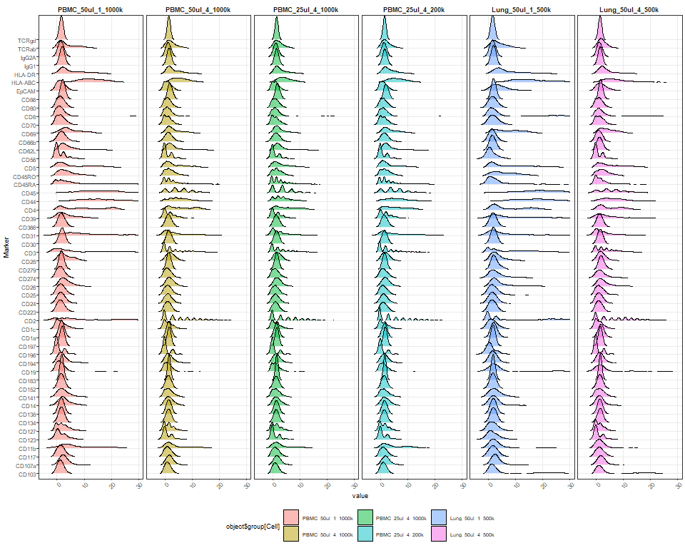
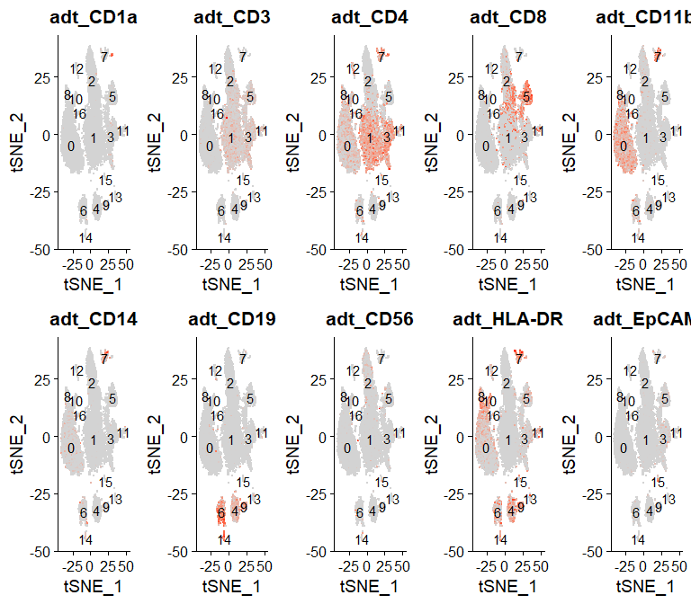

CITE-seq optimization - Demux, Pre-process and downsample
================
Terkild Brink Buus
30/3/2020

## Load utilities

Including libraries, plotting and color settings and custom utility
functions

``` r
set.seed(114)
require("Seurat", quietly=T)
require("tidyverse", quietly=T)
library("Matrix", quietly=T)
library("DropletUtils", quietly=T)

## Load ggplot theme and defaults
source("R/ggplot_settings.R")

## Load helper functions
source("R/Utilities.R")

## Load predefined color schemes
source("R/color.R")

read_kallisto_data <- function(file.path){
  ## Load mtx and transpose it
  res_mat <- as(t(readMM(file.path(file.path,"cells_x_genes.mtx"))), 'CsparseMatrix') 
  ## Attach genes
  rownames(res_mat) <- read.csv(file.path(file.path,"cells_x_genes.genes.txt"), sep = '\t', header = F)[,1]
  ## Attach barcodes
  colnames(res_mat) <- read.csv(file.path(file.path,"cells_x_genes.barcodes.txt"), header = F, sep = '\t')[,1]
  
  return(res_mat)
}

data.drive <- "F:/"
data.project.dir <- "Projects/ECCITE-seq/TotalSeqC_TitrationA"
outdir <- "figures"
t2g.file <- file.path(data.drive,data.project.dir,"/kallisto/t2g_cellranger.txt")

kallistobusDir <- file.path(data.drive,data.project.dir,"kallisto/gex/c1/counts_unfiltered")
kallistobusDirADT <- file.path(data.drive,data.project.dir,"kallisto/features/A1_S5.ADT_15/counts_unfiltered")
kallistobusDirHTO <- file.path(data.drive,data.project.dir,"kallisto/features/H1_S6.HTO_A_13/counts_unfiltered")

data.abpanel <- "data/Supplementary_Table_1.xlsx"
```

## Load data

From kallisto-bustools output. Modified from
<https://github.com/Sarah145/scRNA_pre_process>

``` r
raw_mtx <- read_kallisto_data(kallistobusDir)

t2g <- unique(read.csv(t2g.file, sep = '\t', header=F)[,2:3]) # load t2g file
t2g <- data.frame(t2g[,2], row.names = t2g[,1])
gene_sym <- t2g[as.character(rownames(raw_mtx)),1] # get symbols for gene ids

# Which rows have same gene symbol (but different Ensembl gene id)
gene_sym.duplicated <- which(gene_sym %in% gene_sym[which(duplicated(gene_sym))])

# Which genes are have duplicated entries
gene_sym.duplicated.unique <- unique(gene_sym[gene_sym.duplicated])

# Make placeholder matrix for duplicate gene symbols
raw_mtx_dedup <- Matrix(data=0,nrow=length(gene_sym.duplicated.unique),ncol=ncol(raw_mtx))
rownames(raw_mtx_dedup) <- gene_sym.duplicated.unique
colnames(raw_mtx_dedup) <- colnames(raw_mtx)

# Combine counts from genes with same gene symbol (but different Ensembl gene id)
for(i in seq_along(gene_sym.duplicated)){
  curGene <- gene_sym[gene_sym.duplicated[i]]
  curRow <- gene_sym.duplicated.unique == curGene
  raw_mtx_dedup[curRow,] <- raw_mtx_dedup[curRow,] + raw_mtx[gene_sym.duplicated[i],]
}

# Merged combined counts duplicate gene symbol with matrix of unique gene symbol counts
raw_mtx <- raw_mtx[-gene_sym.duplicated,]
rownames(raw_mtx) <- gene_sym[-gene_sym.duplicated]
raw_mtx <- rbind(raw_mtx,raw_mtx_dedup)

tot_counts <- Matrix::colSums(raw_mtx)
bc_rank <- DropletUtils::barcodeRanks(raw_mtx, lower = 10)

GEX.knee_plot <- knee_plot(bc_rank)

kallisto.GEX <- raw_mtx
```

# Load Kallisto HTO data

``` r
HTO.res_mat <- read_kallisto_data(kallistobusDirHTO)

HTO.tot_counts <- Matrix::colSums(HTO.res_mat)
HTO.bc_rank <- DropletUtils::barcodeRanks(HTO.res_mat, lower = 10)

HTO.knee_plot <- knee_plot(HTO.bc_rank)
kallisto.HTO <- HTO.res_mat
```

# Load Kallisto ADT data

``` r
ADT.res_mat <- read_kallisto_data(kallistobusDirADT)

ADT.tot_counts <- Matrix::colSums(ADT.res_mat)
ADT.bc_rank <- DropletUtils::barcodeRanks(ADT.res_mat, lower = 10)

ADT.knee_plot <- knee_plot(ADT.bc_rank)
kallisto.ADT <- ADT.res_mat
```

Plot Barcode-rank plots

``` r
cowplot::plot_grid(GEX.knee_plot, HTO.knee_plot, ADT.knee_plot, nrow=1, labels=c("GEX","HTO","ADT"))
```

<!-- -->

## Demultiplex by HTO

Use Seurat MULTIseqDemux to demultiplex samples (by their hashing
antibody signal = HTO)

``` r
object <- CreateSeuratObject(counts = kallisto.HTO, assay="HTO.kallisto")
object <- NormalizeData(object, assay = "HTO.kallisto", normalization.method = "CLR")

## Assure the matrices are in the same barcode-space
commonDrops <- Reduce("intersect",x=list(colnames(kallisto.HTO),colnames(kallisto.ADT),colnames(kallisto.GEX)))

length(commonDrops)
```

    ## [1] 149469

``` r
object <- subset(object, cells=commonDrops)
object[["ADT.kallisto"]] <- CreateAssayObject(counts=kallisto.ADT[,commonDrops])
object[["RNA.kallisto"]] <- CreateAssayObject(counts=kallisto.GEX[,commonDrops])
Key(object[["RNA.kallisto"]]) <- "rna_"
Key(object[["ADT.kallisto"]]) <- "adt_"
Key(object[["HTO.kallisto"]]) <- "hto_"


## MULTIseqDemux seems better when using unfiltered input (including empty droplets)
object <- MULTIseqDemux(object, assay="HTO.kallisto")

RidgePlot(object, assay = "HTO.kallisto", features = rownames(object[["HTO.kallisto"]]))
```

<!-- -->

``` r
table(object$MULTI_ID)
```

    ## 
    ##        1        2        3        4        5        6  Doublet Negative 
    ##     2196     2593     2895     3692     2152     2308     3724   129909

``` r
object$sampleID <- object$MULTI_ID

object <- CalculateBarcodeInflections(object,barcode.column="nCount_HTO.kallisto",group.column="sampleID",threshold.low=1000)
Seurat::BarcodeInflectionsPlot(object) + scale_x_continuous(trans="log10")
```

<!-- -->

``` r
object.empty <- subset(object, subset=sampleID == "Negative")
object <- subset(object, subset=sampleID %in% c(1:6))
```

## Assign annotation to each cell

``` r
## Rename groups to meaningful names
groups <- c("PBMC_50ul_1_1000k","PBMC_50ul_4_1000k","PBMC_25ul_4_1000k","PBMC_25ul_4_200k","Lung_50ul_1_500k","Lung_50ul_4_500k","Doublet","Negative")
object$group <- object$sampleID

## Keep ordering of groups for best plotting
levels(object$group) <- groups

object$tissue <- factor(c("PBMC","PBMC","PBMC","PBMC","Lung","Lung","Doublet","Negative")[object$sampleID],levels=c("PBMC","Lung"))
object$volume <- factor(c("50µl","50µl","25µl","25µl","50µl","50µl","Doublet","Negative")[object$sampleID], levels=c("50µl","25µl","Doublet","Negative"))
object$dilution <- factor(c("DF1","DF4","DF4","DF4","DF1","DF4","Doublet","Negative")[object$sampleID], levels=c("DF1","DF4","Doublet","Negative"))
object$cellsAtStaining <- factor(c("1000k","1000k","1000k","200k","500k","500k","Doublet","Negative")[object$sampleID], levels=c("1000k","500k","200k","Doublet","Negative"))
```

## Filter dead/dying cells

Based on mitochondrial reads and number of detected genes. Cutoff set to
15% MT and at least 60 expressed genes by visual inspection. The number
of expressed genes is low due to the low depth of the GEX sequencing
(5000 reads/cell)

``` r
DefaultAssay(object) <- "RNA.kallisto"
object[["percent.mt"]] <- PercentageFeatureSet(object, pattern = "^MT-")

cutoff.percent.mt <- 15
cutoff.nFeature <- 60
FeatureScatter(object, feature1 = "percent.mt", feature2 = "nFeature_RNA.kallisto") + ggplot2::geom_vline(xintercept=cutoff.percent.mt,linetype="dashed") + scale_y_continuous(trans="log10") + ggplot2::geom_hline(yintercept=cutoff.nFeature,linetype="dashed")
```

<!-- -->

``` r
table(object[["percent.mt"]]<cutoff.percent.mt & object[["nFeature_RNA.kallisto"]]>cutoff.nFeature, object$sampleID)
```

    ##        
    ##            1    2    3    4    5    6 Doublet Negative
    ##   FALSE  315  426  448  623  276  411       0        0
    ##   TRUE  1881 2167 2447 3069 1876 1897       0        0

``` r
object <- subset(object, subset = percent.mt <= cutoff.percent.mt & nFeature_RNA.kallisto > cutoff.nFeature)
```

## Filter doublets

Doublet rate calculated from: <https://satijalab.org/costpercell> at
18,000 cells and 6 multiplexed samples (3.27% after HTO demux)

``` r
library(scDblFinder)
DefaultAssay(object) <- "RNA.kallisto"

sce <- as.SingleCellExperiment(object)
sce <- scDblFinder(sce, dbr=0.0327, samples="sampleID")

table(sce$scDblFinder.class, sce$sampleID)
```

    ##          
    ##              1    2    3    4    5    6 Doublet Negative
    ##   doublet   62   72   71   78   44   65       0        0
    ##   singlet 1819 2095 2376 2992 1832 1832       0        0

``` r
identical(colnames(object),colnames(sce))
```

    ## [1] TRUE

``` r
object$scDblFinder.class <- sce$scDblFinder.class
object$scDblFinder.score <- sce$scDblFinder.score
object$scDblFinder.ratio <- sce$scDblFinder.ratio
object$scDblFinder.weighted <- sce$scDblFinder.weighted
rm(sce)

object$scDblFinder.class <- factor(object$scDblFinder.class, levels=c("singlet","doublet"))
  
FeatureScatter(object, feature1 = "nCount_RNA.kallisto", feature2 = "nFeature_RNA.kallisto", group.by="scDblFinder.class", cols=c(alpha("blue",0.01),alpha("red",0.5))) + scale_y_continuous(trans="log10") + scale_x_continuous(trans="log10")
```

<!-- -->

``` r
object <- subset(object, subset=scDblFinder.class=="singlet")
```

## Make DSB normalization

Normalize ADT counts using the “Denoised and Scaled by Background”
method (<https://mattpm.github.io/dsb/>). This method utilizes the ADT
signal in non-cell-containing droplets and signal form isotype controls
to make normalized values. The normalized values correspond to number of
standard deviations from the background median.

``` r
#devtools::install_github(repo = 'MattPM/dsb')
library(dsb)

neg_adt_matrix = GetAssayData(object.empty, assay = "ADT.kallisto", slot = 'counts') %>% as.matrix()
positive_adt_matrix = GetAssayData(object, assay = "ADT.kallisto", slot = 'counts') %>% as.matrix()
isotypes = c("IgG2A","IgG1")

normalized_matrix_individual <- positive_adt_matrix

for(i in c(1:6)){
  curCells <- which(object$sampleID == i)
  normalized_matrix_individual[,curCells] = DSBNormalizeProtein(cell_protein_matrix = positive_adt_matrix[,curCells],
                                        empty_drop_matrix = neg_adt_matrix,
                                        use.isotype.control = TRUE,
                                        isotype.control.name.vec = isotypes)
}

object = SetAssayData(object=object, assay="ADT.kallisto", slot="data", new.data = normalized_matrix_individual)

plotData <- as.data.frame(normalized_matrix_individual)
plotData$Marker <- rownames(plotData)
plotData <- reshape2::melt(plotData, id.vars=c("Marker"))
colnames(plotData) <- c("Marker","Cell","value")
ggplot(plotData,aes(x=value,y=Marker,fill=object$group[Cell])) + ggridges::geom_density_ridges(alpha=0.5, scale=3, rel_min_height = 0.01) + xlim(-5,30) + facet_grid(~object$group[Cell])
```

<!-- -->

## Preprocess data

Run standard Seurat preprocessing on RNA modality.

``` r
object <- NormalizeData(object)
object <- FindVariableFeatures(object)
object <- ScaleData(object)
object <- RunPCA(object, verbose = FALSE)
object <- FindNeighbors(object, dims = 1:30)
object <- FindClusters(object, resolution = 0.3)
```

    ## Modularity Optimizer version 1.3.0 by Ludo Waltman and Nees Jan van Eck
    ## 
    ## Number of nodes: 12946
    ## Number of edges: 578929
    ## 
    ## Running Louvain algorithm...
    ## Maximum modularity in 10 random starts: 0.9391
    ## Number of communities: 17
    ## Elapsed time: 2 seconds

``` r
object <- RunTSNE(object,dims=1:30)
object <- RunUMAP(object,dims=1:30)

DimPlot(object, group.by="tissue", reduction="tsne")
```

<!-- -->

``` r
DimPlot(object, group.by="group", reduction="tsne")
```

<!-- -->

``` r
DimPlot(object, label=TRUE, reduction="tsne")
```

<!-- -->

## Label and merge clusters into “superclusters”

To make the poulations less complex and for easier visualization, we
merged the clusters into major cell types.

``` r
## LINEAGE MARKERS FOR CLUSTERLABELLING
ADTplots <- FeaturePlot(object, features=c("adt_CD1a","adt_CD3","adt_CD4","adt_CD8","adt_CD11b","adt_CD14","adt_CD19","adt_CD56","adt_HLA-DR","adt_EpCAM"), label=TRUE, reduction="tsne", min.cutoff=4, col=c("lightgrey","red"), combine=FALSE)
ADTplots <- lapply(ADTplots,FUN=function(x)x+NoLegend())
CombinePlots(ADTplots,ncol=5)
```

<!-- -->

``` r
library("dplyr")
cluster.markers <- FindAllMarkers(object, only.pos = TRUE, min.pct = 0.25, logfc.threshold = 0.25)
top5 <- cluster.markers %>% group_by(cluster) %>% top_n(n = 5, wt = avg_logFC)
DoHeatmap(object, features = top5$gene, slot = "data") + NoLegend() + ggplot2::scale_fill_gradientn(colors = c("blue", "white", "red"))
```

<!-- -->

Combine clusters into superclusters (corresponding roughly to cell
types)

``` r
## COMBINE CLUSTERS TO SUPERCLUSTERS
superclusters <- c("0"="MO/MØ/DC",
                   "1"="T/NK cells",
                   "2"="T/NK cells",
                   "3"="T/NK cells",
                   "4"="B/Plasma cells",
                   "5"="T/NK cells",
                   "6"="B/Plasma cells",
                   "7"="MO/MØ/DC",
                   "8"="MO/MØ/DC",
                   "9"="B/Plasma cells",
                   "10"="MO/MØ/DC",
                   "11"="T/NK cells",
                   "12"="Other",
                   "13"="Other",
                   "14"="B/Plasma cells",
                   "15"="Other",
                   "16"="MO/MØ/DC")

object$supercluster <- factor(superclusters[as.character(Idents(object))],levels=superclusters.levels)

DimPlot(object, group.by="supercluster", reduction="tsne")
```

<!-- -->

``` r
DimPlot(object, group.by="supercluster", reduction="umap")
```

<!-- -->

``` r
table <- t(table(object$supercluster,object$group))
round(table/rowSums(table)*100,2)
```

    ##                    
    ##                     T/NK cells MO/MØ/DC B/Plasma cells Other
    ##   PBMC_50ul_1_1000k      52.72    38.21           7.53  1.54
    ##   PBMC_50ul_4_1000k      53.94    37.57           7.54  0.95
    ##   PBMC_25ul_4_1000k      55.05    35.31           8.12  1.52
    ##   PBMC_25ul_4_200k       44.99    47.03           6.48  1.50
    ##   Lung_50ul_1_500k       60.70     9.55          25.71  4.04
    ##   Lung_50ul_4_500k       64.47     9.17          22.33  4.04
    ##   Doublet                                                   
    ##   Negative

## Make fine-grained clustering

``` r
object <- FindClusters(object, resolution = 1.2)
```

    ## Modularity Optimizer version 1.3.0 by Ludo Waltman and Nees Jan van Eck
    ## 
    ## Number of nodes: 12946
    ## Number of edges: 578929
    ## 
    ## Running Louvain algorithm...
    ## Maximum modularity in 10 random starts: 0.8348
    ## Number of communities: 23
    ## Elapsed time: 2 seconds

``` r
object$fineCluster <- Idents(object)

DimPlot(object, reduction = "tsne", label = TRUE) + NoLegend()
```

<!-- -->

``` r
DimPlot(object, reduction = "umap", label = TRUE) + NoLegend()
```

<!-- -->

## Downsampling

To better compare UMI counts between samples, we downsample within each
tissue so that each sample have the same number of cells from each fine
grained cluster. Most clusters based on different tissue still have a
few cells assigned to it. To avoid “expressing” clusters to be based on
less than 10 cells, we remove cells belonging to clusters that have less
than 10 cells within a given tissue after equal downsampling.

``` r
data.fineClusters <- FetchData(object, vars=c("tissue","sampleID","fineCluster"))

## Get number of cells in each cluster for each sample
data.fineClusters <- data.fineClusters %>% group_by(tissue, sampleID, fineCluster) %>% summarize(count=length(sampleID))

## Calculate minimum cells within each cluster for each tissue and remove clusters that are represented by less than 10 cells winin a sample of a given tissue
data.fineClusters.min <- data.fineClusters %>% group_by(tissue, fineCluster) %>% summarize(count.min=min(count)) %>% filter(count.min >= 10)

downsampled.index <- c()
for(i in 1:nrow(data.fineClusters.min)){
  curCluster <- data.fineClusters.min[i,]
  
  samples <- unique(object$sampleID[object$tissue == curCluster$tissue])
  
  for(j in seq_along(samples)){
    sample <- samples[j]
    
    ## Extract indices for cells in current sample and cluster
    cellsInCluster <- which(object$sampleID == sample & object$fineCluster == curCluster$fineCluster)
    
    ## Get random subsample according to minimum for the current cluster and tissue
    addToIndex <- cellsInCluster[sample(length(cellsInCluster),curCluster$count.min)]
    
    downsampled.index <- append(downsampled.index,addToIndex)
  }
}

table(object$fineCluster,object$sampleID)
```

    ##     
    ##        1   2   3   4   5   6 Doublet Negative
    ##   0  612 721 829 847  55  56       0        0
    ##   1  319 376 357 664   4   3       0        0
    ##   2  238 267 303 321  33  31       0        0
    ##   3   24  23  25  32 412 483       0        0
    ##   4  166 160 176 270   3   2       0        0
    ##   5  119 140 171 271   3   1       0        0
    ##   6  131 156 186 185  11   7       0        0
    ##   7    0   1   1   2 307 310       0        0
    ##   8    5   2   6   6 325 259       0        0
    ##   9   75 109 134 127   9   4       0        0
    ##   10   8  10  13  23 114 117       0        0
    ##   11  44  59  64 110   2   0       0        0
    ##   12   0   0   0   0 137 130       0        0
    ##   13   1   0   1   2 103 122       0        0
    ##   14   0   1   0   2  87 109       0        0
    ##   15  37  38  51  64   1   2       0        0
    ##   16   2   3   5   8  94  66       0        0
    ##   17  27  19  35  47   3   2       0        0
    ##   18   0   0   0   0  55  54       0        0
    ##   19   2   4   6   4  25  29       0        0
    ##   20   0   0   0   0  32  22       0        0
    ##   21   1   1   3   0  16  18       0        0
    ##   22   8   5  10   7   1   5       0        0

``` r
table(object$fineCluster[downsampled.index],object$sampleID[downsampled.index])
```

    ##     
    ##        1   2   3   4   5   6 Doublet Negative
    ##   0  612 612 612 612  55  55       0        0
    ##   1  319 319 319 319   0   0       0        0
    ##   2  238 238 238 238  31  31       0        0
    ##   3   23  23  23  23 412 412       0        0
    ##   4  160 160 160 160   0   0       0        0
    ##   5  119 119 119 119   0   0       0        0
    ##   6  131 131 131 131   0   0       0        0
    ##   7    0   0   0   0 307 307       0        0
    ##   8    0   0   0   0 259 259       0        0
    ##   9   75  75  75  75   0   0       0        0
    ##   10   0   0   0   0 114 114       0        0
    ##   11  44  44  44  44   0   0       0        0
    ##   12   0   0   0   0 130 130       0        0
    ##   13   0   0   0   0 103 103       0        0
    ##   14   0   0   0   0  87  87       0        0
    ##   15  37  37  37  37   0   0       0        0
    ##   16   0   0   0   0  66  66       0        0
    ##   17  19  19  19  19   0   0       0        0
    ##   18   0   0   0   0  54  54       0        0
    ##   19   0   0   0   0  25  25       0        0
    ##   20   0   0   0   0  22  22       0        0
    ##   21   0   0   0   0  16  16       0        0
    ##   22   0   0   0   0   0   0       0        0

``` r
object.downsampled <- subset(object, cells=downsampled.index[sample(length(downsampled.index),length(downsampled.index))])
table(object.downsampled$sampleID, object.downsampled$orig.ident)
```

    ##           
    ##            SeuratProject
    ##   1                 1777
    ##   2                 1777
    ##   3                 1777
    ##   4                 1777
    ##   5                 1681
    ##   6                 1681
    ##   Doublet              0
    ##   Negative             0

``` r
DimPlot(object.downsampled, split.by="sampleID", reduction="tsne", label=TRUE , ncol=4) + NoLegend()
```

<!-- -->

## Determine gating values for each marker

While DSB normalization should center negative populations around 0,
their variance makes it necessary to make small adjustments per marker
to split between negative and positive cells. This done by visual
inspection.

``` r
abpanel <- data.frame(readxl::read_excel(data.abpanel))
rownames(abpanel) <- abpanel$Marker
abpanel$marker <- abpanel$Marker
abpanel$DSB.cutoff <- 7

## Setting gating thresholds based on DSB normalized values by visual inspection
abpanel[c("EpCAM"),"DSB.cutoff"] <- 15
abpanel[c("CD2","CD31"),"DSB.cutoff"] <- 12
abpanel[c("CD26","CD3","CD39","CD11b"),"DSB.cutoff"] <- 8
abpanel[c("CD127","CD1a","CD223","CD25","CD62L"),"DSB.cutoff"] <- 6
abpanel[c("CD24","CD30","TCRab","CD70"),"DSB.cutoff"] <- 5.5
abpanel[c("CD134","CD138","CD152","CD194","IgG1","IgG2A","CD28","CD80"),"DSB.cutoff"] <- 5
abpanel[c("CD366"),"DSB.cutoff"] <- 4.5
abpanel[c("TCRgd","CD183","CD197"),"DSB.cutoff"] <- 4
abpanel[c("CD86","CD279"),"DSB.cutoff"] <- 3.5
abpanel[c("TCRgd"),"DSB.cutoff"] <- 3

data.ADT.DSB <- GetAssayData(object.downsampled, assay="ADT.kallisto", slot="data")
data.meta <- FetchData(object.downsampled, vars=c("fineCluster","supercluster","dilution","tissue"))

data.ADT.DSB.pivot <- as.data.frame(data.ADT.DSB) %>% 
                          mutate(marker=rownames(.)) %>% 
                          pivot_longer(-marker) %>% 
                          filter(data.meta[name,"dilution"]=="DF1")

## Calculate percent positive (within each supercluster)
data.ADT.DSB.pivot.positive.bySupercluster <- data.ADT.DSB.pivot %>% group_by(tissue=data.meta[name,"tissue"], supercluster=data.meta[name,"supercluster"], marker) %>% summarize(positive=sum(value >= abpanel[marker,"DSB.cutoff"]), count=length(name)) %>% mutate(pct=round(positive/count*100,2))

## Calculate percent positive (within each tissue and supercluster)
data.ADT.DSB.pivot.positive.byTissue <- data.ADT.DSB.pivot %>% group_by(tissue=data.meta[name,"tissue"], marker) %>% summarize(positive=sum(value >= abpanel[marker,"DSB.cutoff"]), count=length(name)) %>% mutate(pct=round(positive/count*100,2))

## Remove negative "outliers" from the visualization as it drastically skews the axes making it hard to interpret the plots.
data.ADT.DSB.pivot.filtered <- data.ADT.DSB.pivot %>% filter(value >= -5)
```

Plot the gating values and ADT distribution within major cell types

``` r
p.ADT.histograms <- ggplot(data.ADT.DSB.pivot.filtered, aes(y=data.meta[name,"supercluster"], fill=data.meta[name,"supercluster"], x=value, linetype=data.meta[name,"tissue"], color=data.meta[name,"tissue"])) + 
  ggridges::geom_density_ridges(alpha=0.5, show.legend=FALSE) + 
  ## A bit of a hack to get the "right" legend symbols
  geom_point(alpha=0, aes(color=NA, linetype=NA)) + 
  geom_line(alpha=0, aes(fill=NA)) + 
  geom_vline(data=abpanel,aes(xintercept=DSB.cutoff)) + 
  geom_text(data=data.ADT.DSB.pivot.positive.bySupercluster, 
            aes(x=Inf, y=as.integer(supercluster)+(3.3-as.integer(tissue))*0.40, color=tissue, fill=NA, linetype=NA, label=paste0(round(pct,1),"%")), hjust=1, vjust=1, size=2, show.legend=FALSE) + 
  #geom_point(data=data.ADT.DSB.pivot.positive.bySupercluster, 
            #aes(x=1, y=1, fill=supercluster, color="black", linetype=21, alpha=0)) + 
  facet_wrap(~marker, scales="free_x", ncol=6) + 
  scale_fill_manual(values=color.supercluster) + 
  scale_color_manual(values=sapply(color.tissue,function(x)alpha(x,0.5))) + 
  scale_linetype_manual(values=c("Lung"="dashed","PBMC"="solid")) + 
  scale_y_discrete(expand = c(0,0,0.65,0)) + 
  labs(fill="Cell type", linetype="Tissue", color="Tissue") +
  guides(fill=guide_legend(ncol=2, override.aes=list(alpha=1, pch=21, size=3), reverse=TRUE),
         color=guide_legend(override.aes=list(linetype=c("solid","dashed"), pch=NA, alpha=1, size=0.75),
                            keywidth=unit(8,"mm"), reverse=TRUE), 
         linetype=FALSE) + 
  theme(legend.position=c(1,0), 
        legend.justification=c(1,0),
        legend.direction="horizontal",
        legend.key.size=unit(3,"mm"),
        strip.text=element_text(vjust=-1),
        panel.spacing.y=unit(0,"lines"),
        axis.title=element_blank())


png(file=file.path(outdir,"Supplementary Figure S1.png"), width=figure.width.full, height=10, units = figure.unit, res=figure.resolution, antialias=figure.antialias)

  p.ADT.histograms

dev.off()
```

    ## png 
    ##   2

``` r
p.ADT.histograms
```

<!-- -->

## Find “ADT expressing cluster” for each tissue

We have tried different approaches. But the one that came closest to
manual inspecition was using the cluster that had the highest value at
the 90th percentile. To make it less sensitive to outliers within very
small clusters, we use the median value if the 90th percentile “rank” is
less than 10 threshhold. This effectively makes sure that the value used
for expression cannot be from within the top 1-3 cells within a cluster.

``` r
## Get data from DF1 samples stained in 50µl (as this is likely to have highest signal)
ADT.matrix <- data.frame(GetAssayData(object.downsampled[,object.downsampled$volume == "50µl"], assay="ADT.kallisto", slot="counts"))
ADT.matrix <- ADT.matrix %>% mutate(marker=rownames(ADT.matrix)) %>% pivot_longer(c(-marker))

## Get annotation
cell.annotation <- FetchData(object.downsampled, vars=c("tissue", "fineCluster", "dilution"))

## Calculate summary statistics for each fineCluster
ADT.matrix.agg <- ADT.matrix %>% group_by(tissue=cell.annotation[name,"tissue"], fineCluster=cell.annotation[name,"fineCluster"], marker) %>% summarise(nCells=length(value), UMIsum=sum(value), nth=nth(value), median=median(value), f90=quantile(value,probs=0.9))

marker.sum <- ADT.matrix %>% group_by(tissue=cell.annotation[name,"tissue"], dilution=cell.annotation[name,"dilution"], marker) %>% summarise(UMItotal=sum(value)) %>% filter(dilution=="DF1")

## Remove dilution factor column (necessary for joining)
marker.sum <- marker.sum[,-2]

## Determine which cluster has "highest expression" based on the highest nth value
Cluster.max <- ADT.matrix.agg %>% group_by(marker, tissue) %>% summarize(fineCluster=fineCluster[which.max(nth)])

ADT.matrix.aggByClusterMax <- Cluster.max %>% left_join(ADT.matrix.agg) %>% left_join(marker.sum) %>% left_join(abpanel, by=c("marker"="Marker")) %>% left_join(data.ADT.DSB.pivot.positive.byTissue)

write.table(ADT.matrix.aggByClusterMax,"data/markerByClusterStats.tsv")
```

## Save Seurat object

``` r
saveRDS(object,file="data/5P-CITE-seq_Titration_full.rds")
saveRDS(object.downsampled,file="data/5P-CITE-seq_Titration.rds")
```
