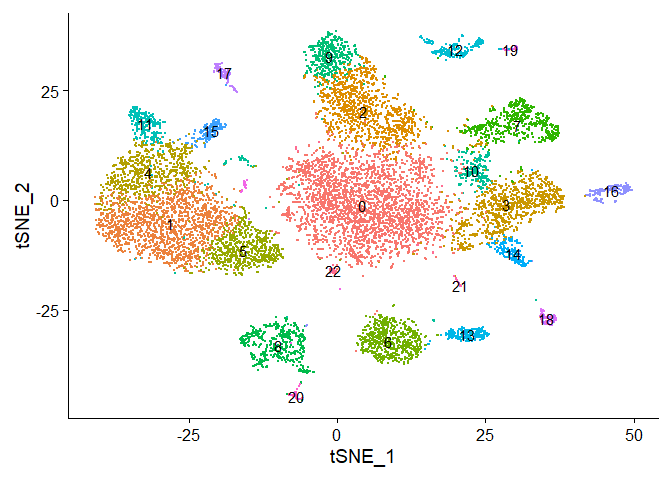
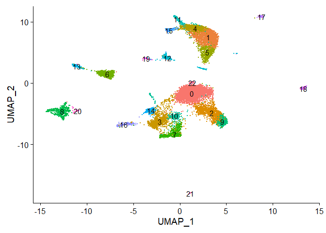
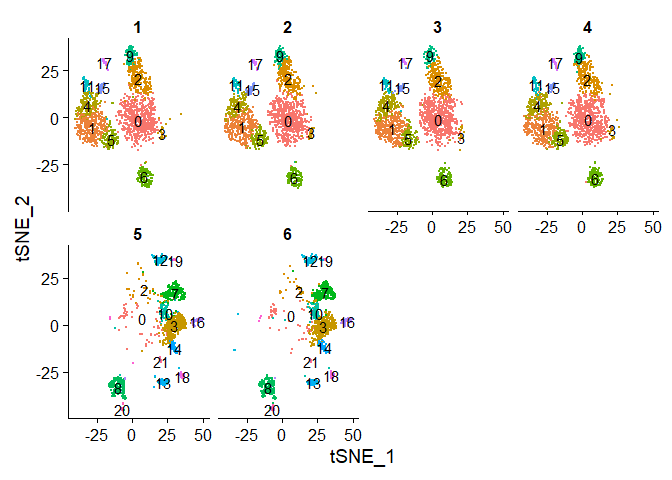

CITE-seq optimization - Demux, Pre-process and downsample
================
Terkild Brink Buus
30/3/2020

## Load libraries etc.

``` r
set.seed(114)
require("Seurat", quietly=T)
require("tidyverse", quietly=T)
```

    ## -- Attaching packages -------------------------------------------------------------------------------- tidyverse 1.3.0 --

    ## v ggplot2 3.3.0     v purrr   0.3.3
    ## v tibble  3.0.0     v dplyr   0.8.5
    ## v tidyr   1.0.2     v stringr 1.4.0
    ## v readr   1.3.1     v forcats 0.5.0

    ## -- Conflicts ----------------------------------------------------------------------------------- tidyverse_conflicts() --
    ## x dplyr::filter() masks stats::filter()
    ## x dplyr::lag()    masks stats::lag()

``` r
library("Matrix", quietly=T)
```

    ## 
    ## Attaching package: 'Matrix'

    ## The following objects are masked from 'package:tidyr':
    ## 
    ##     expand, pack, unpack

``` r
library("DropletUtils", quietly=T)
```

    ## 
    ## Attaching package: 'BiocGenerics'

    ## The following objects are masked from 'package:parallel':
    ## 
    ##     clusterApply, clusterApplyLB, clusterCall, clusterEvalQ,
    ##     clusterExport, clusterMap, parApply, parCapply, parLapply,
    ##     parLapplyLB, parRapply, parSapply, parSapplyLB

    ## The following object is masked from 'package:Matrix':
    ## 
    ##     which

    ## The following objects are masked from 'package:dplyr':
    ## 
    ##     combine, intersect, setdiff, union

    ## The following objects are masked from 'package:stats':
    ## 
    ##     IQR, mad, sd, var, xtabs

    ## The following objects are masked from 'package:base':
    ## 
    ##     anyDuplicated, append, as.data.frame, basename, cbind, colnames,
    ##     dirname, do.call, duplicated, eval, evalq, Filter, Find, get, grep,
    ##     grepl, intersect, is.unsorted, lapply, Map, mapply, match, mget,
    ##     order, paste, pmax, pmax.int, pmin, pmin.int, Position, rank,
    ##     rbind, Reduce, rownames, sapply, setdiff, sort, table, tapply,
    ##     union, unique, unsplit, which, which.max, which.min

    ## 
    ## Attaching package: 'S4Vectors'

    ## The following object is masked from 'package:Matrix':
    ## 
    ##     expand

    ## The following objects are masked from 'package:dplyr':
    ## 
    ##     first, rename

    ## The following object is masked from 'package:tidyr':
    ## 
    ##     expand

    ## The following object is masked from 'package:base':
    ## 
    ##     expand.grid

    ## 
    ## Attaching package: 'IRanges'

    ## The following objects are masked from 'package:dplyr':
    ## 
    ##     collapse, desc, slice

    ## The following object is masked from 'package:purrr':
    ## 
    ##     reduce

    ## The following object is masked from 'package:grDevices':
    ## 
    ##     windows

    ## Welcome to Bioconductor
    ## 
    ##     Vignettes contain introductory material; view with
    ##     'browseVignettes()'. To cite Bioconductor, see
    ##     'citation("Biobase")', and for packages 'citation("pkgname")'.

    ## 
    ## Attaching package: 'matrixStats'

    ## The following objects are masked from 'package:Biobase':
    ## 
    ##     anyMissing, rowMedians

    ## The following object is masked from 'package:dplyr':
    ## 
    ##     count

    ## 
    ## Attaching package: 'DelayedArray'

    ## The following objects are masked from 'package:matrixStats':
    ## 
    ##     colMaxs, colMins, colRanges, rowMaxs, rowMins, rowRanges

    ## The following object is masked from 'package:purrr':
    ## 
    ##     simplify

    ## The following objects are masked from 'package:base':
    ## 
    ##     aperm, apply, rowsum

    ## 
    ## Attaching package: 'SummarizedExperiment'

    ## The following object is masked from 'package:Seurat':
    ## 
    ##     Assays

``` r
driveLetter <-"F:/"
t2g.file <- file.path(driveLetter,"Projects/ECCITE-seq/TotalSeqC_TitrationA/kallisto/t2g_cellranger.txt")
kallistobusDir <- file.path(driveLetter,"Projects/ECCITE-seq/TotalSeqC_TitrationA/kallisto/gex/c1/counts_unfiltered")
kallistobusDirADT <- file.path(driveLetter,"Projects/ECCITE-seq/TotalSeqC_TitrationA/kallisto/features/A1_S5.ADT_15/counts_unfiltered")
kallistobusDirHTO <- file.path(driveLetter,"Projects/ECCITE-seq/TotalSeqC_TitrationA/kallisto/features/H1_S6.HTO_A_13/counts_unfiltered")

## Load helper functions (ggplot themes, biexp transformation etc.)
source("R/Utilities.R")

## Load predefined color schemes
source("R/color.R")
```

## Load GEX data

From kallisto-bustools output. Modified from
<https://github.com/Sarah145/scRNA_pre_process>

``` r
raw_mtx <- as(t(readMM(file.path(kallistobusDir,"cells_x_genes.mtx"))), 'CsparseMatrix') # load mtx and transpose it
rownames(raw_mtx) <- read.csv(file.path(kallistobusDir,"cells_x_genes.genes.txt"), sep = '\t', header = F)[,1] # attach genes
colnames(raw_mtx) <- read.csv(file.path(kallistobusDir,"cells_x_genes.barcodes.txt"), header = F, sep = '\t')[,1] # attach barcodes

t2g <- unique(read.csv(t2g.file, sep = '\t', header=F)[,2:3]) # load t2g file
t2g <- data.frame(t2g[,2], row.names = t2g[,1])
gene_sym <- t2g[as.character(rownames(raw_mtx)),1] # get symbols for gene ids

# Which rows have same gene symbol (but different Ensembl gene id)
gene_sym.duplicated <- which(gene_sym %in% gene_sym[which(duplicated(gene_sym))])

# Which genes are have duplicated entries
gene_sym.duplicated.unique <- unique(gene_sym[gene_sym.duplicated])

# Make placeholder matrix for duplicate gene symbols
raw_mtx_dedup <- Matrix(data=0,nrow=length(gene_sym.duplicated.unique),ncol=ncol(raw_mtx))
rownames(raw_mtx_dedup) <- gene_sym.duplicated.unique
colnames(raw_mtx_dedup) <- colnames(raw_mtx)

# Combine counts from genes with same gene symbol (but different Ensembl gene id)
for(i in seq_along(gene_sym.duplicated)){
  curGene <- gene_sym[gene_sym.duplicated[i]]
  curRow <- gene_sym.duplicated.unique == curGene
  raw_mtx_dedup[curRow,] <- raw_mtx_dedup[curRow,] + raw_mtx[gene_sym.duplicated[i],]
}

# Merged combined counts duplicate gene symbol with matrix of unique gene symbol counts
raw_mtx <- raw_mtx[-gene_sym.duplicated,]
rownames(raw_mtx) <- gene_sym[-gene_sym.duplicated]
raw_mtx <- rbind(raw_mtx,raw_mtx_dedup)

tot_counts <- Matrix::colSums(raw_mtx)
summary(tot_counts)
```

    ##    Min. 1st Qu.  Median    Mean 3rd Qu.    Max. 
    ##     0.0     1.0     1.0   132.1    14.0 38379.0

``` r
bc_rank <- DropletUtils::barcodeRanks(raw_mtx, lower = 10)

knee_plot(bc_rank)
```

    ## Warning: Transformation introduced infinite values in continuous y-axis
    
    ## Warning: Transformation introduced infinite values in continuous y-axis

<!-- -->

``` r
kallisto.GEX <- raw_mtx
```

## Load Kallisto HTO data

``` r
res_mat <- read_count_output(kallistobusDirHTO, name = "cells_x_genes")
dim(res_mat)
```

    ## [1]      6 491492

``` r
tot_counts <- Matrix::colSums(res_mat)
summary(tot_counts)
```

    ##      Min.   1st Qu.    Median      Mean   3rd Qu.      Max. 
    ##      0.00      1.00      2.00     58.07      3.00 111852.00

``` r
bc_rank <- DropletUtils::barcodeRanks(res_mat, lower = 10)

knee_plot(bc_rank)
```

    ## Warning: Transformation introduced infinite values in continuous y-axis
    
    ## Warning: Transformation introduced infinite values in continuous y-axis

<!-- -->

``` r
kallisto.HTO <- res_mat
```

## Load Kallisto ADT data

``` r
res_mat <- read_count_output(kallistobusDirADT, name = "cells_x_genes")
dim(res_mat)
```

    ## [1]     52 504629

``` r
tot_counts <- Matrix::colSums(res_mat)
summary(tot_counts)
```

    ##      Min.   1st Qu.    Median      Mean   3rd Qu.      Max. 
    ##      0.00      1.00      2.00     35.66      3.00 153439.00

``` r
bc_rank <- DropletUtils::barcodeRanks(res_mat, lower = 10)

knee_plot(bc_rank)
```

    ## Warning: Transformation introduced infinite values in continuous y-axis
    
    ## Warning: Transformation introduced infinite values in continuous y-axis

<!-- -->

``` r
kallisto.ADT <- res_mat
```

## Demultiplex by HTO

Use Seurat MULTIseqDemux to demultiplex samples (by their hashing
antibody signal = HTO)

``` r
object <- CreateSeuratObject(counts = kallisto.HTO, assay="HTO.kallisto")
object <- NormalizeData(object, assay = "HTO.kallisto", normalization.method = "CLR")
```

    ## Normalizing across features

    ## Warning: Keys should be one or more alphanumeric characters followed by an
    ## underscore, setting key from hto.kallisto_ to htokallisto_

``` r
## Assure the matrices are in the same barcode-space
commonDrops <- Reduce("intersect",x=list(colnames(kallisto.HTO),colnames(kallisto.ADT),colnames(kallisto.GEX)))

length(commonDrops)
```

    ## [1] 149469

``` r
object <- subset(object, cells=commonDrops)
object[["ADT.kallisto"]] <- CreateAssayObject(counts=kallisto.ADT[,commonDrops])
```

    ## Warning: Keys should be one or more alphanumeric characters followed by an
    ## underscore, setting key from adt.kallisto_ to adtkallisto_

``` r
object[["RNA.kallisto"]] <- CreateAssayObject(counts=kallisto.GEX[,commonDrops])
```

    ## Warning: Keys should be one or more alphanumeric characters followed by an
    ## underscore, setting key from rna.kallisto_ to rnakallisto_

``` r
Key(object[["RNA.kallisto"]]) <- "rna_"
Key(object[["ADT.kallisto"]]) <- "adt_"
Key(object[["HTO.kallisto"]]) <- "hto_"


## MULTIseqDemux seems better when using unfiltered input (including empty droplets)
object <- MULTIseqDemux(object, assay="HTO.kallisto")

RidgePlot(object, assay = "HTO.kallisto", features = rownames(object[["HTO.kallisto"]]))
```

    ## Picking joint bandwidth of 0.128

    ## Picking joint bandwidth of 0.112

    ## Picking joint bandwidth of 0.101

    ## Picking joint bandwidth of 0.114

    ## Picking joint bandwidth of 0.146

    ## Picking joint bandwidth of 0.124

<!-- -->

``` r
table(object$MULTI_ID)
```

    ## 
    ##        1        2        3        4        5        6  Doublet Negative 
    ##     2196     2593     2895     3692     2152     2308     3724   129909

``` r
object$sampleID <- object$MULTI_ID

object <- CalculateBarcodeInflections(object,barcode.column="nCount_HTO.kallisto",group.column="sampleID",threshold.low=1000)
Seurat::BarcodeInflectionsPlot(object) + scale_x_continuous(trans="log10")
```

<!-- -->

``` r
object.empty <- subset(object, subset=sampleID == "Negative")
object <- subset(object, subset=sampleID %in% c(1:6))
```

## Assign annotation to each cell

``` r
## Rename groups to meaningful names
groups <- c("PBMC_50ul_1_1000k","PBMC_50ul_4_1000k","PBMC_25ul_4_1000k","PBMC_25ul_4_200k","Lung_50ul_1_500k","Lung_50ul_4_500k","Doublet","Negative")
object$group <- object$sampleID

## Keep ordering of groups for best plotting
levels(object$group) <- groups

object$tissue <- factor(c("PBMC","PBMC","PBMC","PBMC","Lung","Lung","Doublet","Negative")[object$sampleID],levels=c("PBMC","Lung"))
object$volume <- factor(c("50µl","50µl","25µl","25µl","50µl","50µl","Doublet","Negative")[object$sampleID], levels=c("50µl","25µl","Doublet","Negative"))
object$dilution <- factor(c("DF1","DF4","DF4","DF4","DF1","DF4","Doublet","Negative")[object$sampleID], levels=c("DF1","DF4","Doublet","Negative"))
object$cellsAtStaining <- factor(c("1000k","1000k","1000k","200k","500k","500k","Doublet","Negative")[object$sampleID], levels=c("1000k","500k","200k","Doublet","Negative"))
```

## Filter dead/dying cells

Based on mitochondrial reads and number of detected genes. Cutoff set to
15% MT and at least 60 expressed genes by visual inspection.

``` r
DefaultAssay(object) <- "RNA.kallisto"
object[["percent.mt"]] <- PercentageFeatureSet(object, pattern = "^MT-")
#object[["percent.mt"]][is.nan(object[["percent.mt"]][,1]),1] <- 100

cutoff.percent.mt <- 15
cutoff.nFeature <- 60
FeatureScatter(object, feature1 = "percent.mt", feature2 = "nFeature_RNA.kallisto") + ggplot2::geom_vline(xintercept=cutoff.percent.mt,linetype="dashed") + scale_y_continuous(trans="log10") + ggplot2::geom_hline(yintercept=cutoff.nFeature,linetype="dashed")
```

<!-- -->

``` r
table(object[["percent.mt"]]<cutoff.percent.mt & object[["nFeature_RNA.kallisto"]]>cutoff.nFeature, object$sampleID)
```

    ##        
    ##            1    2    3    4    5    6 Doublet Negative
    ##   FALSE  315  426  448  623  276  411       0        0
    ##   TRUE  1881 2167 2447 3069 1876 1897       0        0

``` r
object <- subset(object, subset = percent.mt <= cutoff.percent.mt & nFeature_RNA.kallisto > cutoff.nFeature)
```

## Filter doublets

Doublet rate calculated from: <https://satijalab.org/costpercell> at
18,000 cells and 6 multiplexed samples (3.27% after HTO demux)

``` r
library(scDblFinder)
DefaultAssay(object) <- "RNA.kallisto"

sce <- as.SingleCellExperiment(object)
sce <- scDblFinder(sce, dbr=0.0327, samples="sampleID")

table(sce$scDblFinder.class, sce$sampleID)
```

    ##          
    ##              1    2    3    4    5    6 Doublet Negative
    ##   doublet   62   72   71   78   44   65       0        0
    ##   singlet 1819 2095 2376 2992 1832 1832       0        0

``` r
identical(colnames(object),colnames(sce))
```

    ## [1] TRUE

``` r
object$scDblFinder.class <- sce$scDblFinder.class
object$scDblFinder.score <- sce$scDblFinder.score
object$scDblFinder.ratio <- sce$scDblFinder.ratio
object$scDblFinder.weighted <- sce$scDblFinder.weighted
rm(sce)

object$scDblFinder.class <- factor(object$scDblFinder.class, levels=c("singlet","doublet"))
  
FeatureScatter(object, feature1 = "nCount_RNA.kallisto", feature2 = "nFeature_RNA.kallisto", group.by="scDblFinder.class", cols=c(alpha("blue",0.01),alpha("red",0.5))) + scale_y_continuous(trans="log10") + scale_x_continuous(trans="log10")
```

<!-- -->

``` r
object <- subset(object, subset=scDblFinder.class=="singlet")
```

## Make DSB normalization

<https://mattpm.github.io/dsb/>

``` r
#devtools::install_github(repo = 'MattPM/dsb')
library(dsb)

neg_adt_matrix = GetAssayData(object.empty, assay = "ADT.kallisto", slot = 'counts') %>% as.matrix()
positive_adt_matrix = GetAssayData(object, assay = "ADT.kallisto", slot = 'counts') %>% as.matrix()
isotypes = c("IgG2A","IgG1")

normalized_matrix_individual <- positive_adt_matrix

for(i in c(1:6)){
  curCells <- which(object$sampleID == i)
  normalized_matrix_individual[,curCells] = DSBNormalizeProtein(cell_protein_matrix = positive_adt_matrix[,curCells],
                                        empty_drop_matrix = neg_adt_matrix,
                                        use.isotype.control = TRUE,
                                        isotype.control.name.vec = isotypes)
}

object = SetAssayData(object=object, assay="ADT.kallisto", slot="data", new.data = normalized_matrix_individual)

plotData <- as.data.frame(normalized_matrix_individual)
plotData$Marker <- rownames(plotData)
plotData <- reshape2::melt(plotData, id.vars=c("Marker"))
colnames(plotData) <- c("Marker","Cell","value")
ggplot(plotData,aes(x=value,y=Marker,fill=object$group[Cell])) + ggridges::geom_density_ridges(alpha=0.5, scale=3, rel_min_height = 0.01) + xlim(-5,30) + facet_grid(~object$group[Cell])
```

    ## Picking joint bandwidth of 0.607

    ## Picking joint bandwidth of 0.428

    ## Picking joint bandwidth of 0.368

    ## Picking joint bandwidth of 0.388

    ## Picking joint bandwidth of 0.647

    ## Picking joint bandwidth of 0.467

    ## Warning: Removed 4221 rows containing non-finite values (stat_density_ridges).

<!-- -->

## Preprocess data

Run standard Seurat preprocessing on RNA modality.

``` r
object <- NormalizeData(object)
object <- FindVariableFeatures(object)
object <- ScaleData(object)
```

    ## Centering and scaling data matrix

``` r
object <- RunPCA(object, verbose = FALSE)
object <- FindNeighbors(object, dims = 1:30)
```

    ## Computing nearest neighbor graph

    ## Computing SNN

``` r
object <- FindClusters(object, resolution = 0.3)
```

    ## Modularity Optimizer version 1.3.0 by Ludo Waltman and Nees Jan van Eck
    ## 
    ## Number of nodes: 12946
    ## Number of edges: 578929
    ## 
    ## Running Louvain algorithm...
    ## Maximum modularity in 10 random starts: 0.9391
    ## Number of communities: 17
    ## Elapsed time: 2 seconds

``` r
object <- RunTSNE(object,dims=1:30)
object <- RunUMAP(object,dims=1:30)
```

    ## Warning: The default method for RunUMAP has changed from calling Python UMAP via reticulate to the R-native UWOT using the cosine metric
    ## To use Python UMAP via reticulate, set umap.method to 'umap-learn' and metric to 'correlation'
    ## This message will be shown once per session

    ## 12:39:17 UMAP embedding parameters a = 0.9922 b = 1.112

    ## 12:39:17 Read 12946 rows and found 30 numeric columns

    ## 12:39:17 Using Annoy for neighbor search, n_neighbors = 30

    ## 12:39:17 Building Annoy index with metric = cosine, n_trees = 50

    ## 0%   10   20   30   40   50   60   70   80   90   100%

    ## [----|----|----|----|----|----|----|----|----|----|

    ## **************************************************|
    ## 12:39:20 Writing NN index file to temp file C:\Users\Terkild\AppData\Local\Temp\Rtmp8wudK1\file3be85b265d07
    ## 12:39:20 Searching Annoy index using 1 thread, search_k = 3000
    ## 12:39:24 Annoy recall = 100%
    ## 12:39:25 Commencing smooth kNN distance calibration using 1 thread
    ## 12:39:27 Initializing from normalized Laplacian + noise
    ## 12:39:28 Commencing optimization for 200 epochs, with 610694 positive edges
    ## 12:39:43 Optimization finished

``` r
DimPlot(object, group.by="tissue", reduction="tsne")
```

<!-- -->

``` r
DimPlot(object, group.by="group", reduction="tsne")
```

<!-- -->

``` r
DimPlot(object, label=TRUE, reduction="tsne")
```

    ## Warning: Using `as.character()` on a quosure is deprecated as of rlang 0.3.0.
    ## Please use `as_label()` or `as_name()` instead.
    ## This warning is displayed once per session.

<!-- -->

## Label and merge clusters into “superclusters”

To make the poulations less complex and for easier visualization, we
merged the clusters into major cell types

``` r
## LINEAGE MARKERS FOR CLUSTERLABELLING
ADTplots <- FeaturePlot(object, features=c("adt_CD1a","adt_CD3","adt_CD4","adt_CD8","adt_CD11b","adt_CD14","adt_CD19","adt_CD56","adt_HLA-DR","adt_EpCAM"), label=TRUE, reduction="tsne", min.cutoff=4, col=c("lightgrey","red"), combine=FALSE)
ADTplots <- lapply(ADTplots,FUN=function(x)x+NoLegend())
CombinePlots(ADTplots,ncol=5)
```

    ## Warning: CombinePlots is being deprecated. Plots should now be combined using
    ## the patchwork system.

<!-- -->

``` r
FeaturePlot(object, features=c("CD3D","TRAC"), label=TRUE, reduction="tsne", min.cutoff=1.3, col=c("lightgrey","red"), combine=FALSE)
```

    ## [[1]]

<!-- -->

    ## 
    ## [[2]]

<!-- -->

``` r
library("dplyr")
cluster.markers <- FindAllMarkers(object, only.pos = TRUE, min.pct = 0.25, logfc.threshold = 0.25)
```

    ## Calculating cluster 0

    ## Calculating cluster 1

    ## Calculating cluster 2

    ## Calculating cluster 3

    ## Calculating cluster 4

    ## Calculating cluster 5

    ## Calculating cluster 6

    ## Calculating cluster 7

    ## Calculating cluster 8

    ## Calculating cluster 9

    ## Calculating cluster 10

    ## Calculating cluster 11

    ## Calculating cluster 12

    ## Calculating cluster 13

    ## Calculating cluster 14

    ## Calculating cluster 15

    ## Calculating cluster 16

``` r
top5 <- cluster.markers %>% group_by(cluster) %>% top_n(n = 5, wt = avg_logFC)
DoHeatmap(object, features = top5$gene, slot = "data") + NoLegend() + ggplot2::scale_fill_gradientn(colors = c("blue", "white", "red"))
```

    ## Scale for 'fill' is already present. Adding another scale for 'fill', which
    ## will replace the existing scale.

<!-- -->

``` r
## COMBINE CLUSTERS TO SUPERCLUSTERS
superclusters <- c("0"="MO/MØ/DC",
                   "1"="T/NK cells",
                   "2"="T/NK cells",
                   "3"="T/NK cells",
                   "4"="B/Plasma cells",
                   "5"="T/NK cells",
                   "6"="B/Plasma cells",
                   "7"="MO/MØ/DC",
                   "8"="MO/MØ/DC",
                   "9"="B/Plasma cells",
                   "10"="MO/MØ/DC",
                   "11"="T/NK cells",
                   "12"="Other",
                   "13"="Other",
                   "14"="B/Plasma cells",
                   "15"="Other",
                   "16"="MO/MØ/DC")

object$supercluster <- factor(superclusters[as.character(Idents(object))],levels=superclusters.levels)

DimPlot(object, group.by="supercluster", reduction="tsne")
```

<!-- -->

``` r
DimPlot(object, group.by="supercluster", reduction="umap")
```

<!-- -->

``` r
table <- t(table(object$supercluster,object$group))
round(table/rowSums(table)*100,2)
```

    ##                    
    ##                     T/NK cells MO/MØ/DC B/Plasma cells Other
    ##   PBMC_50ul_1_1000k      52.72    38.21           7.53  1.54
    ##   PBMC_50ul_4_1000k      53.94    37.57           7.54  0.95
    ##   PBMC_25ul_4_1000k      55.05    35.31           8.12  1.52
    ##   PBMC_25ul_4_200k       44.99    47.03           6.48  1.50
    ##   Lung_50ul_1_500k       60.70     9.55          25.71  4.04
    ##   Lung_50ul_4_500k       64.47     9.17          22.33  4.04
    ##   Doublet                                                   
    ##   Negative

## Make fine-grained clustering

``` r
## SEE HOW DIFFERENT GROUPS ARE LOCATED IN PRINCIPAL COMPONENTS
#temp <- cbind(object@reductions$pca@cell.embeddings[,1:50],FetchData(object, vars=c("group","volume","dilution","tissue")))
#temp <- temp[temp$tissue=="PBMC",]

#temp2 <- temp %>% pivot_longer(c(-group,-volume,-dilution,-tissue))
#temp3 <- temp2 %>% group_by(name, group) %>% summarise(mean=median(value))
#ggplot(temp3,aes(x=name,y=mean,col=group)) + geom_point()

object <- FindClusters(object, resolution = 1.2)
```

    ## Modularity Optimizer version 1.3.0 by Ludo Waltman and Nees Jan van Eck
    ## 
    ## Number of nodes: 12946
    ## Number of edges: 578929
    ## 
    ## Running Louvain algorithm...
    ## Maximum modularity in 10 random starts: 0.8348
    ## Number of communities: 23
    ## Elapsed time: 2 seconds

``` r
object$fineCluster <- Idents(object)

DimPlot(object, reduction = "tsne", label = TRUE) + NoLegend()
```

<!-- -->

``` r
DimPlot(object, reduction = "umap", label = TRUE) + NoLegend()
```

<!-- -->

``` r
table(Idents(object),object$sampleID)
```

    ##     
    ##        1   2   3   4   5   6 Doublet Negative
    ##   0  612 721 829 847  55  56       0        0
    ##   1  319 376 357 664   4   3       0        0
    ##   2  238 267 303 321  33  31       0        0
    ##   3   24  23  25  32 412 483       0        0
    ##   4  166 160 176 270   3   2       0        0
    ##   5  119 140 171 271   3   1       0        0
    ##   6  131 156 186 185  11   7       0        0
    ##   7    0   1   1   2 307 310       0        0
    ##   8    5   2   6   6 325 259       0        0
    ##   9   75 109 134 127   9   4       0        0
    ##   10   8  10  13  23 114 117       0        0
    ##   11  44  59  64 110   2   0       0        0
    ##   12   0   0   0   0 137 130       0        0
    ##   13   1   0   1   2 103 122       0        0
    ##   14   0   1   0   2  87 109       0        0
    ##   15  37  38  51  64   1   2       0        0
    ##   16   2   3   5   8  94  66       0        0
    ##   17  27  19  35  47   3   2       0        0
    ##   18   0   0   0   0  55  54       0        0
    ##   19   2   4   6   4  25  29       0        0
    ##   20   0   0   0   0  32  22       0        0
    ##   21   1   1   3   0  16  18       0        0
    ##   22   8   5  10   7   1   5       0        0

## Downsampling

To better compare UMI counts between samples, we downsample within each
tissue so that each sample have the same number of cells from each fine
grained cluster. Most clusters based on different tissue still have a
few cells assigned to it. To avoid “expressing” clusters to be based on
less than 10 cells, we remove cells belonging to clusters that have less
than 10 cells within a given tissue after equal downsampling.

``` r
data.fineClusters <- FetchData(object, vars=c("tissue","sampleID","fineCluster"))

## Get number of cells in each cluster for each sample
data.fineClusters <- data.fineClusters %>% group_by(tissue, sampleID, fineCluster) %>% summarize(count=length(sampleID))

## Calculate minimum cells within each cluster for each tissue and remove clusters that are represented by less than 10 cells winin a sample of a given tissue
data.fineClusters.min <- data.fineClusters %>% group_by(tissue, fineCluster) %>% summarize(count.min=min(count)) %>% filter(count.min >= 10)

downsampled.index <- c()
for(i in 1:nrow(data.fineClusters.min)){
  curCluster <- data.fineClusters.min[i,]
  
  samples <- unique(object$sampleID[object$tissue == curCluster$tissue])
  
  for(j in seq_along(samples)){
    sample <- samples[j]
    
    ## Extract indices for cells in current sample and cluster
    cellsInCluster <- which(object$sampleID == sample & object$fineCluster == curCluster$fineCluster)
    
    ## Get random subsample according to minimum for the current cluster and tissue
    addToIndex <- cellsInCluster[sample(length(cellsInCluster),curCluster$count.min)]
    
    downsampled.index <- append(downsampled.index,addToIndex)
  }
}

table(object$sampleID,object$fineCluster)
```

    ##           
    ##              0   1   2   3   4   5   6   7   8   9  10  11  12  13  14  15  16
    ##   1        612 319 238  24 166 119 131   0   5  75   8  44   0   1   0  37   2
    ##   2        721 376 267  23 160 140 156   1   2 109  10  59   0   0   1  38   3
    ##   3        829 357 303  25 176 171 186   1   6 134  13  64   0   1   0  51   5
    ##   4        847 664 321  32 270 271 185   2   6 127  23 110   0   2   2  64   8
    ##   5         55   4  33 412   3   3  11 307 325   9 114   2 137 103  87   1  94
    ##   6         56   3  31 483   2   1   7 310 259   4 117   0 130 122 109   2  66
    ##   Doublet    0   0   0   0   0   0   0   0   0   0   0   0   0   0   0   0   0
    ##   Negative   0   0   0   0   0   0   0   0   0   0   0   0   0   0   0   0   0
    ##           
    ##             17  18  19  20  21  22
    ##   1         27   0   2   0   1   8
    ##   2         19   0   4   0   1   5
    ##   3         35   0   6   0   3  10
    ##   4         47   0   4   0   0   7
    ##   5          3  55  25  32  16   1
    ##   6          2  54  29  22  18   5
    ##   Doublet    0   0   0   0   0   0
    ##   Negative   0   0   0   0   0   0

``` r
table(object$sampleID[downsampled.index],object$fineCluster[downsampled.index])
```

    ##           
    ##              0   1   2   3   4   5   6   7   8   9  10  11  12  13  14  15  16
    ##   1        612 319 238  23 160 119 131   0   0  75   0  44   0   0   0  37   0
    ##   2        612 319 238  23 160 119 131   0   0  75   0  44   0   0   0  37   0
    ##   3        612 319 238  23 160 119 131   0   0  75   0  44   0   0   0  37   0
    ##   4        612 319 238  23 160 119 131   0   0  75   0  44   0   0   0  37   0
    ##   5         55   0  31 412   0   0   0 307 259   0 114   0 130 103  87   0  66
    ##   6         55   0  31 412   0   0   0 307 259   0 114   0 130 103  87   0  66
    ##   Doublet    0   0   0   0   0   0   0   0   0   0   0   0   0   0   0   0   0
    ##   Negative   0   0   0   0   0   0   0   0   0   0   0   0   0   0   0   0   0
    ##           
    ##             17  18  19  20  21  22
    ##   1         19   0   0   0   0   0
    ##   2         19   0   0   0   0   0
    ##   3         19   0   0   0   0   0
    ##   4         19   0   0   0   0   0
    ##   5          0  54  25  22  16   0
    ##   6          0  54  25  22  16   0
    ##   Doublet    0   0   0   0   0   0
    ##   Negative   0   0   0   0   0   0

``` r
object.downsampled <- subset(object, cells=downsampled.index[sample(length(downsampled.index),length(downsampled.index))])
table(object.downsampled$sampleID, object.downsampled$orig.ident)
```

    ##           
    ##            SeuratProject
    ##   1                 1777
    ##   2                 1777
    ##   3                 1777
    ##   4                 1777
    ##   5                 1681
    ##   6                 1681
    ##   Doublet              0
    ##   Negative             0

``` r
DimPlot(object.downsampled, split.by="sampleID", reduction="tsne", label=TRUE , ncol=4) + NoLegend()
```

<!-- -->

## Find “ADT expressing cluster” for each tissue

``` r
abpanel <- data.frame(readxl::read_excel("data/Supplementary_Table_1.xlsx"))
rownames(abpanel) <- abpanel$Marker

ADT.matrix <- data.frame(GetAssayData(object.downsampled[,object.downsampled$volume == "50µl"], assay="ADT.kallisto", slot="counts"))
ADT.matrix <- ADT.matrix %>% mutate(marker=rownames(ADT.matrix)) %>% pivot_longer(c(-marker))
cell.annotation <- FetchData(object, vars=c("dilution", "tissue", "fineCluster"))

## nth function extracts the value at a set fractile or median if fractile "rank" is less than a set "nth" threshhold
nth <- function(value, nth=10, fractile=0.9){
  if(length(value)*(1-fractile) <= nth){
    newvalue <- median(value)
  } else {
    newvalue <- quantile(value, probs=c(fractile))
  }
  return(newvalue)
}

ADT.matrix.agg <- ADT.matrix %>% group_by(tissue=cell.annotation[name,"tissue"], fineCluster=cell.annotation[name,"fineCluster"], marker) %>% summarise(nCells=length(value), UMIsum=sum(value), nth=nth(value), median=median(value), f90=quantile(value,probs=0.9))

Cluster.max <- ADT.matrix.agg %>% group_by(marker, tissue) %>% summarize(fineCluster=fineCluster[which.max(nth)])

ADT.matrix.aggByClusterMax <- Cluster.max %>% left_join(ADT.matrix.agg)
```

    ## Joining, by = c("marker", "tissue", "fineCluster")

``` r
write.table(ADT.matrix.aggByClusterMax,"data/markerByClusterStats.tsv")
```

## Save Seurat object

``` r
saveRDS(object,file="data/5P-CITE-seq_Titration_full.rds")
saveRDS(object.downsampled,file="data/5P-CITE-seq_Titration.rds")
```
