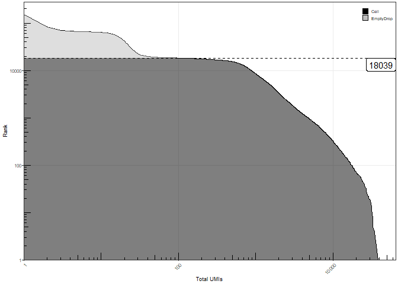
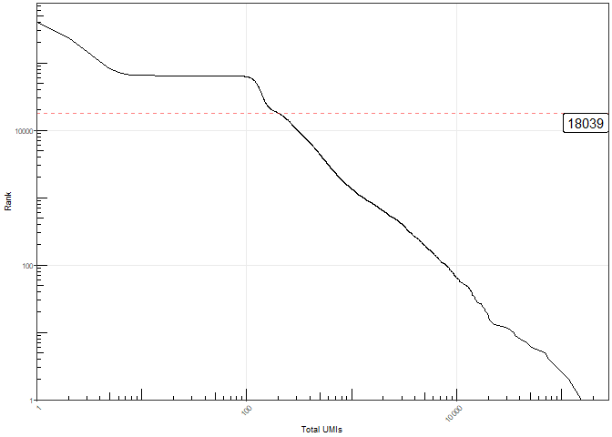
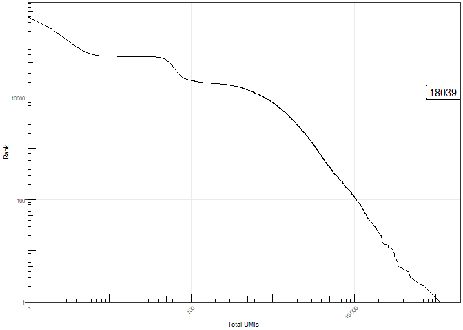
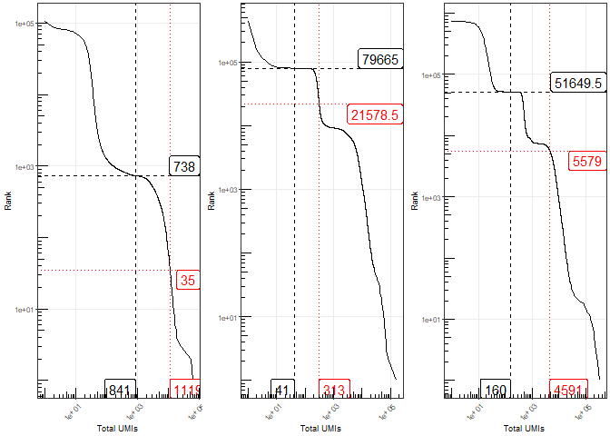
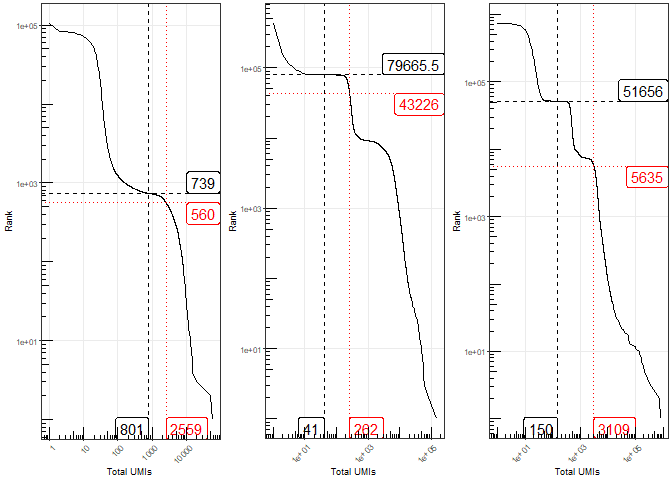
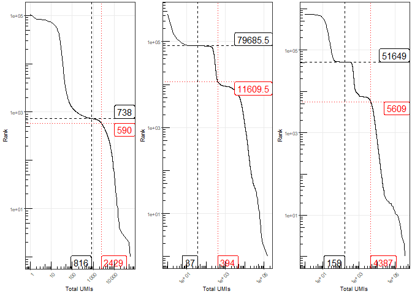
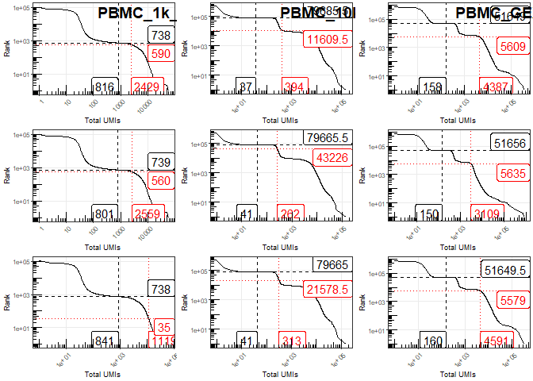

CITE-seq optimization - Load unfiltered data
================
Terkild Brink Buus
30/3/2020

## Load utilities

Including libraries, plotting and color settings and custom utility
functions

``` r
set.seed(114)
require("Seurat", quietly=T)
require("tidyverse", quietly=T)
library("Matrix", quietly=T)
library("DropletUtils", quietly=T)

## Load ggplot theme and defaults
source("R/ggplot_settings.R")

## Load helper functions
source("R/Utilities.R")

read_kallisto_data <- function(file.path){
  ## Load mtx and transpose it
  res_mat <- as(t(readMM(file.path(file.path,"cells_x_genes.mtx"))), 'CsparseMatrix') 
  ## Attach genes
  rownames(res_mat) <- read.csv(file.path(file.path,"cells_x_genes.genes.txt"), sep = '\t', header = F)[,1]
  ## Attach barcodes
  colnames(res_mat) <- read.csv(file.path(file.path,"cells_x_genes.barcodes.txt"), header = F, sep = '\t')[,1]
  
  return(res_mat)
}
```

## Set file paths

How the different aligned and counted read outputs from various
algorithms were generated using Snakemake and can be seen in the
included [Snakefile](Snakefile)

``` r
data.drive <- "F:/"
data.project.dir <- "Projects/ECCITE-seq/TotalSeqC_TitrationA"
outdir <- "figures"
t2g.file <- file.path(data.drive,data.project.dir,"/kallisto/t2g_cellranger.txt")
kallistobusDir <- file.path(data.drive,data.project.dir,"kallisto/gex/c1/counts_unfiltered")

## ADT data
kallistobusDirADT <- file.path(data.drive,data.project.dir,"kallisto/features/A1_S5.ADT_15/counts_unfiltered")
data10XADTDir <- file.path(data.drive,data.project.dir,"cellranger_A1/outs/raw_feature_bc_matrix")
dataCSCADTDir <- file.path(data.drive,data.project.dir,"cite-seq-count/A1_S5_d1_ADT/umi_count")
dataCSCADTDir.dense <- file.path(data.drive,data.project.dir,"cite-seq-count/A1_S5_d1_ADT/uncorrected_cells/dense_umis.tsv")
dataCSCADTnocorrectDir <- file.path(data.drive,data.project.dir,"cite-seq-count/A1_S5_d1_ADT_nocorrect/umi_count")
dataCSCADTnocorrectDir.dense <- file.path(data.drive,data.project.dir,"cite-seq-count/A1_S5_d1_ADT_nocorrect/uncorrected_cells/dense_umis.tsv")

## HTO data
kallistobusDirHTO <- file.path(data.drive,data.project.dir,"kallisto/features/H1_S6.HTO_A_13/counts_unfiltered")
data10XHTODir <- file.path(data.drive,data.project.dir,"cellranger_H1/outs/raw_feature_bc_matrix")
dataCSCHTODir <- file.path(data.drive,data.project.dir,"cite-seq-count/H1_S6_d1_HTO/umi_count")
dataCSCHTODir.dense <- file.path(data.drive,data.project.dir,"cite-seq-count/H1_S6_d1_HTO/uncorrected_cells/dense_umis.tsv")
dataCSCHTOnocorrectDir <- file.path(data.drive,data.project.dir,"cite-seq-count/H1_S6_d1_HTO_nocorrect/umi_count")
dataCSCHTOnocorrectDir.dense <- file.path(data.drive,data.project.dir,"cite-seq-count/H1_S6_d1_HTO_nocorrect/uncorrected_cells/dense_umis.tsv")

## 10X datasets
data.10X.dir <- file.path(data.drive,"data","10XDatasets")
```

# TITRATION DATASET

## Load GEX data

From kallisto-bustools output. Modified from
<https://github.com/Sarah145/scRNA_pre_process>

``` r
raw_mtx <- read_kallisto_data(kallistobusDir)

t2g <- unique(read.csv(t2g.file, sep = '\t', header=F)[,2:3]) # load t2g file
t2g <- data.frame(t2g[,2], row.names = t2g[,1])
gene_sym <- t2g[as.character(rownames(raw_mtx)),1] # get symbols for gene ids

## Which rows have same gene symbol (but different Ensembl gene id)
gene_sym.duplicated <- which(gene_sym %in% gene_sym[which(duplicated(gene_sym))])

## Which genes are have duplicated entries
gene_sym.duplicated.unique <- unique(gene_sym[gene_sym.duplicated])

## Make placeholder matrix for duplicate gene symbols
raw_mtx_dedup <- Matrix(data=0,nrow=length(gene_sym.duplicated.unique),ncol=ncol(raw_mtx))
rownames(raw_mtx_dedup) <- gene_sym.duplicated.unique
colnames(raw_mtx_dedup) <- colnames(raw_mtx)

## Combine counts from genes with same gene symbol (but different Ensembl gene id)
for(i in seq_along(gene_sym.duplicated)){
  curGene <- gene_sym[gene_sym.duplicated[i]]
  curRow <- gene_sym.duplicated.unique == curGene
  raw_mtx_dedup[curRow,] <- raw_mtx_dedup[curRow,] + raw_mtx[gene_sym.duplicated[i],]
}

## Merged combined counts duplicate gene symbol with matrix of unique gene symbol counts
raw_mtx <- raw_mtx[-gene_sym.duplicated,]
rownames(raw_mtx) <- gene_sym[-gene_sym.duplicated]
raw_mtx <- rbind(raw_mtx,raw_mtx_dedup)

tot_counts <- Matrix::colSums(raw_mtx)
bc_rank <- DropletUtils::barcodeRanks(raw_mtx, lower = 10)
gex.inflection <- S4Vectors::metadata(bc_rank)[["inflection"]]
gex.aboveInf <- names(which(tot_counts > gex.inflection))

GEX.knee_plot <- knee_plot_auc(bc_rank)
GEX.knee_plot
```

<!-- -->

``` r
kallisto.GEX <- raw_mtx
```

## Load ADT data from titration dataset

``` r
ADT.res_mat <- read_kallisto_data(kallistobusDirADT)

ADT.tot_counts <- Matrix::colSums(ADT.res_mat)
ADT.bc_rank <- DropletUtils::barcodeRanks(ADT.res_mat, lower = 10)

ADT.knee_plot <- knee_plot_highlight(ADT.bc_rank, highlight=gex.aboveInf)
ADT.knee_plot
```

<!-- -->

``` r
kallisto.ADT <- ADT.res_mat

cellranger.ADT <- Read10X(data.dir=data10XADTDir)

CSC.ADT <- Read10X(data.dir=dataCSCADTDir, gene.column=1)
CSC.ADT.dense <- read.table(file=dataCSCADTDir.dense)
CSC.ADT <- cbind(CSC.ADT,CSC.ADT.dense)
CSC.ADT <- CSC.ADT[rownames(CSC.ADT) != "unmapped",]

CSC.ADT.uncorrected <- Read10X(data.dir=dataCSCADTnocorrectDir, gene.column=1)
CSC.ADT.uncorrected.dense <- read.table(file=dataCSCADTnocorrectDir.dense)
CSC.ADT.uncorrected <- cbind(CSC.ADT.uncorrected,CSC.ADT.uncorrected.dense)
CSC.ADT.uncorrected <- CSC.ADT.uncorrected[rownames(CSC.ADT.uncorrected) != "unmapped",]
```

## Load HTO data from titration dataset

``` r
HTO.res_mat <- read_kallisto_data(kallistobusDirHTO)

HTO.tot_counts <- Matrix::colSums(HTO.res_mat)
HTO.bc_rank <- DropletUtils::barcodeRanks(HTO.res_mat, lower = 10)

HTO.knee_plot <- knee_plot_highlight(HTO.bc_rank, highlight=gex.aboveInf)
HTO.knee_plot
```

<!-- -->

``` r
kallisto.HTO <- HTO.res_mat

knee_plots_combined <- cowplot::plot_grid(GEX.knee_plot, ADT.knee_plot, HTO.knee_plot, labels=c("mRNA","ADT","HTO"), nrow=1, label_size=panel.label_size-1, vjust=panel.label_vjust, hjust=panel.label_hjust)


png(file=file.path(outdir,"Supplementary Figure S4.png"), width=figure.width.full, height=2.5, units=figure.unit, res=figure.resolution, antialias=figure.antialias)
knee_plots_combined
dev.off()
```

    ## png 
    ##   2

``` r
cellranger.HTO <- Read10X(data.dir=data10XHTODir)

CSC.HTO <- Read10X(data.dir=dataCSCHTODir, gene.column=1)
CSC.HTO.dense <- read.table(file=dataCSCHTODir.dense)
CSC.HTO <- cbind(CSC.HTO,CSC.HTO.dense)
CSC.HTO <- CSC.HTO[rownames(CSC.HTO) != "unmapped",]

CSC.HTO.uncorrected <- Read10X(data.dir=dataCSCHTOnocorrectDir, gene.column=1)
CSC.HTO.uncorrected.dense <- read.table(file=dataCSCHTOnocorrectDir.dense)
CSC.HTO.uncorrected <- cbind(CSC.HTO.uncorrected,CSC.HTO.uncorrected.dense)
CSC.HTO.uncorrected <- CSC.HTO.uncorrected[rownames(CSC.HTO.uncorrected) != "unmapped",]
```

# 10X DATASETS

## Load GEX data from 10X datasets

``` r
data.10X.datasets <- c("PBMC_1k_GEXFeature_v3","PBMC_10k_GEXFeature_v3","PBMC_GEXFeatureVDJ_v1")
data.10X.datasets.dir <- file.path(data.10X.dir,data.10X.datasets)
names(data.10X.datasets.dir) <- data.10X.datasets

## Load gene expression data to distinguish cell-containing droplets from empty-droplets
data.10X.datasets.gex.dir <- file.path(data.10X.datasets.dir,"raw_feature_bc_matrix")
names(data.10X.datasets.gex.dir) <- data.10X.datasets
data.10X.datasets.gex <- lapply(data.10X.datasets.gex.dir, function(dir)Read10X(data.dir=dir)$`Gene Expression`)
data.10X.datasets.gex.bc_rank <- lapply(data.10X.datasets.gex,function(raw_mtx)DropletUtils::barcodeRanks(raw_mtx, lower = 10))
data.10X.datasets.gex.tot_counts <- lapply(data.10X.datasets.gex,function(raw_mtx)tot_counts <- Matrix::colSums(raw_mtx))

## Get inflection points
data.10X.datasets.gex.inflection <- sapply(data.10X.datasets.gex.bc_rank,function(bc_rank)S4Vectors::metadata(bc_rank)[["inflection"]])

## Extract barcodes above inflection point
data.10X.datasets.gex.aboveInf <- sapply(data.10X.datasets, function(dataset)names(which(data.10X.datasets.gex.tot_counts[[dataset]] > data.10X.datasets.gex.inflection[dataset])))

data.10X.datasets.gex.aboveInf.index <- sapply(data.10X.datasets, function(dataset)which(data.10X.datasets.gex.tot_counts[[dataset]] > data.10X.datasets.gex.inflection[dataset]))

identical(colnames(data.10X.datasets.gex[[1]])[data.10X.datasets.gex.aboveInf.index[[1]]],data.10X.datasets.gex.aboveInf[[1]])
```

    ## [1] TRUE

``` r
sapply(data.10X.datasets.gex.aboveInf,length)
```

    ##  PBMC_1k_GEXFeature_v3 PBMC_10k_GEXFeature_v3  PBMC_GEXFeatureVDJ_v1 
    ##                    740                   7960                   7627

``` r
## Draw knee plots
data.10X.datasets.knee_plots <- lapply(data.10X.datasets.gex.bc_rank,function(x)knee_plot_auc(x)+theme(legend.position="none"))

rm(data.10X.datasets.gex)
rm(data.10X.datasets.gex.bc_rank)
rm(data.10X.datasets.gex.tot_counts)
```

## Load Kallisto ADT data

10Xv3 chemestry needs to translate feature barcodes to GEX barcodes to
be compatible. Traslation matrix can be downloaded here:
<https://github.com/10XGenomics/cellranger/blob/master/lib/python/cellranger/barcodes/translation/3M-february-2018.txt.gz>

``` r
## Translate V3 feature barcodes into cell barcodes for using 
translateV3 <- read.table("F:/data/10XDatasets/10xv3_feature_to_gex_barcode_translation.txt", header=FALSE)
translateV3.names <- translateV3[,1]
translateV3 <- translateV3[,2]
names(translateV3) <- translateV3.names

data.10X.datasets.adt.kallisto.dir <- sapply(data.10X.datasets.dir,function(datasetDir)dir(path=file.path(datasetDir,"kallisto","features"), pattern="counts_unfiltered", recursive=TRUE, full.names=TRUE, include.dirs=TRUE))

data.10X.datasets.adt.kallisto <- lapply(data.10X.datasets.adt.kallisto.dir,function(dir)read_kallisto_data(dir))

lapply(data.10X.datasets.adt.kallisto,dim)
```

    ## $PBMC_1k_GEXFeature_v3
    ## [1]     17 124716
    ## 
    ## $PBMC_10k_GEXFeature_v3
    ## [1]     17 674603
    ## 
    ## $PBMC_GEXFeatureVDJ_v1
    ## [1]     17 734856

``` r
data.10X.datasets.adt.kallisto[grep("_v3$",data.10X.datasets)] <- lapply(data.10X.datasets.adt.kallisto[grep("_v3$",data.10X.datasets)],function(data){colnames(data) <- translateV3[colnames(data)]; return(data)})

data.10X.datasets.adt.kallisto.bc_rank <- lapply(data.10X.datasets.adt.kallisto,function(raw_mtx)DropletUtils::barcodeRanks(raw_mtx, lower = 10))

adt.kallist.aboveInf <- names(which(Matrix::colSums(data.10X.datasets.adt.kallisto[[1]]) > S4Vectors::metadata(data.10X.datasets.adt.kallisto.bc_rank[[1]])[["inflection"]]))

knee_plots.adt.kallisto <- lapply(data.10X.datasets.adt.kallisto.bc_rank,knee_plot)
cowplot::plot_grid(plotlist=knee_plots.adt.kallisto, nrow=1)
```

<!-- -->

## Load CSC ADT data

``` r
data.10X.datasets.adt.csc.dir <- sapply(data.10X.datasets.dir,function(datasetDir)dir(path=file.path(datasetDir,"cite-seq-count"), pattern="umi_count", recursive=TRUE, full.names=TRUE, include.dirs=TRUE))

data.10X.datasets.adt.csc.dense.dir <- sapply(data.10X.datasets.dir,function(datasetDir)list.files(path=file.path(datasetDir,"cite-seq-count"), pattern="dense_umis.tsv", recursive=TRUE, full.names=TRUE, include.dirs=FALSE))

data.10X.datasets.adt.csc_nc.dir <- grep("_nocorrect",data.10X.datasets.adt.csc.dir, value=TRUE)
data.10X.datasets.adt.csc_nc.dense.dir <- grep("_nocorrect",data.10X.datasets.adt.csc.dense.dir, value=TRUE)
names(data.10X.datasets.adt.csc_nc.dir) <- data.10X.datasets
names(data.10X.datasets.adt.csc_nc.dense.dir) <- data.10X.datasets

data.10X.datasets.adt.csc.dir <- setdiff(data.10X.datasets.adt.csc.dir, data.10X.datasets.adt.csc_nc.dir)
data.10X.datasets.adt.csc.dense.dir <- setdiff(data.10X.datasets.adt.csc.dense.dir, data.10X.datasets.adt.csc_nc.dense.dir)
names(data.10X.datasets.adt.csc.dir) <- data.10X.datasets
names(data.10X.datasets.adt.csc.dense.dir) <- data.10X.datasets

data.10X.datasets.adt.csc <- lapply(data.10X.datasets.adt.csc.dir,function(dir)Read10X(data.dir=dir, gene.column=1))
data.10X.datasets.adt.csc.dense <- lapply(data.10X.datasets.adt.csc.dense.dir,function(dir)read.table(file=dir))
data.10X.datasets.adt.csc <- lapply(data.10X.datasets,function(dataset)Matrix::cbind2(data.10X.datasets.adt.csc[[dataset]],Matrix::Matrix(as.matrix(data.10X.datasets.adt.csc.dense[[dataset]]))))
names(data.10X.datasets.adt.csc) <- data.10X.datasets
data.10X.datasets.adt.csc <- lapply(data.10X.datasets.adt.csc,function(data)data[rownames(data) != "unmapped",])

data.10X.datasets.adt.csc[grep("_v3$",data.10X.datasets)] <- lapply(data.10X.datasets.adt.csc[grep("_v3$",data.10X.datasets)],function(data){colnames(data) <- translateV3[colnames(data)]; return(data)})

data.10X.datasets.adt.csc_nc <- lapply(data.10X.datasets.adt.csc_nc.dir,function(dir)Read10X(data.dir=dir, gene.column=1))
data.10X.datasets.adt.csc_nc.dense <- lapply(data.10X.datasets.adt.csc_nc.dense.dir,function(dir)read.table(file=dir))
data.10X.datasets.adt.csc_nc <- lapply(data.10X.datasets,function(dataset)Matrix::cbind2(data.10X.datasets.adt.csc_nc[[dataset]],Matrix::Matrix(as.matrix(data.10X.datasets.adt.csc_nc.dense[[dataset]]))))
names(data.10X.datasets.adt.csc_nc) <- data.10X.datasets
data.10X.datasets.adt.csc_nc <- lapply(data.10X.datasets.adt.csc_nc,function(data)data[rownames(data) != "unmapped",])

data.10X.datasets.adt.csc_nc[grep("_v3$",data.10X.datasets)] <- lapply(data.10X.datasets.adt.csc_nc[grep("_v3$",data.10X.datasets)],function(data){colnames(data) <- translateV3[colnames(data)]; return(data)})

data.10X.datasets.adt.csc.bc_rank <- lapply(data.10X.datasets.adt.csc,function(raw_mtx)DropletUtils::barcodeRanks(raw_mtx, lower = 10))

knee_plots.adt.csc <- lapply(data.10X.datasets.adt.csc.bc_rank,knee_plot)
cowplot::plot_grid(plotlist=knee_plots.adt.csc, nrow=1)
```

<!-- -->

## Load CellRanger featureOnly ADT data

``` r
data.10X.datasets.adt.cellranger.dir <- sapply(data.10X.datasets.dir,function(datasetDir)dir(path=file.path(datasetDir), pattern="raw_feature_bc_matrix", recursive=TRUE, full.names=TRUE, include.dirs=TRUE)[1])

data.10X.datasets.adt.cellranger <- lapply(data.10X.datasets.adt.cellranger.dir,function(dir)Read10X(dir))
lapply(data.10X.datasets.adt.cellranger,dim)
```

    ## $PBMC_1k_GEXFeature_v3
    ## [1]      17 6794880
    ## 
    ## $PBMC_10k_GEXFeature_v3
    ## [1]      17 6794880
    ## 
    ## $PBMC_GEXFeatureVDJ_v1
    ## [1]     17 737280

``` r
data.10X.datasets.adt.cellranger.bc_rank <- lapply(data.10X.datasets.adt.cellranger,function(raw_mtx)DropletUtils::barcodeRanks(raw_mtx, lower = 10))

knee_plots.adt.cellranger <- lapply(data.10X.datasets.adt.cellranger.bc_rank,knee_plot)
cowplot::plot_grid(plotlist=knee_plots.adt.cellranger, nrow=1)
```

<!-- -->

``` r
cowplot::plot_grid(plotlist=c(knee_plots.adt.cellranger,knee_plots.adt.csc,knee_plots.adt.kallisto), labels=data.10X.datasets, nrow=3)
```

<!-- -->

## Save data

``` r
save(file="data/data.10X.datasets.Rdata",
     data.10X.datasets, 
     data.10X.datasets.adt.kallisto, 
     data.10X.datasets.adt.csc, 
     data.10X.datasets.adt.csc_nc, 
     data.10X.datasets.adt.cellranger, 
     data.10X.datasets.gex.aboveInf,
     data.10X.datasets.knee_plots)

save(file="data/data.HTO.Rdata",
     kallisto.HTO,
     cellranger.HTO,
     CSC.HTO, 
     CSC.HTO.uncorrected, 
     gex.aboveInf)

save(file="data/data.ADT.Rdata",
     kallisto.ADT,
     cellranger.ADT,
     CSC.ADT, 
     CSC.ADT.uncorrected, 
     gex.aboveInf)
```
