CITE-seq optimization - Make Seurat Object
================
Terkild Brink Buus
30/3/2020

## Load libraries etc.

``` r
set.seed(114)
require("Seurat", quietly=T)
require("tidyverse", quietly=T)
```

    ## -- Attaching packages -------------------------------------------------------------------------------- tidyverse 1.3.0 --

    ## v ggplot2 3.3.0     v purrr   0.3.3
    ## v tibble  2.1.3     v dplyr   0.8.5
    ## v tidyr   1.0.2     v stringr 1.4.0
    ## v readr   1.3.1     v forcats 0.5.0

    ## -- Conflicts ----------------------------------------------------------------------------------- tidyverse_conflicts() --
    ## x dplyr::filter() masks stats::filter()
    ## x dplyr::lag()    masks stats::lag()

``` r
library("Matrix", quietly=T)
```

    ## 
    ## Attaching package: 'Matrix'

    ## The following objects are masked from 'package:tidyr':
    ## 
    ##     expand, pack, unpack

``` r
library("DropletUtils", quietly=T)
```

    ## 
    ## Attaching package: 'BiocGenerics'

    ## The following objects are masked from 'package:parallel':
    ## 
    ##     clusterApply, clusterApplyLB, clusterCall, clusterEvalQ,
    ##     clusterExport, clusterMap, parApply, parCapply, parLapply,
    ##     parLapplyLB, parRapply, parSapply, parSapplyLB

    ## The following object is masked from 'package:Matrix':
    ## 
    ##     which

    ## The following objects are masked from 'package:dplyr':
    ## 
    ##     combine, intersect, setdiff, union

    ## The following objects are masked from 'package:stats':
    ## 
    ##     IQR, mad, sd, var, xtabs

    ## The following objects are masked from 'package:base':
    ## 
    ##     anyDuplicated, append, as.data.frame, basename, cbind, colnames,
    ##     dirname, do.call, duplicated, eval, evalq, Filter, Find, get, grep,
    ##     grepl, intersect, is.unsorted, lapply, Map, mapply, match, mget,
    ##     order, paste, pmax, pmax.int, pmin, pmin.int, Position, rank,
    ##     rbind, Reduce, rownames, sapply, setdiff, sort, table, tapply,
    ##     union, unique, unsplit, which, which.max, which.min

    ## 
    ## Attaching package: 'S4Vectors'

    ## The following object is masked from 'package:Matrix':
    ## 
    ##     expand

    ## The following objects are masked from 'package:dplyr':
    ## 
    ##     first, rename

    ## The following object is masked from 'package:tidyr':
    ## 
    ##     expand

    ## The following object is masked from 'package:base':
    ## 
    ##     expand.grid

    ## 
    ## Attaching package: 'IRanges'

    ## The following objects are masked from 'package:dplyr':
    ## 
    ##     collapse, desc, slice

    ## The following object is masked from 'package:purrr':
    ## 
    ##     reduce

    ## The following object is masked from 'package:grDevices':
    ## 
    ##     windows

    ## Welcome to Bioconductor
    ## 
    ##     Vignettes contain introductory material; view with
    ##     'browseVignettes()'. To cite Bioconductor, see
    ##     'citation("Biobase")', and for packages 'citation("pkgname")'.

    ## 
    ## Attaching package: 'matrixStats'

    ## The following objects are masked from 'package:Biobase':
    ## 
    ##     anyMissing, rowMedians

    ## The following object is masked from 'package:dplyr':
    ## 
    ##     count

    ## 
    ## Attaching package: 'DelayedArray'

    ## The following objects are masked from 'package:matrixStats':
    ## 
    ##     colMaxs, colMins, colRanges, rowMaxs, rowMins, rowRanges

    ## The following object is masked from 'package:purrr':
    ## 
    ##     simplify

    ## The following objects are masked from 'package:base':
    ## 
    ##     aperm, apply, rowsum

    ## 
    ## Attaching package: 'SummarizedExperiment'

    ## The following object is masked from 'package:Seurat':
    ## 
    ##     Assays

``` r
t2g.file <- "F:/Projects/ECCITE-seq/TotalSeqC_TitrationA/kallisto/t2g_cellranger.txt"
kallistobusDir <- "F:/Projects/ECCITE-seq/TotalSeqC_TitrationA/kallisto/gex/c1/counts_unfiltered"
kallistobusDirADT <- "F:/Projects/ECCITE-seq/TotalSeqC_TitrationA/kallisto/features/A1_S5.ADT_15/counts_unfiltered"
kallistobusDirHTO <- "F:/Projects/ECCITE-seq/TotalSeqC_TitrationA/kallisto/features/H1_S6.HTO_A_13/counts_unfiltered"

superclusters.levels <- c("T cells","MO/MØ/DC","B cells","Other")
color.supercluster <- RColorBrewer::brewer.pal(4,"Dark2")
names(color.supercluster) <- superclusters.levels

## Load helper functions (ggplot themes, biexp transformation etc.)
source("R/Utilities.R")
```

## Load GEX data

From kallisto-bustools output. Modified from
<https://github.com/Sarah145/scRNA_pre_process>

``` r
raw_mtx <- as(t(readMM(file.path(kallistobusDir,"cells_x_genes.mtx"))), 'CsparseMatrix') # load mtx and transpose it
rownames(raw_mtx) <- read.csv(file.path(kallistobusDir,"cells_x_genes.genes.txt"), sep = '\t', header = F)[,1] # attach genes
colnames(raw_mtx) <- read.csv(file.path(kallistobusDir,"cells_x_genes.barcodes.txt"), header = F, sep = '\t')[,1] # attach barcodes

t2g <- unique(read.csv(t2g.file, sep = '\t', header=F)[,2:3]) # load t2g file
t2g <- data.frame(t2g[,2], row.names = t2g[,1])
gene_sym <- t2g[as.character(rownames(raw_mtx)),1] # get symbols for gene ids

# Which rows have same gene symbol (but different Ensembl gene id)
gene_sym.duplicated <- which(gene_sym %in% gene_sym[which(duplicated(gene_sym))])

# Which genes are have duplicated entries
gene_sym.duplicated.unique <- unique(gene_sym[gene_sym.duplicated])

# Make placeholder matrix for duplicate gene symbols
raw_mtx_dedup <- Matrix(data=0,nrow=length(gene_sym.duplicated.unique),ncol=ncol(raw_mtx))
rownames(raw_mtx_dedup) <- gene_sym.duplicated.unique
colnames(raw_mtx_dedup) <- colnames(raw_mtx)

# Combine counts from genes with same gene symbol (but different Ensembl gene id)
for(i in seq_along(gene_sym.duplicated)){
  curGene <- gene_sym[gene_sym.duplicated[i]]
  curRow <- gene_sym.duplicated.unique == curGene
  raw_mtx_dedup[curRow,] <- raw_mtx_dedup[curRow,] + raw_mtx[gene_sym.duplicated[i],]
}

# Merged combined counts duplicate gene symbol with matrix of unique gene symbol counts
raw_mtx <- raw_mtx[-gene_sym.duplicated,]
rownames(raw_mtx) <- gene_sym[-gene_sym.duplicated]
raw_mtx <- rbind(raw_mtx,raw_mtx_dedup)

tot_counts <- Matrix::colSums(raw_mtx)
summary(tot_counts)
```

    ##    Min. 1st Qu.  Median    Mean 3rd Qu.    Max. 
    ##     0.0     1.0     1.0   132.1    14.0 38379.0

``` r
bc_rank <- DropletUtils::barcodeRanks(raw_mtx, lower = 10)

knee_plot(bc_rank)
```

    ## Warning: Transformation introduced infinite values in continuous y-axis
    
    ## Warning: Transformation introduced infinite values in continuous y-axis

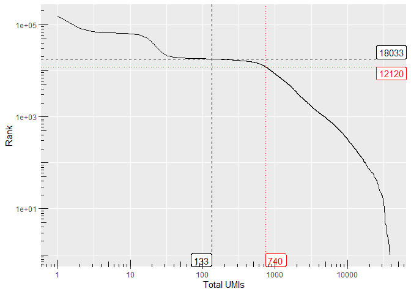<!-- -->

``` r
kallisto.GEX <- raw_mtx
```

## Load Kallisto HTO data

``` r
res_mat <- read_count_output(kallistobusDirHTO, name = "cells_x_genes")
dim(res_mat)
```

    ## [1]      6 491492

``` r
tot_counts <- Matrix::colSums(res_mat)
summary(tot_counts)
```

    ##      Min.   1st Qu.    Median      Mean   3rd Qu.      Max. 
    ##      0.00      1.00      2.00     58.07      3.00 111852.00

``` r
bc_rank <- DropletUtils::barcodeRanks(res_mat, lower = 10)

knee_plot(bc_rank)
```

    ## Warning: Transformation introduced infinite values in continuous y-axis
    
    ## Warning: Transformation introduced infinite values in continuous y-axis

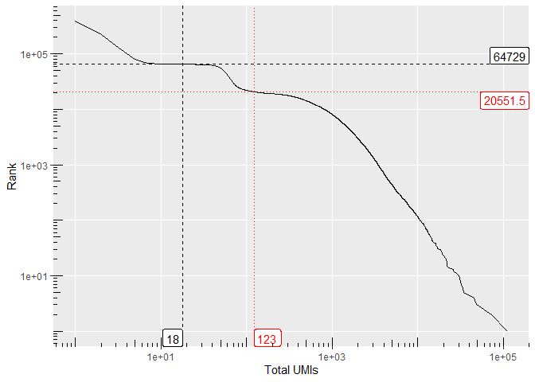<!-- -->

``` r
kallisto.HTO <- res_mat
```

## Load Kallisto ADT data

``` r
res_mat <- read_count_output(kallistobusDirADT, name = "cells_x_genes")
dim(res_mat)
```

    ## [1]     52 504629

``` r
tot_counts <- Matrix::colSums(res_mat)
summary(tot_counts)
```

    ##      Min.   1st Qu.    Median      Mean   3rd Qu.      Max. 
    ##      0.00      1.00      2.00     35.66      3.00 153439.00

``` r
bc_rank <- DropletUtils::barcodeRanks(res_mat, lower = 10)

knee_plot(bc_rank)
```

    ## Warning: Transformation introduced infinite values in continuous y-axis
    
    ## Warning: Transformation introduced infinite values in continuous y-axis

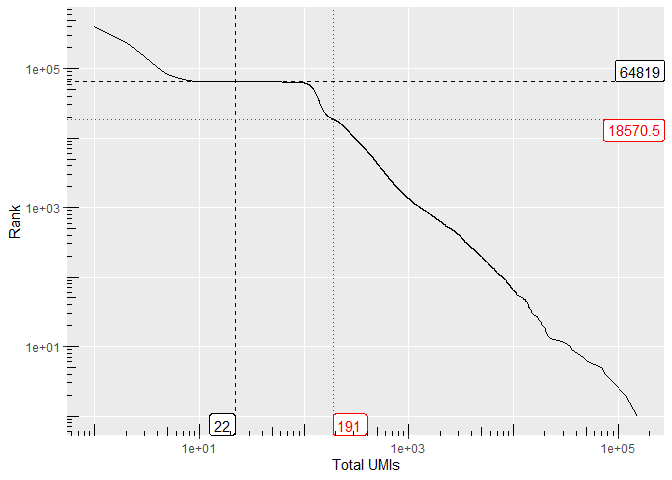<!-- -->

``` r
kallisto.ADT <- res_mat
```

## Demultiplex by HTO

Use Seurat MULTIseqDemux to demultiplex samples (by their hashing
antibody signal = HTO)

``` r
object <- CreateSeuratObject(counts = kallisto.HTO, assay="HTO.kallisto")
object <- NormalizeData(object, assay = "HTO.kallisto", normalization.method = "CLR")
```

    ## Normalizing across features

    ## Warning: Keys should be one or more alphanumeric characters followed by an
    ## underscore, setting key from hto.kallisto_ to htokallisto_

``` r
## Assure the matrices are in the same barcode-space
commonDrops <- Reduce("intersect",x=list(colnames(kallisto.HTO),colnames(kallisto.ADT),colnames(kallisto.GEX)))

length(commonDrops)
```

    ## [1] 149469

``` r
object <- subset(object, cells=commonDrops)
object[["ADT.kallisto"]] <- CreateAssayObject(counts=kallisto.ADT[,commonDrops])
```

    ## Warning: Keys should be one or more alphanumeric characters followed by an
    ## underscore, setting key from adt.kallisto_ to adtkallisto_

``` r
object[["RNA.kallisto"]] <- CreateAssayObject(counts=kallisto.GEX[,commonDrops])
```

    ## Warning: Keys should be one or more alphanumeric characters followed by an
    ## underscore, setting key from rna.kallisto_ to rnakallisto_

``` r
Key(object[["RNA.kallisto"]]) <- "rna_"
Key(object[["ADT.kallisto"]]) <- "adt_"
Key(object[["HTO.kallisto"]]) <- "hto_"


## MULTIseqDemux seems better when using unfiltered input (including empty droplets)
object <- MULTIseqDemux(object, assay="HTO.kallisto")

RidgePlot(object, assay = "HTO.kallisto", features = rownames(object[["HTO.kallisto"]]))
```

    ## Picking joint bandwidth of 0.128

    ## Picking joint bandwidth of 0.112

    ## Picking joint bandwidth of 0.101

    ## Picking joint bandwidth of 0.114

    ## Picking joint bandwidth of 0.146

    ## Picking joint bandwidth of 0.124

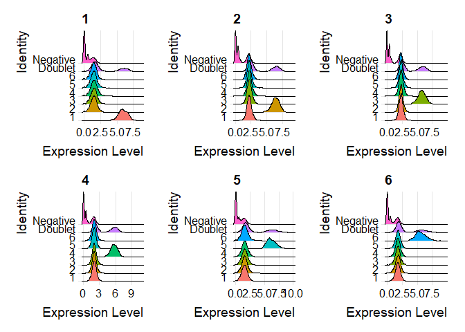<!-- -->

``` r
table(object$MULTI_ID)
```

    ## 
    ##        1        2        3        4        5        6  Doublet Negative 
    ##     2196     2593     2895     3692     2152     2308     3724   129909

``` r
object$sampleID <- object$MULTI_ID

object <- CalculateBarcodeInflections(object,barcode.column="nCount_HTO.kallisto",group.column="sampleID",threshold.low=1000)
Seurat::BarcodeInflectionsPlot(object) + scale_x_continuous(trans="log10")
```

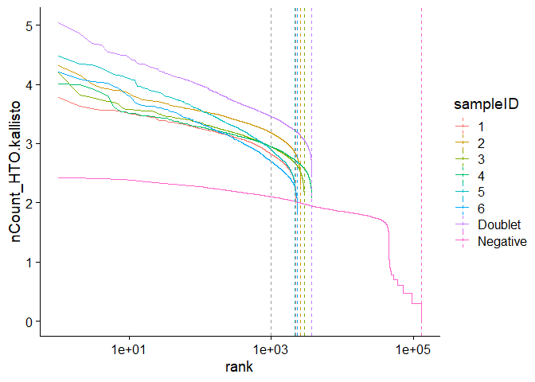<!-- -->

``` r
object.empty <- subset(object, subset=sampleID == "Negative")
object <- subset(object, subset=sampleID %in% c(1:6))
```

## Assign annotation to each cell

``` r
## Rename groups to meaningful names
groups <- c("PBMC_50ul_1_1000k","PBMC_50ul_4_1000k","PBMC_25ul_4_1000k","PBMC_25ul_4_200k","Lung_50ul_1_500k","Lung_50ul_4_500k","Doublet","Negative")
object$group <- object$sampleID

## Keep ordering of groups for best plotting
levels(object$group) <- groups

object$tissue <- factor(c("PBMC","PBMC","PBMC","PBMC","Lung","Lung","Doublet","Negative")[object$sampleID],levels=c("PBMC","Lung"))
object$volume <- factor(c("50µl","50µl","25µl","25µl","50µl","50µl","Doublet","Negative")[object$sampleID])
object$dilution <- factor(c("1","4","4","4","1","4","Doublet","Negative")[object$sampleID])
object$cellsAtStaining <- factor(c("1000k","1000k","1000k","200k","500k","500k","Doublet","Negative")[object$sampleID])
```

## Filter dead/dying cells

Based on mitochondrial reads and number of detected genes. Cutoff set to
15% MT and at least 60 expressed genes by visual inspection.

``` r
DefaultAssay(object) <- "RNA.kallisto"
object[["percent.mt"]] <- PercentageFeatureSet(object, pattern = "^MT-")
#object[["percent.mt"]][is.nan(object[["percent.mt"]][,1]),1] <- 100

cutoff.percent.mt <- 15
cutoff.nFeature <- 60
FeatureScatter(object, feature1 = "percent.mt", feature2 = "nFeature_RNA.kallisto") + ggplot2::geom_vline(xintercept=cutoff.percent.mt,linetype="dashed") + scale_y_continuous(trans="log10") + ggplot2::geom_hline(yintercept=cutoff.nFeature,linetype="dashed")
```

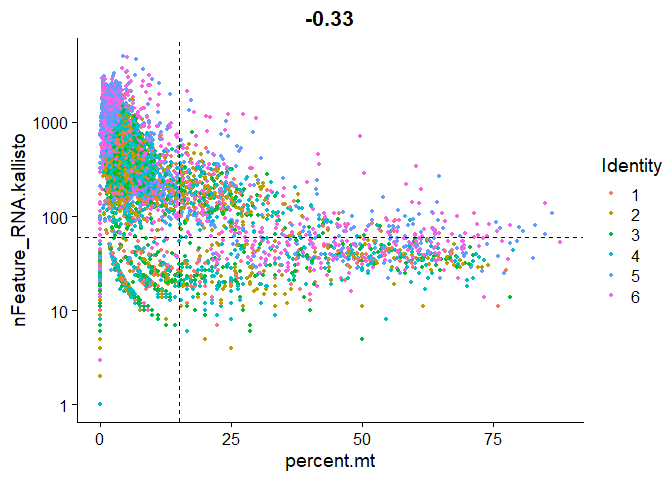<!-- -->

``` r
table(object[["percent.mt"]]<cutoff.percent.mt & object[["nFeature_RNA.kallisto"]]>cutoff.nFeature, object$sampleID)
```

    ##        
    ##            1    2    3    4    5    6 Doublet Negative
    ##   FALSE  315  426  448  623  276  411       0        0
    ##   TRUE  1881 2167 2447 3069 1876 1897       0        0

``` r
object <- subset(object, subset = percent.mt <= cutoff.percent.mt & nFeature_RNA.kallisto > cutoff.nFeature)
```

## Make DSB normalization

<https://mattpm.github.io/dsb/>

``` r
#devtools::install_github(repo = 'MattPM/dsb')
library(dsb)

neg_adt_matrix = GetAssayData(object.empty, assay = "ADT.kallisto", slot = 'counts') %>% as.matrix()
positive_adt_matrix = GetAssayData(object, assay = "ADT.kallisto", slot = 'counts') %>% as.matrix()
isotypes = c("IgG2A","IgG1")

normalized_matrix_individual <- positive_adt_matrix

for(i in c(1:6)){
  curCells <- which(object$sampleID == i)
  normalized_matrix_individual[,curCells] = DSBNormalizeProtein(cell_protein_matrix = positive_adt_matrix[,curCells],
                                        empty_drop_matrix = neg_adt_matrix,
                                        use.isotype.control = TRUE,
                                        isotype.control.name.vec = isotypes)
}

object = SetAssayData(object=object, assay="ADT.kallisto", slot="data", new.data = normalized_matrix_individual)

plotData <- as.data.frame(normalized_matrix_individual)
plotData$Marker <- rownames(plotData)
plotData <- reshape2::melt(plotData, id.vars=c("Marker"))
colnames(plotData) <- c("Marker","Cell","value")
ggplot(plotData,aes(x=value,y=Marker,fill=object$group[Cell])) + ggridges::geom_density_ridges(alpha=0.5, scale=3, rel_min_height = 0.01) + xlim(-5,30) + facet_grid(~object$group[Cell])
```

    ## Picking joint bandwidth of 0.603

    ## Picking joint bandwidth of 0.426

    ## Picking joint bandwidth of 0.365

    ## Picking joint bandwidth of 0.386

    ## Picking joint bandwidth of 0.642

    ## Picking joint bandwidth of 0.465

    ## Warning: Removed 4376 rows containing non-finite values (stat_density_ridges).

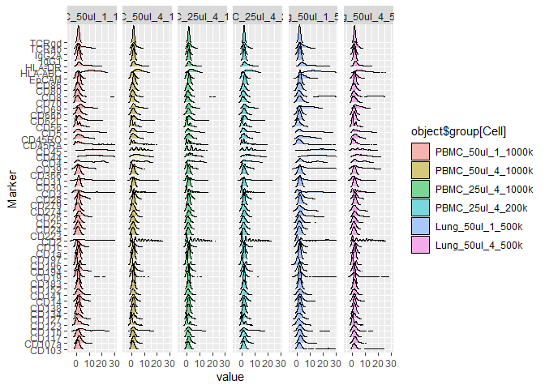<!-- -->

## Preprocess data

Run standard Seurat preprocessing on RNA modality.

``` r
object <- NormalizeData(object)
object <- FindVariableFeatures(object)
object <- ScaleData(object)
```

    ## Centering and scaling data matrix

``` r
object <- RunPCA(object, verbose = FALSE)
object <- FindNeighbors(object, dims = 1:30)
```

    ## Computing nearest neighbor graph

    ## Computing SNN

``` r
object <- FindClusters(object, resolution = 0.3)
```

    ## Modularity Optimizer version 1.3.0 by Ludo Waltman and Nees Jan van Eck
    ## 
    ## Number of nodes: 13338
    ## Number of edges: 584866
    ## 
    ## Running Louvain algorithm...
    ## Maximum modularity in 10 random starts: 0.9358
    ## Number of communities: 16
    ## Elapsed time: 2 seconds

``` r
object <- RunTSNE(object,dims=1:30)
object <- RunUMAP(object,dims=1:30)
```

    ## Warning: The default method for RunUMAP has changed from calling Python UMAP via reticulate to the R-native UWOT using the cosine metric
    ## To use Python UMAP via reticulate, set umap.method to 'umap-learn' and metric to 'correlation'
    ## This message will be shown once per session

    ## 15:27:07 UMAP embedding parameters a = 0.9922 b = 1.112

    ## 15:27:07 Read 13338 rows and found 30 numeric columns

    ## 15:27:07 Using Annoy for neighbor search, n_neighbors = 30

    ## 15:27:07 Building Annoy index with metric = cosine, n_trees = 50

    ## 0%   10   20   30   40   50   60   70   80   90   100%

    ## [----|----|----|----|----|----|----|----|----|----|

    ## **************************************************|
    ## 15:27:10 Writing NN index file to temp file C:\Users\Terkild\AppData\Local\Temp\RtmpkP1Kfa\file23c159547fe
    ## 15:27:10 Searching Annoy index using 1 thread, search_k = 3000
    ## 15:27:14 Annoy recall = 100%
    ## 15:27:15 Commencing smooth kNN distance calibration using 1 thread
    ## 15:27:17 Initializing from normalized Laplacian + noise
    ## 15:27:18 Commencing optimization for 200 epochs, with 630674 positive edges
    ## 15:27:33 Optimization finished

``` r
DimPlot(object, group.by="tissue", reduction="tsne")
```

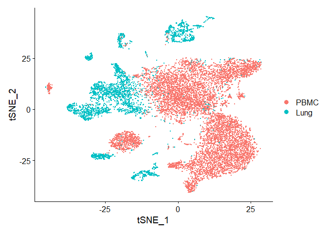<!-- -->

``` r
DimPlot(object, group.by="group", reduction="tsne")
```

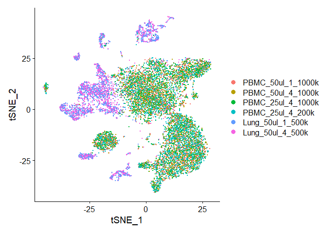<!-- -->

``` r
DimPlot(object, label=TRUE, reduction="tsne")
```

    ## Warning: Using `as.character()` on a quosure is deprecated as of rlang 0.3.0.
    ## Please use `as_label()` or `as_name()` instead.
    ## This warning is displayed once per session.

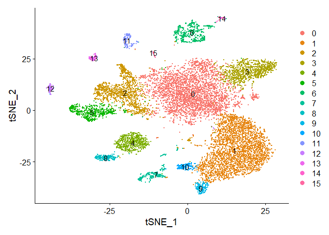<!-- -->

## Label and merge clusters into “superclusters”

To make the poulations less complex and for easier visualization, we
merged the clusters into major cell types

``` r
## LINEAGE MARKERS FOR CLUSTERLABELLING
ADTplots <- FeaturePlot(object, features=c("adt_CD1a","adt_CD3","adt_CD4","adt_CD8","adt_CD11b","adt_CD14","adt_CD19","adt_CD56","adt_HLA-DR","adt_EpCAM"), label=TRUE, reduction="tsne", min.cutoff=4, col=c("lightgrey","red"), combine=FALSE)
ADTplots <- lapply(ADTplots,FUN=function(x)x+NoLegend())
CombinePlots(ADTplots,ncol=5)
```

    ## Warning: CombinePlots is being deprecated. Plots should now be combined using
    ## the patchwork system.

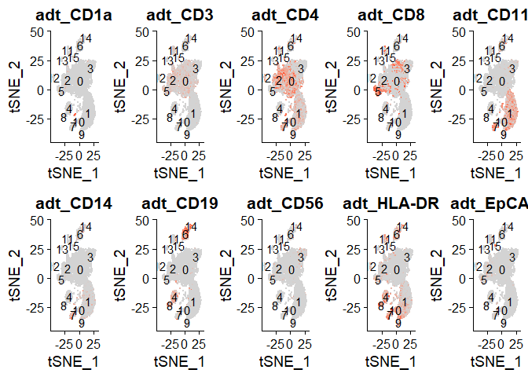<!-- -->

``` r
FeaturePlot(object, features=c("CD3D","TRAC"), label=TRUE, reduction="tsne", min.cutoff=1.3, col=c("lightgrey","red"), combine=FALSE)
```

    ## [[1]]

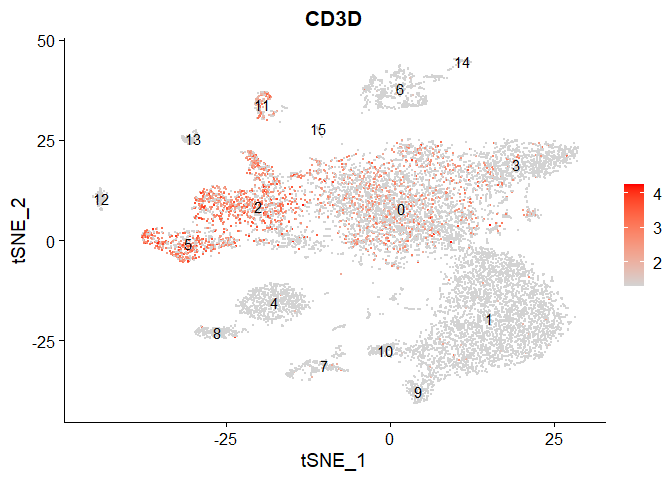<!-- -->

    ## 
    ## [[2]]

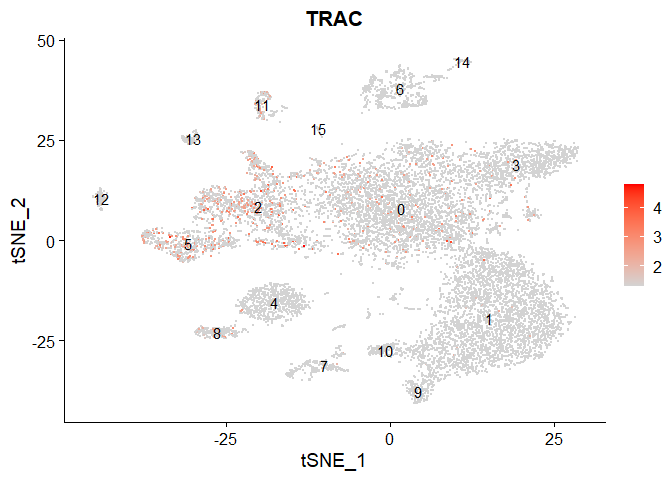<!-- -->

``` r
library("dplyr")
cluster.markers <- FindAllMarkers(object, only.pos = TRUE, min.pct = 0.25, logfc.threshold = 0.25)
```

    ## Calculating cluster 0

    ## Calculating cluster 1

    ## Calculating cluster 2

    ## Calculating cluster 3

    ## Calculating cluster 4

    ## Calculating cluster 5

    ## Calculating cluster 6

    ## Calculating cluster 7

    ## Calculating cluster 8

    ## Calculating cluster 9

    ## Calculating cluster 10

    ## Calculating cluster 11

    ## Calculating cluster 12

    ## Calculating cluster 13

    ## Calculating cluster 14

    ## Calculating cluster 15

``` r
top5 <- cluster.markers %>% group_by(cluster) %>% top_n(n = 5, wt = avg_logFC)
DoHeatmap(object, features = top5$gene, slot = "data") + NoLegend() + ggplot2::scale_fill_gradientn(colors = c("blue", "white", "red"))
```

    ## Scale for 'fill' is already present. Adding another scale for 'fill', which
    ## will replace the existing scale.

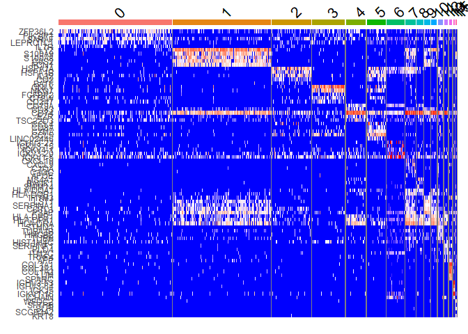<!-- -->

``` r
## COMBINE CLUSTERS TO SUPERCLUSTERS
superclusters <- c("0"="T cells",
                   "1"="MO/MØ/DC",
                   "2"="T cells",
                   "3"="T cells",
                   "4"="B cells",
                   "5"="T cells",
                   "6"="B cells",
                   "7"="MO/MØ/DC",
                   "8"="B cells",
                   "9"="MO/MØ/DC",
                   "10"="MO/MØ/DC",
                   "11"="T cells",
                   "12"="Other",
                   "13"="Other",
                   "14"="B cells",
                   "15"="Other")

object$supercluster <- factor(superclusters[as.character(Idents(object))],levels=superclusters.levels)

DimPlot(object, group.by="supercluster")
```

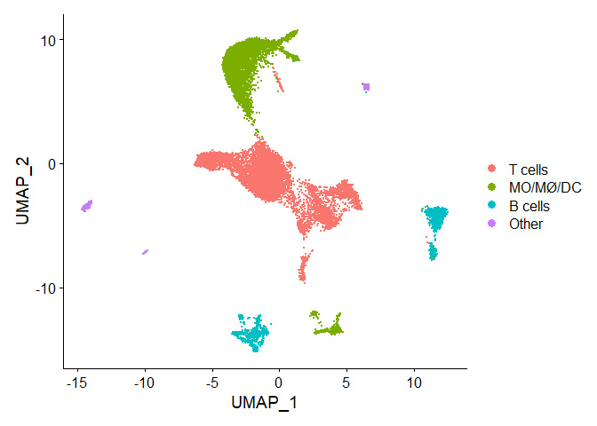<!-- -->

``` r
table <- t(table(object$supercluster,object$group))
round(table/rowSums(table)*100,2)
```

    ##                    
    ##                     T cells MO/MØ/DC B cells Other
    ##   PBMC_50ul_1_1000k   53.38    37.43    7.66  1.54
    ##   PBMC_50ul_4_1000k   54.36    37.10    7.57  0.97
    ##   PBMC_25ul_4_1000k   55.33    35.06    8.05  1.55
    ##   PBMC_25ul_4_200k    45.50    46.45    6.55  1.50
    ##   Lung_50ul_1_500k    60.61     9.65   25.75  4.00
    ##   Lung_50ul_4_500k    64.15     9.28   22.40  4.16
    ##   Doublet                                         
    ##   Negative

## Save Seurat object

``` r
saveRDS(object,file="data/5P-CITE-seq_Titration.rds")
```
