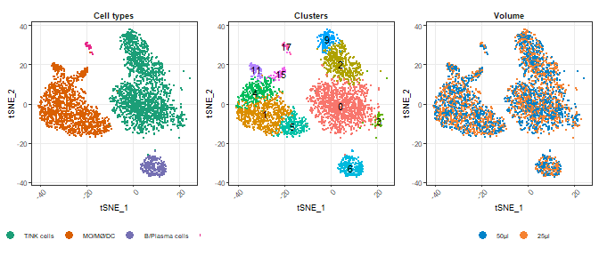

CITE-seq optimization - Staining volume titration
================
Terkild Brink Buus
30/3/2020

## Load utilities

Including libraries, plotting and color settings and custom utility
functions

``` r
set.seed(114)
require("Seurat", quietly=T)
require("tidyverse", quietly=T)
library("Matrix", quietly=T)
library("patchwork", quietly=T)

## Load ggplot theme and defaults
source("R/ggplot_settings.R")

## Load helper functions
source("R/Utilities.R")

## Load predefined color schemes
source("R/color.R")

## Load feature_rankplot functions
source("R/feature_rankplot.R")
source("R/feature_rankplot_hist.R")
source("R/feature_rankplot_hist_custom.R")

outdir <- "figures"
data.Seurat <- "data/5P-CITE-seq_Titration.rds"
data.abpanel <- "data/Supplementary_Table_1.xlsx"
data.markerStats <- "data/markerByClusterStats.tsv"

## Make a custom function for formatting the concentration scale
scaleFUNformat <- function(x) sprintf("%.2f", x)
```

## Load Seurat object

Subset to only focus on conditions with 1 mio cells and dilution factor
4 (thus comparing 50µl to 25µl staining volume in PBMCs).

``` r
object <- readRDS(file=data.Seurat)

## Show number of cells from each sample
table(object$group)
```

    ## 
    ## PBMC_50ul_1_1000k PBMC_50ul_4_1000k PBMC_25ul_4_1000k  PBMC_25ul_4_200k 
    ##              1777              1777              1777              1777 
    ##  Lung_50ul_1_500k  Lung_50ul_4_500k           Doublet          Negative 
    ##              1681              1681                 0                 0

``` r
object <- subset(object, subset=dilution == "DF4" & cellsAtStaining == "1000k")
object
```

    ## An object of class Seurat 
    ## 33572 features across 3554 samples within 3 assays 
    ## Active assay: RNA.kallisto (33514 features)
    ##  2 other assays present: HTO.kallisto, ADT.kallisto
    ##  3 dimensional reductions calculated: pca, tsne, umap

## Load Ab panel annotation and concentrations

Marker stats is reused in other comparisons and was calculated in the
end of the preprocessing vignette.

``` r
abpanel <- data.frame(readxl::read_excel(data.abpanel))
rownames(abpanel) <- abpanel$Marker

## As we are only working with dilution factor 4 samples here, we want to show labels accordingly
# a bit of a hack...
abpanel$conc_µg_per_mL <- abpanel$conc_µg_per_mL/4

markerStats <- read.table(data.markerStats)
markerStats.PBMC <- markerStats[markerStats$tissue == "PBMC",]
rownames(markerStats) <- paste(markerStats$marker,markerStats$tissue,sep="_")

## Make a ordering vector ordering markers per concentration and total UMI count
marker.order <- markerStats.PBMC$marker[order(markerStats.PBMC$conc_µg_per_mL, markerStats.PBMC$UMItotal, decreasing=TRUE)]

head(abpanel)
```

    ##        Marker Category     Alias   Clone Isotype_Mouse Corresponding_gene
    ## CD103   CD103        B      <NA> BerACT8          IgG1              ITGAE
    ## CD107a CD107a        B     LAMP1    H4A3          IgG1              LAMP1
    ## CD117   CD117        E     C-kit   104D2          IgG1                KIT
    ## CD11b   CD11b        B      <NA>  ICRF44          IgG1              ITGAM
    ## CD123   CD123        E      <NA>     6H6          IgG1              IL3RA
    ## CD127   CD127        E IL7Ralpha  A019D5          IgG1               IL7R
    ##        TotalSeqC_Tag BioLegend_Cat Stock_conc_µg_per_mL conc_µg_per_mL
    ## CD103           0145        350233                  500        0.31250
    ## CD107a          0155        328649                  500        0.62500
    ## CD117           0061        313243                  500        0.62500
    ## CD11b           0161        301359                  500        0.15625
    ## CD123           0064        306045                  500        0.12500
    ## CD127           0390        351356                  500        0.31250
    ##        dilution_1x
    ## CD103          400
    ## CD107a         200
    ## CD117          200
    ## CD11b          800
    ## CD123         1000
    ## CD127          400

``` r
head(markerStats)
```

    ##             marker tissue fineCluster nCells UMIsum   nth median   f90 UMItotal
    ## CD103_PBMC   CD103   PBMC           1    638   1740   5.0      2   5.0     5082
    ## CD103_Lung   CD103   Lung          16    132   7084 187.0      5 187.0    60252
    ## CD107a_PBMC CD107a   PBMC           1    638   7757  26.3      8  26.3    13396
    ## CD107a_Lung CD107a   Lung          12    260  11674  99.2     15  99.2    23273
    ## CD117_PBMC   CD117   PBMC           1    638   1318   4.0      2   4.0     3316
    ## CD117_Lung   CD117   Lung          21     32   1695  41.0     41 130.4     5878
    ##             Category Alias   Clone Isotype_Mouse Corresponding_gene
    ## CD103_PBMC         B  <NA> BerACT8          IgG1              ITGAE
    ## CD103_Lung         B  <NA> BerACT8          IgG1              ITGAE
    ## CD107a_PBMC        B LAMP1    H4A3          IgG1              LAMP1
    ## CD107a_Lung        B LAMP1    H4A3          IgG1              LAMP1
    ## CD117_PBMC         E C-kit   104D2          IgG1                KIT
    ## CD117_Lung         E C-kit   104D2          IgG1                KIT
    ##             TotalSeqC_Tag BioLegend_Cat Stock_conc_µg_per_mL conc_µg_per_mL
    ## CD103_PBMC            145        350233                  500           1.25
    ## CD103_Lung            145        350233                  500           1.25
    ## CD107a_PBMC           155        328649                  500           2.50
    ## CD107a_Lung           155        328649                  500           2.50
    ## CD117_PBMC             61        313243                  500           2.50
    ## CD117_Lung             61        313243                  500           2.50
    ##             dilution_1x marker.y DSB.cutoff positive count   pct
    ## CD103_PBMC          400    CD103          7       14  1777  0.79
    ## CD103_Lung          400    CD103          7      501  1681 29.80
    ## CD107a_PBMC         200   CD107a          7      122  1777  6.87
    ## CD107a_Lung         200   CD107a          7      150  1681  8.92
    ## CD117_PBMC          200    CD117          7        3  1777  0.17
    ## CD117_Lung          200    CD117          7       32  1681  1.90

## Cell type and tissue overview

Make tSNE plots colored by cell type, cluster and tissue of origin.

``` r
p.tsne.volume <- DimPlot(object, group.by="volume", reduction="tsne", pt.size=0.1, combine=FALSE)[[1]] + theme_get() + facet_wrap(~"Volume") + scale_color_manual(values=color.volume)

p.tsne.cluster <- DimPlot(object, group.by="supercluster", reduction="tsne", pt.size=0.1, combine=FALSE)[[1]] + theme_get() + scale_color_manual(values=color.supercluster) + facet_wrap(~"Cell types")

p.tsne.finecluster <- DimPlot(object, label=TRUE, label.size=3, reduction="tsne", group.by="fineCluster", pt.size=0.1, combine=FALSE)[[1]] + theme_get() + facet_wrap(  ~"Clusters") + guides(col=F)

p.tsne.cluster + p.tsne.finecluster + p.tsne.volume
```

<!-- -->

## Overall ADT counts

Extract UMI data and calculate UMI sum per marker within each condition.

``` r
## Get the data
ADT.matrix <- data.frame(GetAssayData(object, assay="ADT.kallisto", slot="counts"))
ADT.matrix$marker <- rownames(ADT.matrix)
ADT.matrix$conc <- abpanel[ADT.matrix$marker,"conc_µg_per_mL"]
ADT.matrix <- ADT.matrix %>% pivot_longer(c(-marker,-conc))

## Get cell annotations
cell.annotation <- FetchData(object, vars=c("volume"))

## Calculate marker sum from each dilution within both tissues
ADT.matrix.agg <- ADT.matrix %>% group_by(volume=cell.annotation[name,"volume"], marker, conc) %>% summarise(sum=sum(value))

## Order markers by concentration
ADT.matrix.agg$marker.byConc <- factor(ADT.matrix.agg$marker, levels=marker.order)

## Extract marker annotation
ann.markerConc <- abpanel[marker.order,]
ann.markerConc$Marker <- factor(marker.order, levels=marker.order)

ADT.matrix.agg.total <- ADT.matrix.agg
```

## Plot overall ADT counts by conditions

Samples stained with diluted Ab panel have reduced ADT counts.

``` r
p.UMIcountsPerCondition <- ggplot(ADT.matrix.agg.total[order(-ADT.matrix.agg$conc, -ADT.matrix.agg$sum),], aes(x=volume, y=sum/10^6, fill=conc)) + 
  geom_bar(stat="identity", col=alpha(col="black",alpha=0.05)) + 
  scale_fill_viridis_c(trans="log2", labels=scaleFUNformat, breaks=c(0.0375,0.15,0.625,2.5,10)) + 
  scale_y_continuous(expand=c(0,0,0,0.05)) + 
  labs(fill="DF4\nµg/mL", y=bquote("ADT UMI counts ("~10^6~")")) + 
  guides(fill=guide_colourbar(reverse=T)) + 
  theme(panel.grid.major=element_blank(), axis.title.x=element_blank(), panel.border=element_blank(), axis.line = element_line(), legend.position="right")

p.UMIcountsPerCondition
```

<!-- -->

## Compare total UMI counts per marker

Plot total UMI counts for each marker at the investigated dilution
factors (DF1 vs. DF4). To ease readability, we place dashed lines
between each concentration.

``` r
## Calculate "breaks" where concentration change.
lines <- length(marker.order)-cumsum(sapply(split(ann.markerConc$Marker,ann.markerConc$conc_µg_per_mL),length))+0.5
lines <- data.frame(breaks=lines[-length(lines)])

## Make a marker by concentration "heatmap"
p.markerByConc <- ggplot(ann.markerConc, aes(x=1, y=Marker, fill=conc_µg_per_mL)) + 
  geom_tile(col=alpha(col="black",alpha=0.2)) + 
  geom_hline(data=lines,aes(yintercept=breaks), linetype="dashed", alpha=0.5) + 
  scale_fill_viridis_c(trans="log2") + 
  labs(fill="µg/mL") + 
  theme_get() + 
  theme(axis.ticks.x=element_blank(), axis.title = element_blank(), axis.text.x=element_blank(), panel.grid=element_blank(), legend.position="right", plot.margin=unit(c(0.1,0.1,0.1,0.1),"mm")) + scale_x_continuous(expand=c(0,0))
  
## Make UMI counts per Marker plot
p.UMIcountsPerMarker <- ggplot(ADT.matrix.agg, aes(x=marker.byConc,y=log2(sum))) + 
  geom_line(aes(group=marker), size=1.2, color="#666666") + 
  geom_point(aes(group=volume, fill=volume), pch=21, size=0.7) + 
  geom_vline(data=lines,aes(xintercept=breaks), linetype="dashed", alpha=0.5) + 
  scale_fill_manual(values=color.volume) + 
  scale_y_continuous(breaks=c(9:17)) + 
  ylab("log2(UMI sum)") + 
  guides(fill=guide_legend(override.aes=list(size=1.5), reverse=TRUE)) + 
  theme(axis.title.y=element_blank(), axis.text.y=element_blank(), legend.position="bottom", legend.justification="left", legend.title.align=0, legend.key.width=unit(0.2,"cm"), legend.title=element_blank()) + 
  coord_flip()

## Combine plot with markerByConc annotation heatmap
plotUMIcountsPerMarker <- p.markerByConc + guides(fill=F) + p.UMIcountsPerMarker + guides(fill=F) + plot_spacer() + guide_area() + plot_layout(ncol=4, widths=c(1,30,0.1), guides='collect')

plotUMIcountsPerMarker
```

<!-- -->

## Compare change in UMI/cell within expressing cluster

Using a specific percentile may be prone to outliers in small clusters
(i.e. the 90th percentile of a cluster of 30 will be the \#3 higest cell
making it prone to outliers). We thus set a threshold of the value to
only be the 90th percentile if cluster contains more than 100 cells. For
smaller clusters, the median is used. Expressing cluster is identified
in the “preprocessing” vignette.

``` r
## Get the data
ADT.matrix <- data.frame(GetAssayData(object, assay="ADT.kallisto", slot="counts"))
ADT.matrix$marker <- rownames(ADT.matrix)
ADT.matrix$conc <- abpanel[ADT.matrix$marker,"conc_µg_per_mL"]
ADT.matrix <- ADT.matrix %>% pivot_longer(c(-marker,-conc))

## Get cell annotations
cell.annotation <- FetchData(object, vars=c("volume", "fineCluster"))

## Calculate marker statistics from each dilution within each cluster
ADT.matrix.agg <- ADT.matrix %>% group_by(volume=cell.annotation[name,"volume"], fineCluster=cell.annotation[name,"fineCluster"], marker, conc) %>% summarise(sum=sum(value), median=quantile(value, probs=c(0.9)), nth=nth(value))
ADT.matrix.agg$tissue == "PBMC"
```

    ## logical(0)

``` r
## Use data for the previously determined expressing cluster.
Cluster.max <- markerStats[markerStats$tissue == "PBMC",c("marker","fineCluster")]
Cluster.max$fineCluster <- factor(Cluster.max$fineCluster)

ADT.matrix.aggByClusterMax <- Cluster.max %>% left_join(ADT.matrix.agg)
ADT.matrix.aggByClusterMax$marker.byConc <- factor(ADT.matrix.aggByClusterMax$marker, levels=marker.order)

p.UMIinExpressingCells <- ggplot(ADT.matrix.aggByClusterMax, aes(x=marker.byConc, y=log2(nth))) + 
  geom_line(aes(group=marker), size=1.2, color="#666666") + 
  geom_point(aes(group=volume, fill=volume), pch=21, size=0.7) + 
  geom_vline(data=lines,aes(xintercept=breaks), linetype="dashed", alpha=0.5) + 
  geom_text(aes(label=paste0(fineCluster," ")), y=Inf, adj=1, size=1.5) + 
  scale_fill_manual(values=color.volume) + 
  scale_y_continuous(breaks=c(0:11), labels=2^c(0:11), expand=c(0.05,0.5)) + 
  ylab("90th percentile UMI of expressing cluster") + 
  theme(axis.title.y=element_blank(), axis.text.y=element_blank(), legend.position="right", legend.justification="left", legend.title.align=0, legend.key.width=unit(0.2,"cm")) + 
  coord_flip()

## Combine plot with markerByConc annotation heatmap
UMIinExpressingCells <- p.markerByConc + theme(legend.position="none") + p.UMIinExpressingCells + theme(legend.position="none") + plot_spacer() + plot_layout(ncol=4, widths=c(1,30,0.1), guides='collect')

UMIinExpressingCells
```

<!-- -->

## Titration examples

Most markers are largely unaffected by reducing staining volume.
However, some antibodies used at low concentrations and targeting
abundant epitopes are affected, an example of such is CD31:

``` r
## Make helper function for plotting titration plots
titrationPlot <- function(marker, gate.PBMC=NULL, gate.Lung=NULL, y.axis=FALSE, show.gate=TRUE, legend=FALSE){
  curMarker.name <- marker
  
  ## Get antibody concentration for legends
  curMarker.DF1conc <- abpanel[curMarker.name, "conc_µg_per_mL"]
  if(show.gate==TRUE){
    ## Load gating percentages from manually set DSB thresholds
    gate <- data.frame(gate=markerStats[markerStats$marker == curMarker.name & markerStats$tissue== "PBMC",c("pct")])
    gate$gate <- 1-(gate$gate/100)
    rownames(gate) <- gate$wrap
    ## Allow manual gating
    if(!is.null(gate.PBMC)) gate <- gate.PBMC
  } else {
    gate <- NULL
  }

  p <- feature_rankplot_hist_custom(data=object, 
                                    marker=paste0("adt_",curMarker.name),      
                                    group="volume",
                                    barcodeGroup="supercluster",
                                    conc=curMarker.DF1conc, 
                                    legend=legend, 
                                    yaxis.text=y.axis, 
                                    gates=gate,
                                    histogram.colors=color.volume, 
                                    title=curMarker.name)
  
  return(p)
}

p.CD31 <- titrationPlot("CD31", legend=TRUE)

p.CD31
```

<!-- -->

## tSNE plots

Make tSNE plots with raw UMI counts. Use rainbow color scheme to show
dynamic range in expression levels.

``` r
show_tsne_markers <- c("CD31","CD8")
f.tsne.format <- function(x){
    x + 
    scale_color_gradientn(colours = c("#000033","#3333FF","#3377FF","#33AAFF","#33CC33","orange","red"), 
                          limits=c(0,NA)) + 
    scale_y_continuous(expand=c(0,0,0.05,0), limits=c(-45.52796,37.94770)) + 
    xlim(c(-40.83170,49.63832)) + 
    theme_get() + 
    theme(plot.title=element_text(size=7, face="bold", hjust=0.5),
          plot.background=element_blank(),
          panel.background=element_blank(),
          axis.title=element_blank(),
          axis.text.x=element_blank(),
          axis.text.y=element_blank(),
          legend.key.width=unit(3,"mm"),
          legend.key.height=unit(2,"mm"),
          legend.position=c(1,-0.03),
          legend.justification=c(1,0),
          legend.background=element_blank(),
          legend.direction="horizontal")
}

maximum <- apply(FetchData(object, vars=paste0("adt_",show_tsne_markers), slot="counts"),2,quantile,probs=c(0.95))

p.tsne.1 <- f.tsne.format(FeaturePlot(subset(object, subset=volume=="25µl"), reduction="tsne", sort=TRUE,  combine=FALSE, features=paste0("adt_",show_tsne_markers[1]), slot="counts", max.cutoff=maximum[1], pt.size=0.1)[[1]])
p.tsne.2 <- f.tsne.format(FeaturePlot(subset(object, subset=volume=="50µl"), reduction="tsne", sort=TRUE,  combine=FALSE, features=paste0("adt_",show_tsne_markers[1]), slot="counts", max.cutoff=maximum[1], pt.size=0.1)[[1]])
p.tsne.3 <- f.tsne.format(FeaturePlot(subset(object, subset=volume=="25µl"), reduction="tsne", sort=TRUE,  combine=FALSE, features=paste0("adt_",show_tsne_markers[2]), slot="counts", max.cutoff=maximum[2], pt.size=0.1)[[1]])
p.tsne.4 <- f.tsne.format(FeaturePlot(subset(object, subset=volume=="50µl"), reduction="tsne", sort=TRUE,  combine=FALSE, features=paste0("adt_",show_tsne_markers[2]), slot="counts", max.cutoff=maximum[2], pt.size=0.1)[[1]])

p.tsne <- list(p.tsne.1 + ggtitle("25µl"),p.tsne.2 + ggtitle("50µl"),p.tsne.3 + ggtitle("25µl"),p.tsne.4 + ggtitle("50µl"))
## Get common y-axis label
p.tsne[[1]] <- p.tsne[[1]] + theme(axis.title.y=element_text())
# a bit of a hack to get a common x-axis label
p.tsne[[2]] <- p.tsne[[2]] + theme(axis.title.x=element_text(hjust=1.2))

p.UMI.tsne <- cowplot::plot_grid(plotlist=p.tsne, 
                                 align="h", 
                                 axis="tb", 
                                 nrow=1, 
                                 rel_widths=c(1.05,1,1,1),
                                 labels=c("E",show_tsne_markers[1],"F",show_tsne_markers[2]),
                                 label_size=panel.label_size, 
                                 vjust=panel.label_vjust, 
                                 hjust=c(panel.label_hjust,0.5,panel.label_hjust,0.5))

p.UMI.tsne
```

<!-- -->

## Final plot

``` r
A <- p.UMIcountsPerCondition + theme(legend.key.width=unit(0.3,"cm"), 
                                     legend.key.height=unit(0.4,"cm"), 
                                     legend.text=element_text(size=unit(5,"pt")),
                                     plot.margin=unit(c(0.3,0,0.5,0),"cm"))

B1 <- p.markerByConc + theme(text = element_text(size=10), 
                             plot.margin=unit(c(0.3,0,0,0),"cm"),
                             legend.position="none")
B2 <- p.UMIcountsPerMarker + theme(legend.position="none")
C <- p.UMIinExpressingCells + theme(legend.position="none")

BC.legend <- cowplot::get_legend(p.UMIcountsPerMarker + 
                                   theme(legend.position="bottom", 
                                         legend.direction="horizontal", 
                                         legend.background=element_blank(), 
                                         legend.box.background=element_blank(), legend.key=element_blank()))

D <- p.CD31 + theme(plot.margin=unit(c(0.5,0,0,0),"cm"))

AD <- cowplot::plot_grid(A,D,NULL, 
                         ncol=1, 
                         rel_heights = c(13,17,1.5),
                         labels=c("A","D",""), 
                         label_size=panel.label_size, 
                         vjust=panel.label_vjust, 
                         hjust=panel.label_hjust)

BC <- cowplot::plot_grid(B1, B2, C, 
                         nrow=1, 
                         rel_widths=c(2,10,10), 
                         align="h", 
                         axis="tb", 
                         labels=c("B", "", "C"), 
                         label_size=panel.label_size, 
                         vjust=panel.label_vjust, 
                         hjust=panel.label_hjust)

p.figure <- cowplot::plot_grid(cowplot::ggdraw(plot_grid(AD, BC, 
                                      nrow=1, 
                                      rel_widths=c(1,4), 
                                      align="v", 
                                      axis="l")) + 
    cowplot::draw_plot(BC.legend,0.27,0.020,0.2,0.00001),
    p.UMI.tsne, rel_heights=c(3,1.35), align="v", axis="lr", ncol=1)


png(file=file.path(outdir,"Figure 3.png"), 
    width=figure.width.full, 
    height=6, 
    units = figure.unit, 
    res=figure.resolution, 
    antialias=figure.antialias)

  p.figure
  
dev.off()
```

    ## png 
    ##   2

``` r
p.figure
```

<!-- -->

## Individual titration plots

For supplementary information.

``` r
plots.columns = 6
rows.max <- 5

markers <- abpanel[rownames(object[["ADT.kallisto"]]),]
markers <- markers[order(markers$Category, markers$Marker),]

plots <- list()

## Make individual plots for each marker
for(i in 1:nrow(markers)){
  curMarker <- markers[i,]
  curMarker.name <- curMarker$Marker
  y.axis <- ifelse((i-1) %in% c(0,6,12,18,24,30,36,42,48),TRUE,FALSE)
  plots[[curMarker.name]] <- titrationPlot(curMarker.name, y.axis=y.axis)
}

# a bit of a hack to make celltype legend
p.legend <- cowplot::get_legend(ggplot(data.frame(supercluster=object$supercluster), 
                                           aes(color=supercluster,x=1,y=1)) + 
  geom_point(shape=15, size=1.5) + 
  scale_color_manual(values=color.supercluster) + 
  theme(legend.title=element_blank(), 
        legend.margin=margin(0,0,0,0), 
        legend.key.size = unit(0.15,"cm"),
        legend.position = c(0.98,1.1), 
        legend.justification=c(1,1), 
        legend.direction="horizontal"))

plots.num <- length(plots)
plots.perPage <- plots.columns*rows.max
plots.pages <- ceiling(plots.num/plots.perPage)

## Make a supplementary figure split into pages
for(i in 1:plots.pages){
  start <- (i-1)*plots.perPage+1
  end <- i*plots.perPage
  end <- min(end,plots.num)
  curPlots <- c(start:end)
  plots.rows <- ceiling(length(curPlots)/plots.columns)
  
  curPlots <- cowplot::plot_grid(plotlist=plots[curPlots],ncol=plots.columns, rel_widths=c(1.1,1,1,1,1,1), align="h", axis="tb")
  curPlots.layout <- cowplot::plot_grid(NULL, p.legend, curPlots, vjust=-0.5, hjust=panel.label_hjust, label_size=panel.label_size, ncol=1, rel_heights= c(0.5, 1.3, 70/5*plots.rows))
  
  png(file=file.path(outdir,paste0("Supplementary Figure 3",LETTERS[i],".png")), 
      units=figure.unit, 
      res=figure.resolution, 
      width=figure.width.full, 
      height=(2*plots.rows),
      antialias=figure.antialias)

  print(curPlots.layout)
  
  dev.off()
  
  print(curPlots.layout)
}
```

<!-- --><!-- -->
